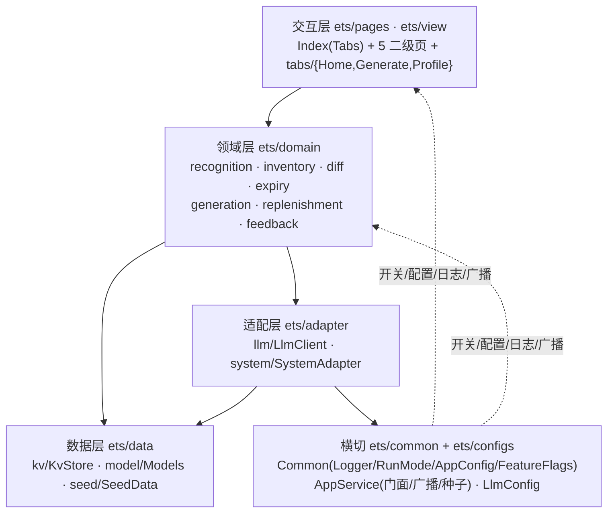
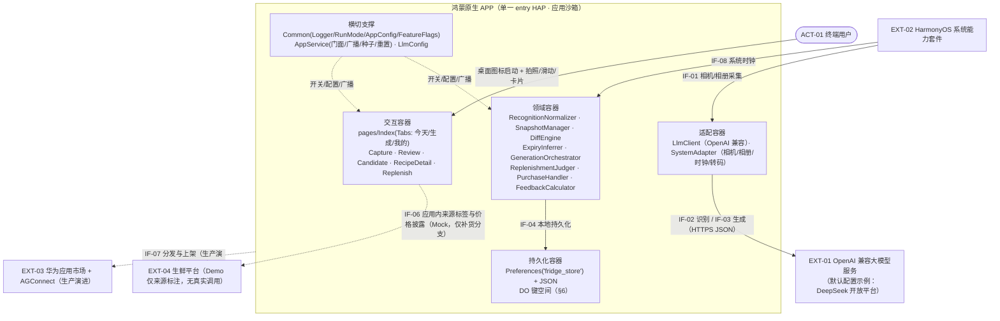
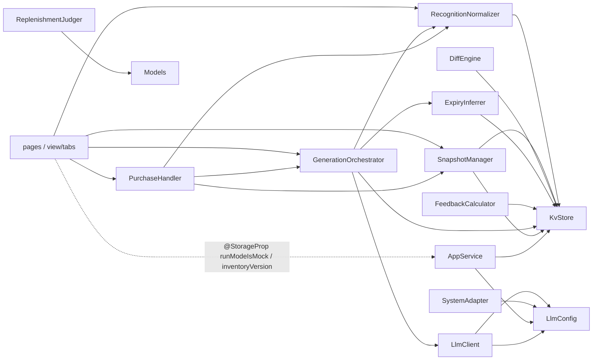
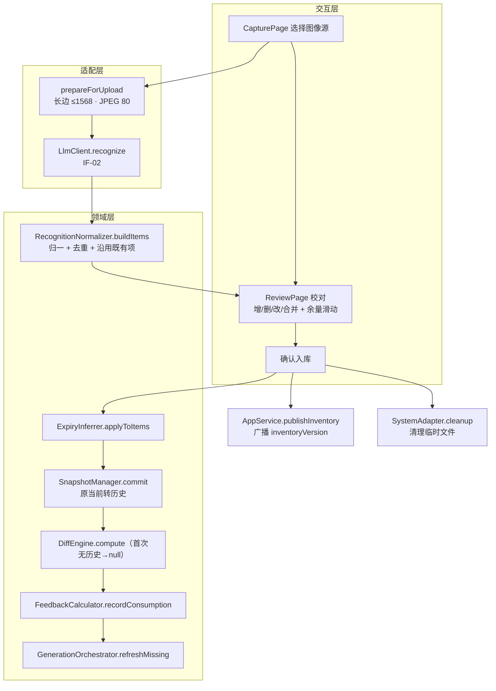
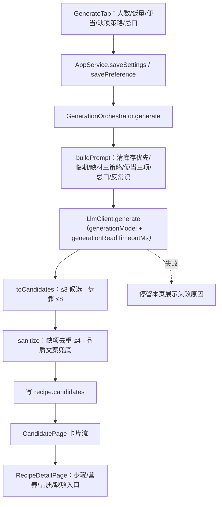
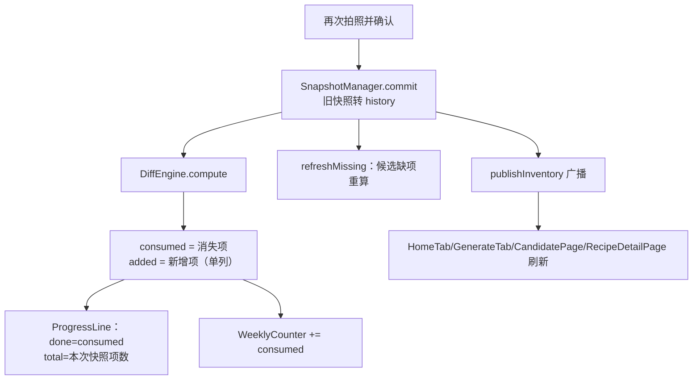
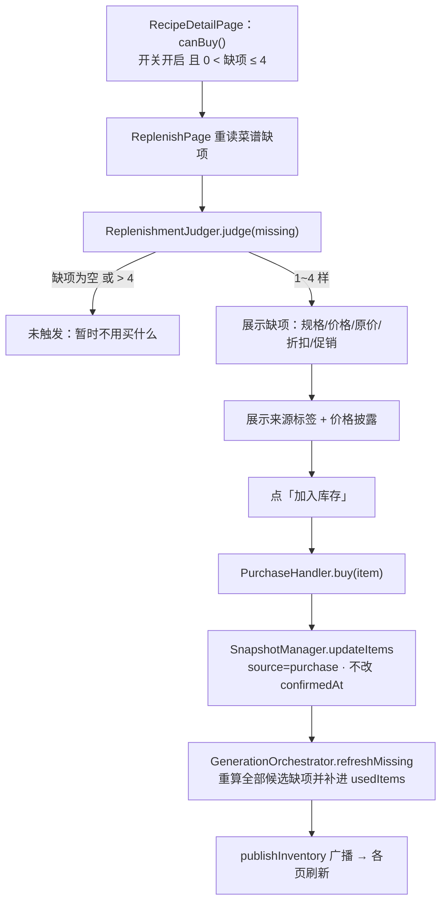
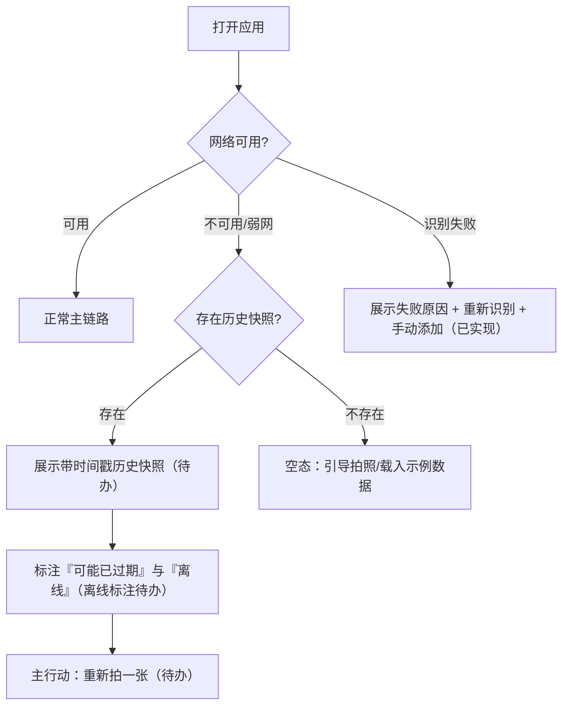
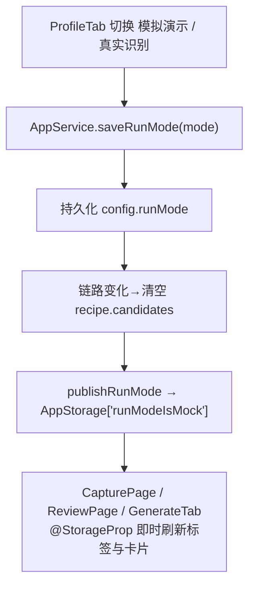

# 冰箱清库存食谱助手 · 架构设计说明书（校准版）

> 文档定位：**以真实代码实现为准**回写的架构设计说明书（校准版）。
> 文档版本：**校准-v1.0**
> 编制日期：2026-09-24
> 上游文档：`docs/需求规格说明书.md`（**v4.0**）、同目录 `需求规格说明书.md`（**校准-v1.0**，亮点分类法定义处）、`docs/洞察报告.md`（**v4.0**）、`docs/系统设计说明书.md`（**v0.2**）、`docs/架构设计说明书.md`（**v0.2**）
> 覆盖范围：架构目标与约束、分层与依赖、容器视图、组件视图（按真实模块）、数据模型、接口契约、关键流程、部署与运行、工程目录、需求追溯、风险与未决项
> 事实优先级：**代码 > `.codegenie/MEMORY.md` > 文档**。本文不重复定义亮点分类法，引用《需求规格说明书（校准版）》§4。

## 版本变更记录

| 版本 | 日期 | 变更摘要 | 变更依据 |
| --- | --- | --- | --- |
| v0.2 | 2026-09-21 | 载体收敛为鸿蒙原生 APP；新增交付范围；容器/组件/接口按应用沙箱与 Mock 改写 | 旧《架构设计说明书》 |
| **校准-v1.0** | 2026-09-24 | ① 架构目标更新为「配置驱动多服务商 + 显式双链路 + 无自建服务端 + 应用沙箱」；② 容器/组件/工程目录全部按真实 `ets/` 目录与真实模块重写；③ 数据模型 `DO-01~DO-11` 对齐真实键空间与 `Models.ets` 字段，标注持久化 vs 会话内存；④ 接口契约 `IF-01~IF-08` 按实际调用与错误码重写；⑤ 关键流程新增「补货入库存 + 缺项重算」「链路切换广播」；⑥ 引用《需求规格说明书（校准版）》§4 亮点分类法，不再自建；⑦ 风险与未决项补齐文档-实现偏差待办 | 本轮代码核验（`entry/src/main/ets/**`、`entry/src/main/module.json5`）、`.codegenie/MEMORY.md` |

---

## 1. 文档说明

### 1.1 目的

在《需求规格说明书（校准版）》锚定的需求之上，给出与 `C:\codes\demo` **真实代码结构一一对应**的架构分解：分层与依赖、容器、组件、数据模型、接口契约、关键流程、部署与工程目录，并给出与上游编号的追溯关系。

### 1.2 范围

- **本文件覆盖**：架构目标、分层依赖、容器视图、组件视图、数据模型、接口契约、关键流程、部署与运行、工程目录、需求追溯、风险与未决项。
- **本文件不覆盖**：系统上下文与边界（见《系统设计说明书》§3~§6）、需求条目与验收用例（见《需求规格说明书（校准版）》）、亮点分类法的定义（见《需求规格说明书（校准版）》§4）。

### 1.3 术语

需求侧与业务侧术语沿用《需求规格说明书（校准版）》§1.3（库存/快照/自动差集/缺项上限 4/补货分支/运行链路等）；边界侧术语沿用《系统设计说明书》§1.3 / §1.4。架构侧用语（容器、逻辑组件、适配器、键空间、广播键）在首次出现处就地说明。

### 1.4 编号与引用规范

- 需求引用沿用上游编号：`FR-xx`、`NFR-xx`、`RQ-xx`、`UC-xx`、`§x.y`。
- 边界与接口引用沿用《系统设计说明书》：`ACT-xx`、`EXT-xx`、`IF-xx`、`DO-xx`。
- 亮点引用《需求规格说明书（校准版）》定义的 `P1~P9`（产品亮点）、`E1~E11`（工程实现亮点）。
- 本文以**章节号**作追溯锚点，以**真实文件名**标识组件；**不新增、不修改任何上游编号族**。

---

## 2. 架构目标与约束

### 2.1 架构目标与约束

| # | 目标 / 约束（校准后） | 架构含义 | 证据 / 来源 |
| --- | --- | --- | --- |
| 1 | **配置驱动的多服务商** | 接口地址、模型名、鉴权头、超时、额外请求头全部来自 `resources/rawfile/configs/llm.json`；代码零硬编码 endpoint；支持运行时覆盖与「跟随配置」 | `configs/LlmConfig.ets:84`、`llm.json` |
| 2 | **显式双链路隔离（演示设施）** | `RunMode` real/mock 由用户显式切换并持久化；真实链路失败即失败、绝不用示例数据顶替；切换经 AppStorage 实时广播 | `common/Common.ets:28`、`AppService.ets:180` |
| 3 | **无自建服务端** | 客户端经 `@kit.NetworkKit` 直连 OpenAI 兼容服务；Demo 无 BFF / 网关 | `adapter/llm/LlmClient.ets:340` |
| 4 | **单一 entry HAP + 应用沙箱** | Stage 模型单一模块；数据落 `Preferences('fridge_store')`；照片不落盘 | `entry/src/main/module.json5`、`data/kv/KvStore.ets:40` |
| 5 | **零维护库存** | 拍照即覆盖快照；自动差集推导消耗；差集以 `normalizedKey` 对齐 | `SnapshotManager.ets:34`、`DiffEngine.ets:19` |
| 6 | **隐私本地优先** | 照片识别后清理临时文件；一键删除全部数据 | `SystemAdapter.ets:204`、`KvStore.ets:129` |
| 7 | **补货隔离** | 补货开关关闭后判定与披露整体停用；补货不改候选排序 | `Common.ets:90`、`ReplenishmentJudger.ets:26` |
| 8 | **5 天交付约束** | 仅系统组件、无自定义视觉资产；P1 默认可放弃 | `NFR-09`、`view/Theme.ets` |

### 2.2 分层与依赖方向

逻辑依赖自外向内单向收敛：**交互层 → 领域层 → 数据层**；外部能力经**适配层**进入；横切能力（开关、日志、配置）以静态类注入各层。与真实目录一一对应。



**依赖约束**：
- 交互层（`pages/`、`view/`）不直接发 HTTP，一切外部调用经 `adapter/llm/LlmClient`。
- 领域层（`domain/`）不感知页面，输出结构化对象供渲染；跨页刷新靠 `AppService` 广播，不反向依赖页面。
- 适配层对领域层暴露**稳定静态签名**（`LlmClient.recognize` / `LlmClient.generate`、`SystemAdapter.*`），更换服务商/网关不改领域层调用点。
- 数据层仅负责键空间读写与 JSON 序列化，不承载业务规则。

### 2.3 关键架构决策摘要（校准）

| # | 决策项 | 结论（以实现为准） |
| --- | --- | --- |
| A-3 | 服务端 | Demo 无自建服务端；客户端直连 OpenAI 兼容服务；**Key 优先取用户填写，其次取配置内置**（`LlmConfig.effectiveApiKey`） |
| A-4 | 生鲜平台接入 | **无独立网关接口/适配器**；补货数据由生成模型在 `missingItems` 中一并返回（规格/价格/折扣），客户端只做展示与入库（IF-06 为实现变更） |
| A-5 | 本地持久化 | 单一 `Preferences('fridge_store')` + JSON，含 `store.schema.version` 迁移链 |
| A-8 | 图像输入 | 相机（`cameraPicker`）+ 相册（`photoAccessHelper`）+ 预置样张回退（仅模拟链路显示） |
| A-9 | 工程结构 | 单一 entry HAP + 分目录源码；无 HSP / 多 HAP |
| A-11 | 编号体系 | 不新增编号族；亮点引用《需求规格说明书（校准版）》P/E 分类 |
| A-12 | 技术栈 | ArkTS + DevEco Studio（Stage 模型）；仅系统组件 |

---

## 3. 产品亮点与工程实现亮点

> 分类法在《需求规格说明书（校准版）》§4 **首次定义**，本节仅引用与落地映射，不重复定义。

### 3.1 产品亮点（引用 §4.1）

| 编号 | 亮点 | 对应实现模块 |
| --- | --- | --- |
| P1 | 拍照即库存、零维护 | `SnapshotManager` + `DiffEngine` + `FeedbackCalculator` |
| P2 | 缺材宽容三策略 | `MissingStrategy` + `GenerationOrchestrator.buildPrompt` |
| P3 | 便当场景单开关 | `GenerateTab` + `GenerationOrchestrator`（便当三项 Prompt） |
| P4 | 清库存优先、不凑搭配采购 | `GenerationOrchestrator`（清库存优先条款）+ `ReplenishmentJudger` |
| P5 | 临期优先 + 轻量保鲜提醒 | `ExpiryInferrer` + `GenerationOrchestrator`（临期优先） |
| P6 | 极简交互 | `pages/` 无登录页、主链路无必填表单 |
| P7 | 营养估算展示（标注待补） | `Models.Nutrition` + `RecipeDetailPage` |
| P8 | 克制的省钱反馈 | `FeedbackCalculator` + `ProfileTab` |
| P9 | 受约束、可隔离、可披露的补货分支 | `ReplenishmentJudger` + `PurchaseHandler` + `ReplenishPage` |

### 3.2 工程实现亮点（展开 §4.2）

| 编号 | 工程亮点 | 架构落点 |
| --- | --- | --- |
| E1 | 配置驱动多服务商适配 | `configs/LlmConfig.ets`（读取 `llm.json`、归一化、运行时覆盖、`effectiveProvider/effectiveApiKey`）+ `LlmClient.post` 统一发请求 |
| E2 | 显式链路隔离与实时广播 | `RunMode` + `AppService.publishRunMode`（AppStorage 键 `runModeIsMock`）+ 页面 `@StorageProp` |
| E3 | 分层架构 | 交互/领域/数据/适配/横切五层目录，适配层稳定签名 |
| E4 | 单 KV + JSON + schema 迁移 | `KvStore`（`Preferences` + `migrate()`） |
| E5 | 上传转码 + 文件头嗅探 | `SystemAdapter.prepareForUpload`（长边 ≤1568、JPEG q80）+ `sniffMime` |
| E6 | 分离超时 | `LlmProviderConfig.readTimeoutMs` vs `generationReadTimeoutMs`；`post(body, timeoutMs)` 按请求量级取值 |
| E7 | 错误码映射与可控重试 | `LlmClient.describeFailure` / `describeHttpError`；`MAX_SEND_ATTEMPTS=2`，仅 `2300055` 可重试 |
| E8 | 输出校验与兜底 | `GenerationOrchestrator.sanitize/trimMissing`；`LlmClient.sanitizeItems/numOrZero/textOrEmpty` |
| E9 | 库存广播驱动跨页重算 | `AppService.publishInventory`（`inventoryVersion`）+ `@StorageProp @Watch` |
| E10 | 种子与一键重置 | `SeedData` + `AppService.seedDemoData` / `clearAllData` |
| E11 | 双 SDK 共用 + 交付清理 | `build-profile.json5`（`signingConfigs`）、`llm.json`（`apiKey` 留空） |

> **边界声明**：以上 E1~E11 为工程实现手段，不构成产品功能；`RunMode`、预置样张、种子、价格与「加入库存」、来源卡片、内置 Key、单菜谱缺货入口均为《需求规格说明书（校准版）》§4.3 所列**演示设施**。

---

## 4. 容器视图（C4 L2）

Demo 期全部容器运行于**同一应用沙箱**内；「本地持久化容器」不独立成进程，代表沙箱内的持久化边界。

### 4.1 容器图与职责



**容器职责**

| 容器 | 职责 | 关键点 |
| --- | --- | --- |
| 交互容器 | 3 Tab + 5 二级页；相机/相册/样张选择；渲染库存、卡片、披露与价格 | 主链路无必填文字表单（`FR-22`） |
| 领域容器 | 识别归一、快照覆盖、自动差集、临期推断、生成编排、补货判定+入库、反馈计算 | 与页面解耦；库存变化经广播驱动跨页重算 |
| 适配容器 | 封装外部调用：LLM 识别/生成、相机/相册/时钟/图片转码 | 稳定静态签名；服务商由配置决定 |
| 持久化容器 | 沙箱内 `Preferences('fridge_store')` 读写全部 DO，含 schema 版本迁移 | 卸载或删除数据即清除 |
| 横切支撑 | 集中开关与配置、日志、链路广播、库存广播、种子与重置 | 补货关闭后默认路径不受影响（`NFR-11`） |

### 4.2 容器生命周期与会话/持久分界

- **沙箱边界**：应用分配独立私有存储；`Preferences` 数据同沙箱跨会话保留，卸载或删除数据即清除。
- **会话内存对象**：仅 **DO-11 披露上下文** 存活于会话内存（`ReplenishmentJudger` 静态字段，不写 KV）。其余 DO 均落 KV（与旧文档「DO-05/DO-06 为会话内存」不同，见 §6 说明）。
- **容量上限未获取**：`Preferences` 单库容量上限**未获取**，故数据模型按「小对象 + 图片不落盘」设计规避，具体数值不编造。

---

## 5. 组件视图（C4 L3，按真实模块）

### 5.1 组件清单与职责

| 层 | 真实文件 | 组件职责 |
| --- | --- | --- |
| 交互层 | `pages/Index.ets` | 三 Tab 主框架（今天/生成/我的），`refreshTick` 驱动子 Tab 刷新 |
| 交互层 | `pages/CapturePage.ets` | 拍照/相册/样张；模拟链路显示样张，真实链路显示真实识别卡片 |
| 交互层 | `pages/ReviewPage.ets` | 识别校对：增/删/改/合并、余量滑动、失败态与重试、确认入库 |
| 交互层 | `pages/CandidatePage.ets` | 候选卡片流（≤3）；订阅 `inventoryVersion` 刷新 |
| 交互层 | `pages/RecipeDetailPage.ets` | 步骤/营养/品质提示/缺项购买入口；订阅 `inventoryVersion` |
| 交互层 | `pages/ReplenishPage.ets` | 补货页：缺 1~4 样、规格/价格/折扣、加入库存、披露 |
| 交互层 | `view/tabs/HomeTab.ets` | 今天：库存、时间戳、超期标注、进度、周度、样张种子入口 |
| 交互层 | `view/tabs/GenerateTab.ets` | 人数/饭量/便当/缺项策略/忌口 + 生成 |
| 交互层 | `view/tabs/ProfileTab.ets` | 功能开关、省钱、保鲜阈值、链路切换、模型服务、数据管理、隐私 |
| 交互层 | `view/Theme.ets` / `view/Widgets.ets` | 设计令牌与系统组件封装（`@Prop` 保证同步） |
| 领域层 | `domain/recognition/RecognitionNormalizer.ets` | 别名映射 + 归一品类键 + 增删改合并 |
| 领域层 | `domain/inventory/SnapshotManager.ets` | 快照提交/转历史/过期判定/就地更新 |
| 领域层 | `domain/diff/DiffEngine.ets` | 自动差集（消耗/新增）、进度分子分母、降级路径 |
| 领域层 | `domain/expiry/ExpiryInferrer.ets` | 保鲜小表推断 + 覆盖 |
| 领域层 | `domain/generation/GenerationOrchestrator.ets` | Prompt 组装、生成、输出校验、缺项去重截断、缺项重算 |
| 领域层 | `domain/replenishment/ReplenishmentJudger.ets` | 补货判定（1~4 样）+ 披露文案 + 关闭开关 |
| 领域层 | `domain/replenishment/PurchaseHandler.ets` | 加入库存（并入当前快照）+ 触发缺项重算 |
| 领域层 | `domain/feedback/FeedbackCalculator.ets` | 单次进度、周度计数、省钱累计 |
| 数据层 | `data/kv/KvStore.ets` | 键空间读写、JSON、schema 迁移、一键清空 |
| 数据层 | `data/model/Models.ets` | DO 接口定义 + 路由参数 |
| 数据层 | `data/seed/SeedData.ets` | 样张、种子快照、默认设置、Mock 菜谱 |
| 适配层 | `adapter/llm/LlmClient.ets` | IF-02/IF-03 组装与解析、错误映射、重试 |
| 适配层 | `adapter/system/SystemAdapter.ets` | IF-01/IF-08、上传转码、MIME 嗅探、临时文件清理 |
| 横切 | `common/Common.ets` | Logger、RunMode、AppConfig、FeatureFlags、档位常量、DateUtil、IdGen |
| 横切 | `common/AppService.ets` | 门面：初始化、开关/Key/链路持久化、广播、种子、重置 |
| 横切 | `configs/LlmConfig.ets` | 读取/归一化 `llm.json`、运行时覆盖、生效值 |
| 入口 | `entryability/EntryAbility.ets` | `onCreate` 调 `AppService.init`；`loadContent('pages/Index')` |

### 5.2 组件协作（简化）



---

## 6. 数据模型

### 6.1 设计原则

1. **单一 KV + JSON**：全部 DO 以键值 + JSON 承载于 `Preferences('fridge_store')`。
2. **版本字段**：顶层 `store.schema.version`，每个对象自带 `schemaVersion`，读取时校验并迁移。
3. **隐私最小化**：照片不落盘；样张为只读资源。
4. **会话与持久分离**：仅 DO-11 留在会话内存。
5. **可重置**：种子 + 一键删除。

### 6.2 实体清单：`DO-01 ~ DO-11` → 真实键、结构、生命周期

| 编号 | 名称 | 真实 KV 键 / 位置 | 对应接口 / 字段（`Models.ets`） | 生命周期 | 跨会话 |
| --- | --- | --- | --- | --- | --- |
| DO-01 | 当前库存快照 | `snapshot.current` | `Snapshot{schemaVersion,capturedAt,confirmedAt,source,items[]}`；`InventoryItem{id,category,normalizedKey,remaining,isExpiring,firstSeenAt}` | 至下次覆盖；超 `expiryHours` 标「可能不新鲜了」 | 是 |
| DO-02 | 历史快照（只读） | `snapshot.history` | 同 DO-01（仅保留一张） | 至下轮覆盖或删除数据 | 是 |
| DO-03 | 本次消耗（差集结果） | `diff.last` | `DiffResult{schemaVersion,computedAt,fromSnapshotAt,toSnapshotAt,consumed[],added[]}` | 随快照更新 | 是 |
| DO-04 | 临期推断项 | `expiry.inferred` | `ExpiryRecord[]` | 随快照更新；可覆盖 | 是 |
| DO-05 | 候选食谱 / 卡片 | `recipe.candidates` | `RecipeCandidate{id,title,summary,usedItems[],missingItems[],steps[],nutrition,isBentoFriendly,expiringUsed[],qualityTip}` | 重新生成/换服务商/切链路时清空 | **是（落 KV，非会话内存）** |
| DO-06 | 生成设置（含便当开关） | `settings.generation` | `GenerationSettings{schemaVersion,people,appetite,bentoMode,missingStrategy}` | 长期，用户修改前保留 | **是（落 KV，非会话内存）** |
| DO-07 | 偏好 / 忌口清单 | `settings.preference` | `PreferenceProfile{schemaVersion,avoidList[]}` | 长期 | 是 |
| DO-08 | 消耗进度与周度计数 | `feedback.progress` + `feedback.weekly` | `FeedbackProgress{lastDone,lastTotal,updatedAt}`；`WeeklyCounter{weekStart,count}` | 进度随差集刷新；周度按周滚动 | 是 |
| DO-09 | 省钱累计 | `feedback.savings` | `SavingsRecord{schemaVersion,totalSaved,lastUpdated}`（**无 badges/weeklyReports**） | 长期 | 是 |
| DO-10 | 匿名会话标识 | `session.anon` | `SessionAnon{schemaVersion,sessionId,createdAt}` | 与沙箱一致 | 是 |
| DO-11 | 商业化披露上下文 | 会话内存（`ReplenishmentJudger.disclosure`） | `DisclosureContext{triggered,disclosureShown,partner,commission}` | 仅补货分支生命周期 | **否** |

**辅助键与配置键**：`store.schema.version`（整库版本）、`demo.seed.version`、`flags.runtime`（`RuntimeFlags`：补货/省钱/品质/差集开关）、`config.apiKey`、`config.runMode`、`config.expiryHours`、`config.llm.providerId`、`config.llm.endpoint`、`config.llm.visionModel`、`config.llm.generationModel`（`KvStore.ets:7`~`:27`）。

**结构示例（`DO-01`，字段以 `Models.ets` 为准）**：

```json
{
  "schemaVersion": 1,
  "capturedAt": "2026-09-24T10:12:00.000Z",
  "confirmedAt": "2026-09-24T10:13:20.000Z",
  "source": "camera",
  "items": [
    { "id": "item_...", "category": "西红柿", "normalizedKey": "西红柿",
      "remaining": "半盒", "isExpiring": true, "firstSeenAt": "2026-09-22T18:30:00.000Z" }
  ]
}
```

> 余量为档位字符串（`REMAINING_LEVELS = ['满','半盒','少量','快没了']`），**不存重量**（`RQ-01`）；`source` 取 `camera`/`album`/`preset`/`purchase`（`ImageSource`）。

### 6.3 快照与差集算法（对齐 FR-20/FR-25）

```
输入：prev = snapshot.history.items，next = snapshot.current.items，键 = normalizedKey
1. 归一：category → normalizedKey（RecognitionNormalizer.normalize，别名映射）
2. consumed = { x ∈ prev | x.normalizedKey ∉ next.keys }   // 消失项 = 本次消耗
3. added    = { y ∈ next | y.normalizedKey ∉ prev.keys }   // 新增项，单列
4. 进度：done = |consumed|，total = |next.items|（分母仅含本次快照）
5. 周度：count += |consumed|（事件累计）
6. 降级：名称稳定性不达标时由用户确认消耗项（DiffEngine.fromUserSelection；当前未接入开关）
```

---

## 7. 接口契约

### 7.1 接口总览（`IF-01 ~ IF-08`，按实现校准）

| 编号 | 接口 | 实现位置 | Demo 基准 | 校准要点 |
| --- | --- | --- | --- | --- |
| IF-01 | 相机图像采集 | `SystemAdapter.pickFromCamera` / `pickFromAlbum` / `preset` | `cameraPicker` + `photoAccessHelper`（只读 URI） | 仅声明 `CAMERA` + `INTERNET` 权限 |
| IF-02 | 多模态识别 | `LlmClient.recognize` → `LlmClient.post` | 配置驱动的 OpenAI 兼容 Chat Completions 调用 | **以 `data:{mime};base64,...` 的 `image_url` 块发图**；无 `detail` 字段；`response_format` 按 `supportsJsonResponseFormat` 决定 |
| IF-03 | 食谱生成 | `LlmClient.generate` → `LlmClient.post` | 同一通道，`generationModel` + `generationReadTimeoutMs` | 非流式；`stream:false` |
| IF-04 | 本地持久化 | `KvStore` | `Preferences('fridge_store')` + JSON | `store.schema.version` 迁移；清空即删除数据 |
| IF-06 | 生鲜平台来源卡片 | **无独立适配器**：`ReplenishmentJudger`（来源/披露）+ `ReplenishPage`（展示） | 应用内标签与价格披露，**不拉起外部 App** | 缺项规格/价格由生成模型返回（与 IF-03 同通道） |
| IF-07 | 分发与上架 | `build-profile.json5` + 构建产物 | 本地 HAP（`entry-default-signed.hap`） | 上架为生产演进 |
| IF-08 | 系统时钟 | `SystemAdapter.nowIso` / `DateUtil` | 系统时钟 | 用于时间戳与 `expiryHours` 判定 |

### 7.2 识别契约（IF-02）

**Prompt（内联于客户端）**：`LlmClient.VISION_PROMPT`（`LlmClient.ets:126`）——只输出 JSON；禁止重量/克数；同一食材用统一常用名；余量须落在 `REMAINING_LEVELS` 内，判断不了则省略。

**请求体形状**（`VisionRequest`，`LlmClient.ets:32`）：

```json
{
  "model": "<provider.visionModel>",
  "messages": [
    { "role": "user", "content": [
      { "type": "text", "text": "<VISION_PROMPT>" },
      { "type": "image_url", "image_url": { "url": "data:image/jpeg;base64,<...>" } }
    ]}
  ],
  "temperature": "<provider.visionTemperature>",
  "stream": false,
  "response_format": { "type": "json_object" }
}
```

**响应**：`RecognitionResult{items[], notes, failed?, errorMessage?}`；失败返回 `items:[] + failed:true + errorMessage`，**绝不携带示例数据**（`LlmClient.ets:207`）。

**上传前转码**：`SystemAdapter.prepareForUpload` 长边 ≤ `MAX_UPLOAD_EDGE=1568`、JPEG `UPLOAD_JPEG_QUALITY=80`；转码失败走 `rawUpload` + `sniffMime` 兜底（PNG/GIF/WebP/JPEG）。

### 7.3 生成契约（IF-03）

**Prompt 组装**：`GenerationOrchestrator.buildPrompt`（`:20`）——现有食材、人数/饭量、临期优先、清库存优先（不凑搭配）、缺项三策略、便当三项、忌口、反常识、缺项购买参考字段、严格 JSON schema（steps ≤8）。

**请求体**（`TextRequest`）：`model=<generationModel>`、`messages:[{role:'user',content:prompt}]`、`temperature=<generationTemperature>`、`stream:false`、可选 `response_format`。

**响应 → 归一化**：`LlmClient.toCandidates`（`:265`）截断 ≤ `MAX_CANDIDATES=3`、步骤 ≤ `MAX_STEPS=8`；`MissingItem{category,strategy,amount,price,originalPrice,promo}`；`GenerationOrchestrator.sanitize`（`:80`）再做缺项去重截断 ≤ `MAX_MISSING_ITEMS=4` 与品质文案兜底。

### 7.4 配置契约（`configs/llm.json`）

| 字段 | 说明 |
| --- | --- |
| `schemaVersion` | 配置版本 |
| `activeProviderId` | 默认激活服务商 id |
| `providers[]` | `id` / `label` / `description` / `endpoint`（完整 Chat Completions 地址）/ `auth{header,prefix}` / `apiKey`（留空则由用户填写）/ `visionModel` / `generationModel` / `visionTemperature` / `generationTemperature` / `supportsJsonResponseFormat` / `connectTimeoutMs` / `readTimeoutMs` / `generationReadTimeoutMs` / `extraHeaders[{name,value}]` |

**运行时覆盖**（`LlmOverrides`）：`providerId` / `endpoint` / `visionModel` / `generationModel`，空串表示「跟随配置」；`LlmConfig.effectiveProvider()` 合并覆盖，`effectiveApiKey(userKey)` 取「用户填写 > 配置内置」。

> **安全约定**：`apiKey` 位于 `rawfile`，会随 HAP 打包。**当前仓库 `llm.json` 内含真实 `sk-` 密钥**，交付前必须留空；本文档不复制该密钥。

### 7.5 错误码与处理

| 错误码 / HTTP | 语义 | 处理 |
| --- | --- | --- |
| `2300055` | 向对端发送数据失败（服务端上传途中断开，常见于模型不支持图片） | **唯一可重试**（`MAX_SEND_ATTEMPTS=2`），文案提示确认模型是否支持图片 |
| `2300028` | 超时 | 不重试，提示检查网络 |
| `2300005` / `2300006` | 地址解析失败 / DNS | 提示检查网络与接口配置 |
| `2300003` | 地址不正确 | 提示检查 `configs/llm.json` |
| `2300060` | 安全连接建立失败 | 提示检查网络环境 |
| HTTP 400 / 401 / 403 / 413 / 429 | 请求被拒 / 鉴权失败 / 体积过大 / 频率受限 | 透出服务端 `error.message`，或给出对应可读文案 |

### 7.6 失败与降级语义

| 场景 | 判定 | 行为 | 需求 |
| --- | --- | --- | --- |
| 识别失败/无结果 | `failed:true` 或 items 为空 | 展示失败原因 + 「重新识别」+ 手动添加 | `NFR-02` |
| 生成失败 | 抛错 | 停留生成页展示失败原因，不跳转、不用示例顶替 | `NFR-02` |
| 补货分支关闭 | `FeatureFlags.replenishBranchEnabled=false` | `judge` 返回未触发，入口隐藏 | `NFR-11` |
| 品质提示关闭 | `qualityTipEnabled=false` | 用固定兜底文案 | `NFR-08` |
| 换服务商/模型/链路 | 覆盖变化或链路切换 | 清空 `recipe.candidates` | `AppService` |
| 名称不稳定（理论） | 连拍不可对齐 | 切「用户确认消耗项」（`fromUserSelection`，**当前未接入**） | `NFR-12` / 待办 |

---

## 8. 关键流程

### 8.1 首次盘点建快照



### 8.2 生成主链路



### 8.3 二次拍照自动差集



### 8.4 补货入库存 + 缺项重算（**重点校准流程**）



> **说明**：补货入库**不产生历史快照**（`updateItems` 就地更新），也**不刷新拍摄时间**，因此原「可能不新鲜了」提示仍会展示；补货买入项**不计入单次进度分母**。

### 8.5 弱网/离线降级（当前实现状态）



> **校准**：超期标注已实现（`SnapshotManager.isExpired` + `freshnessLabel`），但**离线态检测与历史快照只读区块未实现**，属 `NFR-03` 待办。

### 8.6 链路切换广播（演示设施）



---

## 9. 部署与运行

### 9.1 Demo 部署

| 项 | 内容 |
| --- | --- |
| 构建 | DevEco Studio（Stage 模型），单一 entry HAP；`build-profile.json5` 含 debug/release 两种 buildMode |
| 产物 | `entry/build/default/outputs/default/`；安装须用 `entry-default-signed.hap`（unsigned 报签名失败） |
| SDK | `targetSdkVersion` / `compatibleSdkVersion` = `6.1.0(23)`；同一工程在 6.1.0 与 26.0.0 双环境共用（需清理 `.hvigor`/`build`/`oh_modules` 缓存） |
| 运行环境 | 远程真机为主；MEMORY 记录当前无可用设备，补货全链路**仅编译验证**，标 `[待真机验证]` |
| 网络 | 直连 OpenAI 兼容服务（默认示例 DeepSeek 开放平台） |
| 数据准备 | 预置种子（完整库存 + 差集前历史）；样张仅模拟链路可见 |

### 9.2 配置与密钥管理

| 项 | Demo 处理 | 生产演进 |
| --- | --- | --- |
| API Key | 用户填写优先，其次取 `llm.json` 内置；**交付前须留空** | 收敛至 BFF / 网关，客户端不持有 |
| 接口地址 / 模型 | 由 `llm.json` + 运行时覆盖决定 | 由网关统一下发 |
| 过期阈值 | `config.expiryHours`，默认 24h | 可配置策略 |
| 开关 | `FeatureFlags` + `flags.runtime` | 可远程下发 |
| 签名 | 交付时空置 `signingConfigs`，接收方自行配置自动签名 | 正式签名与上架 |

### 9.3 生产演进（不纳入 Demo 边界）

- **BFF / 网关**：收敛 Key 与调用治理，`IF-02/IF-03` 由直连改为经网关。
- **真实生鲜适配器**：补货由「应用内展示 + 加入库存」升级为「真实跳转分佣结算」；需重做 UI 与披露。
- **上架**：软著 + 工信部 APP 备案 + 华为审核。
- **账号与跨端**：如需跨端，生产引入账号与服务端留存；Demo 无账号体系。

---

## 10. 工程目录结构（按真实树）

```
entry/src/main/
├── ets/
│   ├── entryability/EntryAbility.ets              # Stage 入口，onCreate 调 AppService.init
│   ├── entrybackupability/EntryBackupAbility.ets  # 备份扩展
│   ├── pages/                                     # 交互层（3 Tab 宿主 + 5 二级页）
│   │   ├── Index.ets                              #   三 Tab 主框架（今天/生成/我的）
│   │   ├── CapturePage.ets                        #   拍照 / 相册 / 样张
│   │   ├── ReviewPage.ets                         #   识别校对 / 余量 / 确认入库
│   │   ├── CandidatePage.ets                      #   候选卡片流
│   │   ├── RecipeDetailPage.ets                   #   菜谱详情 / 缺项入口
│   │   └── ReplenishPage.ets                      #   补货页
│   ├── view/                                      # 交互层（可复用组件与令牌）
│   │   ├── Theme.ets                              #   设计令牌（Palette/FontSize/Space/Radius/Size）
│   │   ├── Widgets.ets                            #   系统组件封装（@Prop 同步）
│   │   └── tabs/{HomeTab,GenerateTab,ProfileTab}.ets
│   ├── domain/                                    # 领域层
│   │   ├── recognition/RecognitionNormalizer.ets
│   │   ├── inventory/SnapshotManager.ets
│   │   ├── diff/DiffEngine.ets
│   │   ├── expiry/ExpiryInferrer.ets
│   │   ├── generation/GenerationOrchestrator.ets
│   │   ├── replenishment/{ReplenishmentJudger,PurchaseHandler}.ets
│   │   └── feedback/FeedbackCalculator.ets
│   ├── data/                                      # 数据层
│   │   ├── kv/KvStore.ets
│   │   ├── model/Models.ets
│   │   └── seed/SeedData.ets
│   ├── adapter/                                   # 适配层
│   │   ├── llm/LlmClient.ets
│   │   └── system/SystemAdapter.ets
│   ├── configs/LlmConfig.ets                      # 模型服务配置（读 llm.json）
│   └── common/{Common,AppService}.ets             # 横切：常量/开关/门面/广播
├── resources/
│   ├── base/{element,media}                       # 字符串/颜色/图标（无自定义视觉资产）
│   └── rawfile/configs/llm.json                   # 多服务商配置（apiKey 交付前留空）
└── module.json5                                   # 仅 INTERNET + CAMERA
entry/src/mock/mock-config.json5                   # 空占位
```

**命名规范**：页面 `XxxPage.ets`；可复用组件集中在 `view/`；领域模块按能力分目录；配置集中在 `configs/`；横切集中在 `common/`。

---

## 11. 需求追溯

### 11.1 架构章节 ↔ 需求 / 接口 / 数据对象

| 架构章节 | 覆盖需求 | 关键接口 / DO | 验收锚点 |
| --- | --- | --- | --- |
| §5 组件（识别） | FR-01、FR-02、NFR-01、NFR-02 | IF-01、IF-02、DO-01 | UC-01~UC-03、UC-19、UC-20 |
| §6 数据模型（快照/差集） | FR-20、FR-24、FR-25、NFR-12 | IF-04、IF-08、DO-01~DO-03、DO-08 | UC-04、UC-16、UC-30、UC-32、UC-33 |
| §5/§6（临期） | FR-05、FR-06、FR-08 | DO-04 | UC-06 |
| §8.2 生成主链路 | FR-08~FR-15、FR-18 | IF-03、DO-05~DO-07 | UC-06~UC-14 |
| §8.4 补货入库存 + 重算 | FR-26、RQ-02 | IF-03（缺项购买信息） | UC-28 |
| §7.1 IF-06 / §8.4 披露 | FR-27、NFR-11 | DO-11 | UC-29、UC-31 |
| §5（反馈） | FR-07、FR-19、FR-20、NFR-06、NFR-08、RQ-07 | DO-08、DO-09 | UC-15、UC-16、UC-23、UC-24 |
| §4 容器 / §9 部署 | FR-21、FR-22、NFR-03、NFR-04、NFR-07、NFR-09、NFR-10 | IF-01、IF-04、IF-07、IF-08 | UC-17、UC-18、UC-21、UC-22、UC-25、UC-27 |
| §6/§7 降级 | NFR-02、NFR-06、NFR-08、NFR-11、NFR-12 | 开关 / 错误映射 | UC-20、UC-23、UC-24、UC-29、UC-33 |
| §2.1 配置驱动 | FR-01、FR-26 | IF-02、IF-03、`configs/llm.json` | UC-01、UC-28 |
| §10 工程目录 | NFR-09 | — | 设计走查 |

### 11.2 反向需求 ↔ 架构声明

| 反向需求 | 架构声明（校准后） |
| --- | --- |
| RQ-01 | 识别 Prompt 禁止重量；DO-01 仅存余量档位，无克数 |
| RQ-02 | 生成 Prompt 明写「不凑搭配新增购买项」；补货缺项上限 4 且**不改变候选排序**；默认路径无来源推广入口 |
| RQ-03 | 目录无社区/内容模块 |
| RQ-04 | 生成编排以缺材宽容为约束，不要求配齐 |
| RQ-05 | 无账号模块；DO-10 仅本地匿名标识 |
| RQ-06 | 交互层无记账/营养记录表单（手动添加为可选） |
| RQ-07 | DO-09 仅在「我的」展示；无启动弹窗与主动推送 |
| RQ-08 | 自动差集替代逐项扣减；临期小表推断；无模板库/家庭共享/广告/精确倒计时 |
| RQ-09 | 架构不产出减少浪费的量化指标 |

### 11.3 验证方式

| 验证项 | 方式 | 通过标准 |
| --- | --- | --- |
| 构建 | DevEco Studio 构建单一 entry HAP | 通过并产出 `entry-default-signed.hap` |
| 主链路回归 | 种子按演示剧本执行 | 同输入多次结果可比对 |
| 自动差集 | 差集前后对种子演示 | 消失项自动为本次消耗，用户零交互（UC-32） |
| 补货入库存 + 重算 | 生成→详情→补货→加入库存 | 买入项并入库存，全部候选缺项重算（**当前待真机验证**） |
| 补货隔离 | 开关开/关对比同一输入 | 默认候选排序一致（UC-29、UC-31） |
| 隐私 | 一键删除全部数据 | 删除后无照片/库存/历史残留（UC-22） |
| 链路切换 | 我的页切换 | 各页标签与样张即时变化（E2） |
| 名称稳定性 | 同一照片连拍 3 次 | 品类名一致或可对齐；不达标降级可切换（UC-33，**待办**） |

---

## 12. 风险与未决项

### 12.1 风险

| # | 风险 | 影响 | 缓解 / 标注 |
| --- | --- | --- | --- |
| 1 | 补货全链路**仅编译验证**、无可用设备 | 无法确认真机行为 | 标 `[待真机验证]`；文档不写成已验证 |
| 2 | 视觉识别可用性取决于配置（DeepSeek 官方不支持 `image_url`） | 默认服务商可能不可用 | 标为「配置决定」而非承诺；提示切换支持图片的服务商/网关 |
| 3 | 客户端内置 Key（`llm.json` 含真实 `sk-`） | 安全泄露 | Demo 限制；交付前留空；生产以网关收敛 |
| 4 | 名称稳定性未实测、降级未接入 | `NFR-12`/`FR-20` 降级路径不可切换 | 列为待办；`fromUserSelection` 已实现待接线 |
| 5 | 营养「估算值」标注缺失、省钱无徽章/周报 | 与旧文档验收不一致 | 标 `[实现变更]/[待办]`，不美化 |
| 6 | 应用内价格与来源卡片为纯模拟 | 生产替换需重做 UI 与披露 | 以生成模型输出字段（amount/price/promo）与展示层隔离 |
| 7 | 跨 IDE/SDK 版本缓存不兼容 | 构建异常 | 双环境共用时清理 `.hvigor`/`oh_modules`/`build` |
| 8 | 包体/存储容量上限未获取 | 无法事前约束 | 原样标「未获取」，不编造 |

### 12.2 未决项

**能力未获取项（原样标注，不编造）**
- `Preferences` 单库容量上限；团队账户可用额度上限；端侧识别能力是否可用；是否支持多图同请求。

**文档-实现偏差待办（详见《需求规格说明书（校准版）》附录 C）**
- 营养估算标注、省钱徽章/周报、名称稳定性实测与降级接线、离线态、临期排序开关、口味偏好、步数/时效实测、补货真机验证、注释编号漂移、交付前密钥清理。
