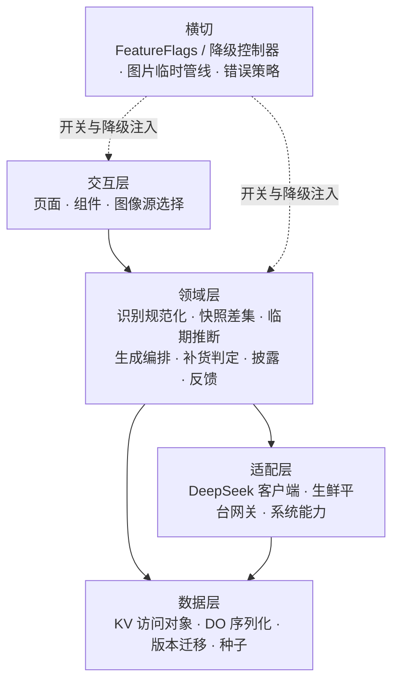
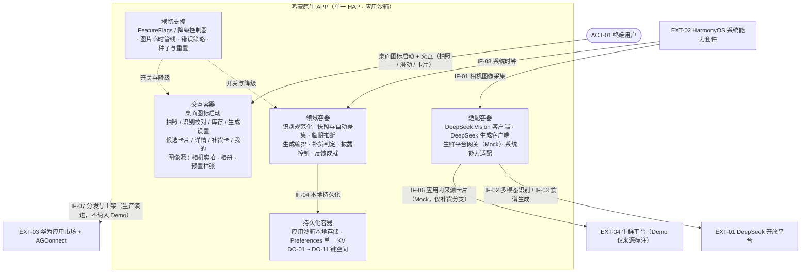
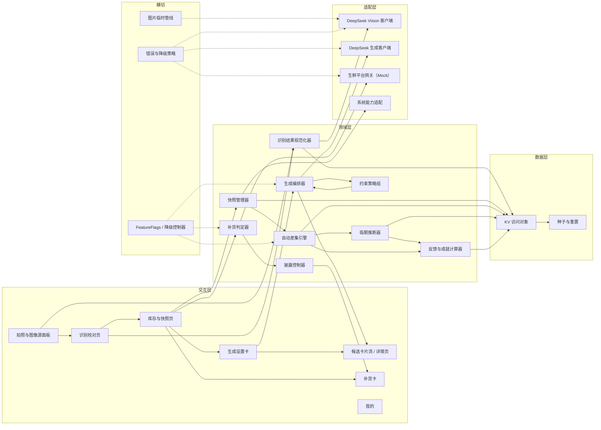
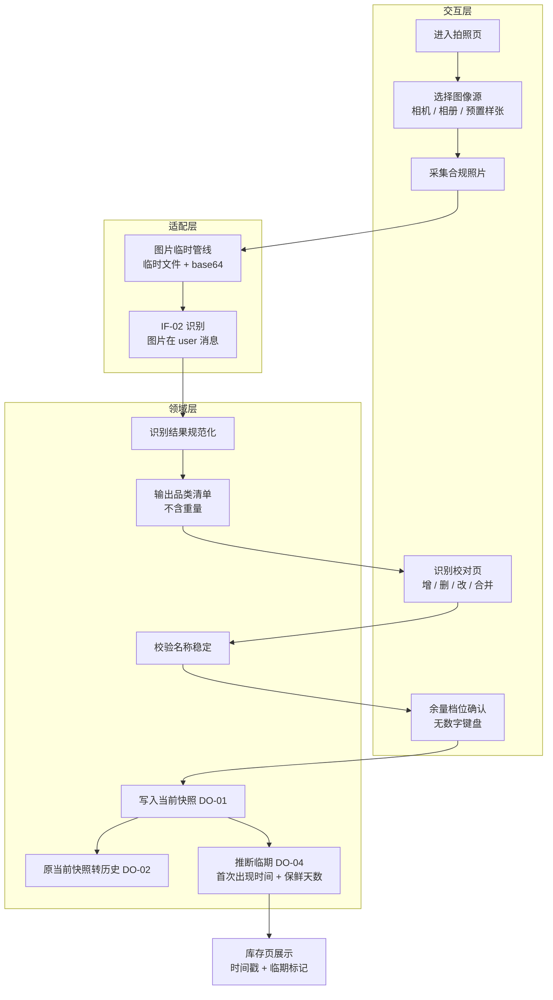
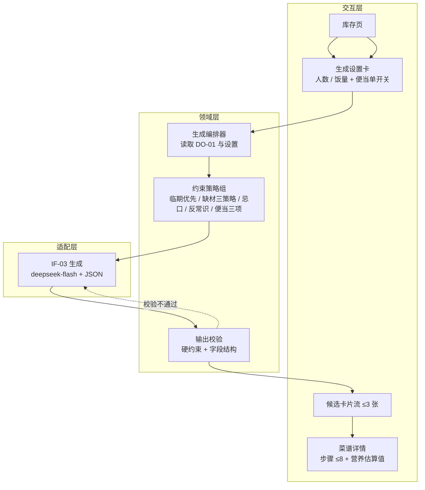
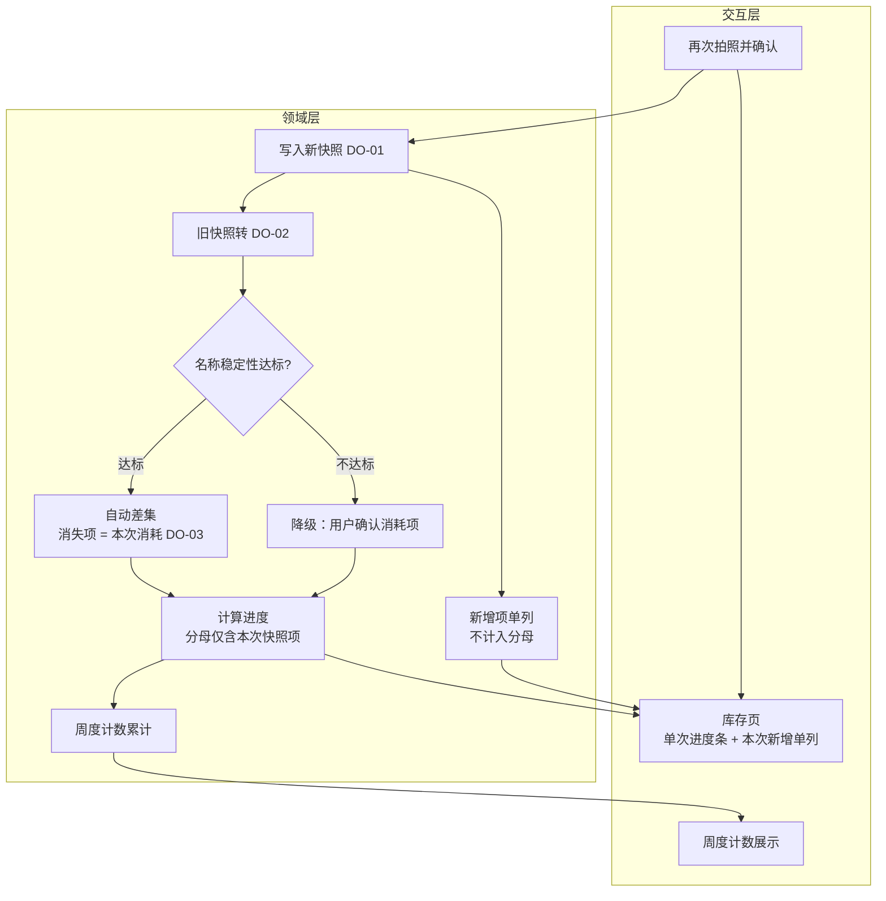
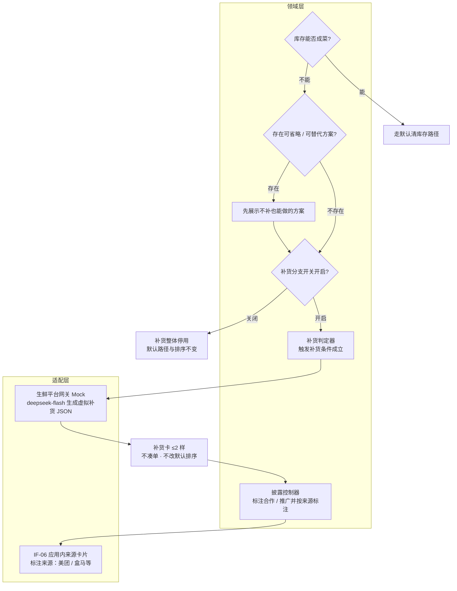
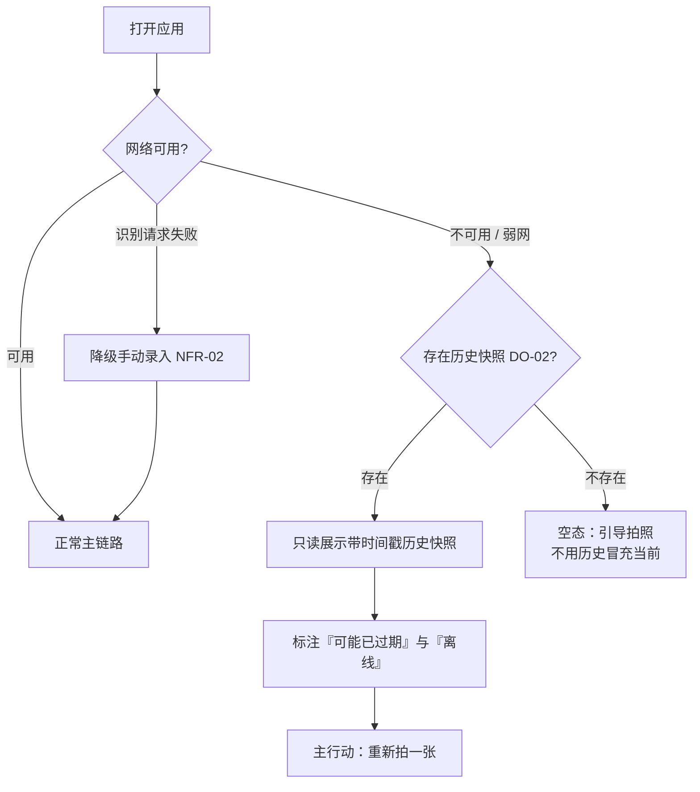
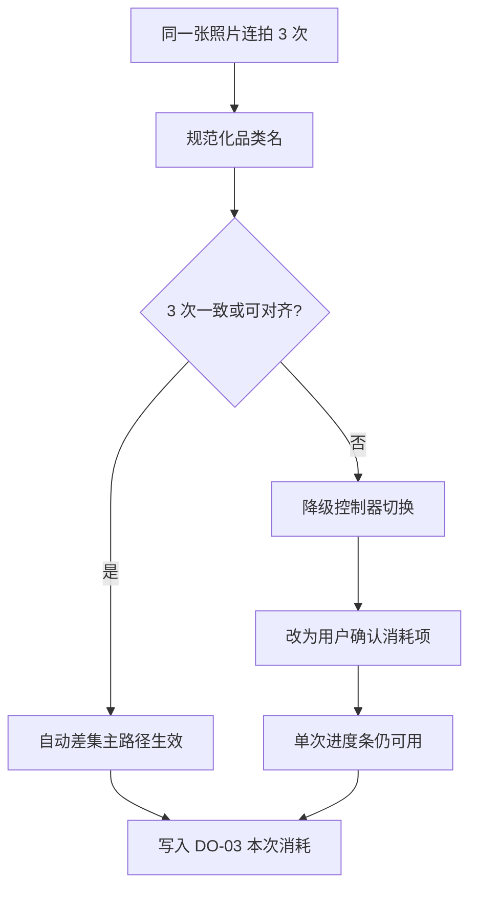

# 冰箱清库存食谱助手 · 架构设计说明书（第一版）

> 文档版本：**v0.2**
> 编制日期：2026-09-21
> 上游依据：`docs/需求规格说明书.md`（**v4.0**）、`docs/洞察报告.md`（**v4.0**）、`docs/系统设计说明书.md`（**v0.2**）、`requirements.md`、`web_results/E-05 可用多模态API`
> 上游边界文档：《系统设计说明书》（C4 L1：系统上下文与系统边界）
> 覆盖范围：容器视图（C4 L2）、组件视图（C4 L3）、数据模型、接口契约、关键流程、部署与运行、工程目录、需求追溯
> 不覆盖：系统上下文与系统边界的重新定义（沿用《系统设计说明书》§3 / §4/ §5 / §6）、具体业务代码实现

## 版本变更记录

| 版本 | 日期 | 变更摘要 | 变更依据 |
| --- | --- | --- | --- |
| v0.1 | 2026-09-18 | 首次产出：架构概览与原则、双方案容器视图（C4 L2）、共用逻辑组件视图（C4 L3）与装配差异、`DO-01 ~ DO-11` 本地数据模型、`IF-01 ~ IF-08` 接口契约（识别 / 生成 / 补货 Mock 三组 JSON 与 Prompt 约束）、六条关键流程、Demo 部署与生产演进、单一 entry HAP 工程目录、需求追溯与验证、风险与未决项 | `docs/系统设计说明书.md` v0.1 §8 承接清单、`docs/需求规格说明书.md` v3.0、`docs/洞察报告.md` v3.0、`web_results/E-05` |
| v0.2 | 2026-09-21 | ① 载体收敛为**鸿蒙原生 APP**，容器视图与部署改为单一形态；② 新增 **§2.4 交付范围：MVP → Demo**；③ 删除双方案边界差异与装配差异两节，删除「方案部署差异」节并同步章节号；④ 接口契约按应用沙箱、应用内来源卡片（Mock）、APP 上架改写；⑤ 删除「系统入口与卡片」接口行并释放其编号；⑥ 风险与未决项删除旧平台形态前置项，改写 Mock 替换风险 | 本轮载体收敛决策、`docs/系统设计说明书.md` v0.2、`web_results/E-05` |

---

## 1. 文档说明

### 1.1 目的

在《系统设计说明书》确定的系统上下文与边界之内，给出「冰箱清库存食谱助手」在 **Demo 基准**下可直接指导开发的架构分解：容器划分与职责、逻辑组件模型与协作、本地数据模型、接口契约与报文、关键流程、部署与运行形态、工程目录结构，并给出与上游需求编号的追溯关系。

本文承接《系统设计说明书》§8「后续迭代大纲」列出的 5 项输入（容器视图、组件视图、数据模型、接口契约、部署与运行）。

### 1.2 范围

- **本文件覆盖**：容器视图（C4 L2）、组件视图（C4 L3）、数据模型（存储结构、字段、键空间）、接口契约（请求 / 响应报文、错误码、降级语义）、关键流程、部署与运行、工程目录结构、需求追溯。
- **本文件不覆盖**：系统上下文与系统边界（参与者、外部系统、范围内外、信任边界，见《系统设计说明书》§3 ~ §5）、需求条目定义与验收用例（见《需求规格说明书》）、业务代码正文与 UI 高保真稿。

### 1.3 术语

需求侧术语（库存、本次快照、历史快照、自动差集、本次消耗、过期阈值、粗粒度余量、缺材宽容、补货分支、触发补货条件、便当场景开关、临期、识别名称稳定性、反常识组合）沿用 `docs/需求规格说明书.md` §1.3；边界侧术语（参与者、外部系统、外部接口、概念数据对象）沿用 `docs/系统设计说明书.md` §1.3 / §1.4。本文新增的架构侧用语（容器、逻辑组件、适配器、键空间、降级控制器）在首次出现处就地说明，不单独建立编号族。

### 1.4 编号与引用规范

- 需求引用一律沿用上游编号：`FR-xx`、`NFR-xx`、`RQ-xx`、`UC-xx`、`§x.y`。
- 边界与接口引用沿用《系统设计说明书》：`ACT-xx`、`EXT-xx`、`IF-xx`、`DO-xx`。
- 调研依据沿用 `web_results/` 文件名编号（如 `E-05`）与 `docs/洞察报告.md` 附录 A 来源编号（如 `A-18` / `A-27`）。
- 本文以**章节号**（§x.y）作为架构内容的追溯锚点；容器与逻辑组件以**名称**标识。**不新增、不修改任何上游编号族**，追溯表以章节号 ↔ `FR/NFR/IF/DO/RQ/UC` 组织。

---

## 2. 架构概览与原则

### 2.1 架构目标与约束

| # | 目标 / 约束 | 架构含义 | 来源 |
| --- | --- | --- | --- |
| 1 | Demo 双层基准 | 架构以 **Demo 基准**收敛；生产演进点（BFF / 网关、真实分佣、上架）单独标注，不进入 Demo 边界 | 《系统设计说明书》§2.1 |
| 2 | 无自建服务端 | 客户端直连 `deepseek-flash`（API Key 内置，仅演示用途）；不实现 BFF / 网关 | §2.3 决策 A-3 |
| 3 | 5 天交付 | 单一 entry HAP、源码分层、仅系统组件；P1 默认可放弃 | §2.3 决策 A-9 / A-12、`NFR-09` |
| 4 | 单一载体：鸿蒙原生 APP | 容器视图与部署各出一套；组件逻辑模型面向该载体统一，上架与真实分佣为生产演进 | §2.3 决策 A-2、《系统设计说明书》§2.3 |
| 5 | 零维护库存 | 拍照即覆盖、消耗自动推导；架构须保证自动差集为可独立降级的能力 | `FR-20`、`FR-24`、`FR-25`、`NFR-12` |
| 6 | 隐私本地优先 | 照片不落盘、临时文件即用即清、一键删除全部数据 | `NFR-04` |
| 7 | 补货隔离 | 补货分支与默认路径在代码与数据上双重隔离，关闭开关后默认结果不变 | `FR-26`、`FR-27`、`NFR-11` |

### 2.2 分层与依赖方向

逻辑依赖自外向内单向收敛：**交互层 → 领域层 → 数据层**，外部能力统一经**适配层**进入，横切能力以**降级控制器 / 开关**注入各层。



**依赖约束**：
- 交互层不直接调用外部接口，一切外部调用经适配层；页面不持有网络与存储细节。
- 领域层不感知具体页面，输出结构化结果（JSON 对象）供交互层渲染。
- 适配层对领域层暴露**稳定接口签名**；Demo 期由 Mock 实现，生产期替换真实实现而不改领域层调用点（见 §6.4）。
- 数据层仅负责键空间读写与序列化，不承载业务规则。

### 2.3 关键架构决策摘要

| # | 决策项 | 结论 |
| --- | --- | --- |
| A-1 | 交付与命名 | 本文档为《架构设计说明书》v0.1，编制日 2026-09-18；《系统设计说明书》中的下游引用同步指向本名称 |
| A-2 | 载体覆盖 | 单一载体（鸿蒙原生 APP）：容器视图（§3）、部署与运行（§8）各出一套；组件视图（§4.1 ~ §4.10）面向该载体统一展开 |
| A-3 | 服务端 | Demo 无自建服务端；客户端直连 `deepseek-flash`，API Key 内置，仅演示用途；生产预留 BFF / 网关，**不纳入 Demo 边界** |
| A-4 | 生鲜平台接入 | 客户端内适配器：定义生鲜平台网关接口，Mock 实现调用 `deepseek-flash` 生成**虚拟补货 JSON**；不连接真实生鲜平台、不做真实结算 |
| A-5 | 本地持久化 | **Preferences 单一 KV**：键值 + JSON 序列化承载 `DO-01 ~ DO-11` |
| A-6 | 演示运行环境 | 远程真机为主 + 本地模拟器为辅 |
| A-7 | 分发与上架 | Demo 不涉及分发与上架，本地 HAP / 远程真机运行；`IF-07` 仅作生产演进 |
| A-8 | 图像输入 | 抽象图像源：相机实拍 + 相册 / 预置样张导入；云真机 / 模拟器上用预置样张回退，标注为 Demo 输入回退，不改变 `FR-22` 主交互 |
| A-9 | 工程结构 | 单一 entry HAP + 源码分层目录，不引入 HSP / 多 HAP |
| A-10 | 文档深度 | 逻辑架构 + 接口契约 + 工程目录；含三组 JSON 契约与 Prompt 约束、工程目录树、关键流程；不写具体业务代码 |
| A-11 | 编号体系 | 不新增编号族；以章节号作追溯锚点，沿用 `IF-xx`、`DO-xx` 与 `FR/NFR/RQ/UC` |
| A-12 | 技术栈 | ArkTS + DevEco Studio（Stage 模型）；仅使用系统组件（延续 `NFR-09`），无自定义视觉资产 |

**补充约定（随决策落地）**：
- 冰箱照片**不落盘**：仅生成临时文件供识别使用，识别后清理；预置样张作为**只读资源**内置，不属用户数据；「一键删除全部数据」清空 KV 与临时缓存（满足 `NFR-04`）。
- 集中式开关：补货分支开关、省钱反馈开关、品质提示降级、自动差集降级（名称稳定性不达标时切「用户确认消耗项」）统一由 `FeatureFlags` / 降级控制器管理（对应 `NFR-06` / `NFR-11` / `NFR-12`）。
- Demo 种子：内置固定输入集（含「只剩葱姜蒜 + 大半块肉」触发用例、前后两张可差集快照），用于 `NFR-05` 回归一致性。

### 2.4 交付范围：MVP → Demo

> 本节只做**范围映射**，不改变既有 P0/P1/P2 口径（计数以《需求规格说明书》附录 A 为准）。

| 层级 | 范围 | 内容 |
| --- | --- | --- |
| **MVP** | 全部 P0（**27 条** = 18 FR + 9 NFR） | 拍照识别、结果校对、余量档位、临期标记、生成链路（缺材 / 便当 / 忌口 / 反常识 / 临期优先）、营养估算、无注册登录、无文本表单、快照有效期、名称稳定性等；缺则概念不成立 |
| **Demo** | MVP + 演示级 P1 | P1 中的 **FR-07 / FR-20 / FR-25 / FR-26 / FR-27**、**NFR-06 / NFR-09 / NFR-11** 以**演示级 / 走查级**覆盖（配合 `NFR-05` 演示剧本）；**FR-06 / FR-16 / FR-17 为时间余量项**，不列为 Demo 前提 |
| **P2** | 仅 UI | FR-19（省钱成就 / 周报）仅作 UI 展示，不计入 Demo 前提 |

- **Demo 前提**：MVP（P0 27 条）+ 上表演示级 P1 可稳定复现。
- **非 Demo 前提**：FR-06 / FR-16 / FR-17（时间余量项）；生产上架与真实跳转分佣（`IF-07` 与 `IF-06` 生产演进）。
- **演示形态**：本地 HAP 安装 + 应用内来源卡片（Mock），不依赖应用市场上架与真实外部接口。

---

## 3. 容器视图（C4 L2）

容器指可独立部署 / 运行、承载明确职责的运行时单元。Demo 期全部容器运行于**同一应用沙箱**内；「本地持久化容器」不独立成进程，代表沙箱内的持久化边界。

### 3.1 容器图与职责



**容器职责**

| 容器 | 职责 | 关键点 |
| --- | --- | --- |
| 交互容器 | 承载全部用户可见页面与交互；选择图像源；渲染库存 / 卡片 / 披露与来源标注 | 仅拍照、滑动、卡片选择，无必填文字表单（`FR-22`）；桌面图标启动 |
| 领域容器 | 识别结果规范化、快照覆盖、自动差集、临期推断、生成编排、补货判定、披露控制、反馈成就计算 | 与页面解耦，输出结构化对象；自动差集可独立降级 |
| 适配容器 | 封装全部外部调用：DeepSeek Vision / 生成、生鲜平台网关、系统能力 | 对领域层暴露稳定签名；Demo 期生鲜平台为 Mock 实现 |
| 持久化容器 | 应用沙箱内 Preferences 单一 KV 读写 `DO-01 ~ DO-11`，含 schema 版本与序列化 | 同一沙箱跨会话保留；卸载应用或删除数据即清除 |
| 横切支撑 | 集中开关与降级、图片临时管线、统一错误策略、Demo 种子与重置 | 补货分支关闭后默认路径不受影响（`NFR-11`） |

### 3.2 容器间交互

| # | 发起 → 接收 | 内容 | 通道 | 对应接口 / 需求 |
| --- | --- | --- | --- | --- |
| 1 | 交互容器 → 适配容器 | 请求相机采集 / 相册与样张导入 | 系统能力适配 | `IF-01`、`FR-01` |
| 2 | 适配容器 → DeepSeek | 上传图像 + 识别 Prompt，返回品类 JSON | HTTPS / REST | `IF-02`、`FR-01`、`NFR-01` |
| 3 | 交互容器 → 领域容器 | 校对结果、余量档位、生成设置、便当开关 | 进程内调用 | `FR-02`、`FR-04`、`FR-12`、`FR-13` |
| 4 | 领域容器 → 适配容器 | 生成 Prompt（含缺材 / 便当 / 忌口 / 反常识 / 临期） | HTTPS / REST | `IF-03`、`FR-09` ~ `FR-15` |
| 5 | 领域容器 ↔ 持久化容器 | 快照、历史、偏好、进度、省钱的读写 | KV 访问对象 | `IF-04`、`FR-20`、`FR-24`、`FR-25` |
| 6 | 领域容器 → 系统能力 | 时间戳与过期判断 | 系统时钟适配 | `IF-08`、`FR-24` |
| 7 | 领域容器 → 适配容器 | 补货分支 Mock 生成与**应用内来源卡片**展示（不拉起外部 App） | 网关接口（Mock） | `IF-06`、`FR-26`、`FR-27` |

### 3.3 本地存储容器与生命周期

- **沙箱边界**：应用分配独立 UID 与独立私有存储；本地 `Preferences` 数据在同一沙箱内**可跨会话保留**，**卸载应用或删除数据**后沙箱数据随之清除。
- **容器生命周期**：交互容器随启动创建、随退出销毁；领域容器无状态（状态全部落入持久化容器或当前会话内存）；持久化容器随沙箱存在，不依赖进程存活。
- **会话与持久的分界**：`DO-05`（候选食谱）、`DO-06`（便当开关）、`DO-11`（披露上下文）仅存活于当前会话内存；其余 `DO` 落入 KV。详见 §5.2。
- **容量上限未获取**：`Preferences` / 关系库单库容量上限**未获取**（需开发者账号登录），故数据模型按「小对象 + 单图不落盘」设计以规避容量依赖，具体上限数值不编造。

---

## 4. 组件视图（C4 L3）

### 4.1 逻辑分层总览

组件按 §2.2 的五层归位。组件以名称标识，不新增编号族。

| 层 | 组件 | 职责 |
| --- | --- | --- |
| 交互层 | 拍照与图像源面板 | 提供相机实拍 / 相册导入 / 预置样张三种图像源；触发采集 |
| 交互层 | 识别校对页 | 展示识别项，支持增、删、改与合并（`FR-02`） |
| 交互层 | 库存与快照页 | 展示当前快照、时间戳、过期标注、临期标记、余量档位（`FR-03`、`FR-24`） |
| 交互层 | 生成设置卡 | 人数 / 饭量选择 + 便当场景单开关（`FR-12`、`FR-13`） |
| 交互层 | 候选卡片流与详情页 | 单屏 ≤3 张卡片、横向切换、步骤 / 营养 / 缺材策略（`FR-15`、`FR-14`、`FR-18`） |
| 交互层 | 补货卡 | 仅补货分支内出现，≤2 样 + 合作 / 推广标注（`FR-26`、`FR-27`） |
| 交互层 | 我的 | 口味偏好 / 忌口、单次进度 + 周度计数、省钱徽章（`FR-16`、`FR-17`、`FR-19`、`FR-20`） |
| 领域层 | 识别结果规范化器 | 品类名归一（别名映射 + 品类表对齐），支撑 `NFR-12` |
| 领域层 | 快照管理器 | 快照覆盖、历史转存、时间戳与过期判定（`FR-24`、`FR-25`） |
| 领域层 | 自动差集引擎 | 对比前后快照，产出消失项 / 新增项（`FR-20`） |
| 领域层 | 临期推断器 | 首次出现时间 + 品类默认保鲜天数推断，允许覆盖（`FR-05`） |
| 领域层 | 生成编排器 | 组装约束、调用生成、校验输出、产出候选卡片（`FR-08` ~ `FR-15`） |
| 领域层 | 约束策略组 | 缺材三策略、便当三项、忌口、反常识、临期优先、人数 / 饭量 |
| 领域层 | 补货判定器 | 判定「是否存在可成菜组合」与触发条件（`FR-26`） |
| 领域层 | 披露控制器 | 补货分支内的合作 / 推广标注状态（`FR-27`、`NFR-11`） |
| 领域层 | 反馈与成就计算器 | 单次进度、周度计数、省钱累计与徽章 / 周报（`FR-19`、`FR-20`、`FR-07`） |
| 数据层 | KV 访问对象 | 键空间读写、JSON 序列化 / 反序列化、schema 版本校验 |
| 数据层 | 种子与重置 | Demo 固定输入集加载、一键删除全部数据 |
| 适配层 | DeepSeek Vision 客户端 | `IF-02` 请求组装与响应解析 |
| 适配层 | DeepSeek 生成客户端 | `IF-03` 请求组装与响应解析 |
| 适配层 | 生鲜平台网关接口 + Mock 实现 | `IF-06` 虚拟补货 JSON；与真实实现同签名 |
| 适配层 | 系统能力适配 | 相机权限、时钟、启动、应用内来源卡片展示 |
| 横切 | FeatureFlags / 降级控制器 | 补货分支、省钱反馈、品质降级、自动差集降级 |
| 横切 | 图片临时管线 | 临时文件生成、base64 编码、识别后清理 |
| 横切 | 错误与降级策略 | 超时、网络失败、JSON 解析失败、名称不稳定的统一处理 |



### 4.2 识别与校对

- **输入**：`IF-01` 采集的一张冰箱照片（相机实拍、相册导入或预置样张）。
- **处理**：图片临时管线生成临时文件 → base64 编码 → `IF-02` 请求（图片置于 `user` 消息）→ 解析结构化 JSON → 识别结果规范化器按品类表归一 → 交互校对。
- **输出**：品类项集合（**不含重量 / 克数**[`RQ-01`]），每项含品类名、归一后的品类键、置信度。
- **校验**：校对页支持增、删、改、合并；识别失败或超时进入手动录入（`NFR-02`），主链路不被阻断。
- **稳定性**：同一照片连续识别 3 次的品类名须一致或可规范化对齐（`NFR-12`），规范化器是达标手段之一（别名 / 单复数 / 别称映射）。

### 4.3 快照与自动差集

- **快照管理器**：用户确认后，将本次结果写为当前快照 `DO-01`（带 `capturedAt` / `confirmedAt` 与来源），原当前快照转存为历史快照 `DO-02`（只读，仅保留上一张）。过期判定读 `IF-08` 时钟，阈值取 `24h`（可配置，`FR-24`）。
- **自动差集引擎**：以**规范化品类键**为对齐主键，对 `DO-02` 与 `DO-01` 求差集：消失项 = 本次消耗（`DO-03`）；新增项记首次出现时间并单列展示，**不计入单次进度分母**（`FR-20`）。
- **抗噪**：差集只在两次快照均来自「用户确认」时执行；历史快照不参与任何计数（`FR-25`）。
- **降级**：名称稳定性不达标时（`NFR-12`），降级控制器将自动差集切换为「用户确认消耗项」，单次进度条仍可用（`FR-20` 降级路径），详见 §6.7 / §7.6。

### 4.4 临期推断

- 新增项写入 `DO-04`：记 `firstSeenAt`，按**品类默认保鲜天数**推断临期标记，允许用户一键覆盖。
- **不做** 350+ 食材保质期模板库、不做精确临期天数倒计时（`RQ-08`）。
- 临期项在库存列表视觉可区分，并在生成编排中被**优先使用**（`FR-05`、`FR-08`），排序支持「临期优先」（`FR-06`，P1）。

### 4.5 生成编排（缺材 / 便当 / 忌口 / 反常识 / 临期优先）

生成编排器按固定顺序组装约束并调用 `IF-03`：

1. **输入集**：当前快照 `DO-01` 的品类与粗粒度余量、人数 / 饭量（`FR-13`）、便当开关状态 `DO-06`（`FR-12`）、口味偏好与忌口 `DO-07`（`FR-10`、`FR-16`、`FR-17`）、临期标记 `DO-04`（`FR-08`）。
2. **硬约束**：不使用忌口食材（`FR-10`）、不产生反常识组合（`FR-11`）、步骤 ≤8 步（`FR-14`）；便当开关开启时同时施加「少汤水 / 适合二次加热 / 隔夜不变味」三项约束（`FR-12`）。
3. **软策略**：缺材三策略「可省略 / 可用替代品 / 需额外购买极少量且明确列出」，其中**「可省略」与「可用替代品」的展示优先顺序高于「需额外购买」**（`FR-09`）；「需购买」的处理统一引用 `FR-26`，不在默认路径产生购买引导。
4. **输出校验**：客户端校验模型输出满足硬约束与字段结构，不满足则重试或降级为缓存候选；临期项被使用比例、使用食材覆盖率纳入校验（`FR-08` 验收）。
5. **呈现**：候选以卡片流呈现，单屏 ≤3 张、可横向切换，卡片含菜名、耗时、所用库存食材、缺失食材标识、便当标签（只读）（`FR-15`）；详情含步骤（≤8）、营养三指标（须带「估算值」标注，`FR-18`）。

### 4.6 补货分支与 Mock 生鲜平台适配

- **触发**：补货判定器在库存**完全无法构成任何一道可执行菜**时置位（示例输入：只剩葱姜蒜 + 大半块肉，`FR-26`）；若存在「不补也能做」的可省略 / 可替代方案，须**先展示**该方案。
- **上限与隔离**：补货项 ≤2 样（暂定阈值，可配置）；补货卡**不得改变默认清库存结果的排序与展示**，不得引导凑单（`FR-26`、`RQ-02`、`NFR-11`）。
- **适配器**：领域层仅依赖生鲜平台网关接口签名；Demo 由 **Mock 实现**调用 `deepseek-flash` 生成**虚拟补货 JSON**（见 §6.4），并在应用内以**来源卡片**呈现（**标明来源：美团 / 盒马等**），**不拉起外部 App、不调真实 API、不做真实结算**（`A-4`）。
- **同构性**：Mock 与真实实现对领域层**同签名**，生产替换不改调用点。真实分佣口径为美团联盟 CPS **3%–6%**，单笔约 **0.45–1.8 元/单**，属生产演进。

### 4.7 披露与隔离

- 披露控制器在补货分支内维护合作 / 推广标注状态 `DO-11`，**来源卡片展示前**可见标注并标明来源（`FR-27`）。
- **隔离**：**来源卡片入口仅存在于补货分支**；默认路径中不存在任何来源卡片或推广元素（`NFR-11`）；关闭补货分支后，该卡片与标注完全消失，默认清库存路径与结果排序不变（`UC-29`、`UC-31`）。
- 披露状态仅存活于补货分支生命周期，不写入持久化（见 §5.2）。

### 4.8 反馈与成就

- **单次进度**：分母仅含**本次快照**库存项，补货买入显示为「本次新增」且不计入分母；不出现任何可能为负数的净值指标（`FR-20`）。
- **周度计数**：纯事件累计，按周滚动，不依赖库存连续性；历史快照不参与计数（`FR-20`）。
- **省钱累计**：以「相比点外卖省下的钱」口径累计，仅以徽章 / 周报克制呈现，**不出现在启动弹窗或首页首屏核心位置**，无主动推送（`FR-19`、`RQ-07`）；省钱反馈可整体关闭而不影响主链路（`NFR-06`）。
- **品质提示**：对指定食材给出**建议性**文案，不得输出「已变质」等确定性结论；算法不可用时降级为固定规则文案（`FR-07`、`NFR-08`）。

### 4.9 平台能力适配（相机 / 存储 / 时钟 / 来源卡片）

| 能力 | 适配内容 | 约束 |
| --- | --- | --- |
| 相机 | `IF-01`；`module.json5` 声明 `ohos.permission.CAMERA`，运行时动态申请授权 | 与普通应用一致，非自由无限制调用 |
| 本地存储 | `IF-04`；应用沙箱内 Preferences 单一 KV（`A-5`） | 同沙箱跨会话保留；卸载应用或删除数据即清除；容量上限**未获取** |
| 时钟 | `IF-08`；快照时间戳与 `24h`（可配置）过期判断 | 以系统时钟为准 |
| 来源卡片 | `IF-06`；**应用内来源卡片（Mock）**，标明来源（美团 / 盒马等）与合作 / 推广性质 | 仅补货分支内；不拉起外部 App、不调真实 API；生产演进为真实跳转 |

图像源抽象：相机实拍 + 相册 / 预置样张导入；云真机 / 模拟器无实物冰箱时使用**预置样张回退**，标注为 Demo 输入回退，不改变 `FR-22` 主交互（`A-8`）。

### 4.10 降级与开关

| 开关 / 降级 | 触发 | 行为 | 对应需求 |
| --- | --- | --- | --- |
| 补货分支开关 | 手动 | 关闭后补货判定与披露整体停用，默认路径与排序不变 | `NFR-11`、`UC-29` |
| 省钱反馈开关 | 手动 | 关闭后主链路完整可用 | `NFR-06`、`UC-23` |
| 品质提示降级 | 算法不可用（默认预期） | 切固定规则文案库 | `FR-07`、`NFR-08`、`UC-24` |
| 自动差集降级 | 名称稳定性不达标 | 切「用户确认消耗项」，进度条仍可用 | `NFR-12`、`FR-20`、`UC-33` |
| 识别失败降级 | 超时 / 网络失败 / 解析失败 | 进入手动录入，主链路继续 | `NFR-02`、`UC-20` |
| 离线降级 | 无网 / 弱网 | 展示带时间戳历史快照（只读），标「可能已过期」与「离线」 | `NFR-03`、`UC-21` |

> 全部开关由横切 `FeatureFlags` / 降级控制器集中管理；开关状态与业务数据分离，便于回归对比（`NFR-05`）。

> 全部组件面向**鸿蒙原生 APP**单一载体装配：桌面图标启动、应用沙箱持久化、无平台级卡片 / 意图组件；上架走应用市场（生产演进）。

---

## 5. 数据模型

### 5.1 设计原则

1. **单一 KV + JSON**：全部 `DO-01 ~ DO-11` 以键值 + JSON 序列化承载于 Preferences（`A-5`），不引入关系库 / 对象库，降低 5 天交付与容量依赖风险。
2. **版本字段**：顶层维护 `store.schema.version`，每个对象带 `schemaVersion`，读取时校验并执行迁移（§6.5）。
3. **隐私最小化**：照片**不落盘**；照片仅在识别调用期间以临时文件 / 内存形式存在，识别后清理；预置样张为只读资源，不属用户数据（`NFR-04`、`RQ-08`）。
4. **会话与持久分离**：仅需跨会话保留的对象落 KV；单次会话对象（候选、便当开关、披露上下文）留在内存。
5. **可重置**：任一 Demo 环境可一键恢复到固定输入集，保证 `NFR-05` 回归一致性。

### 5.2 实体清单：`DO-01 ~ DO-11` → 键空间、结构、生命周期

| 编号 | 名称（沿用《系统设计说明书》§6） | KV 键 | 主要字段 | 生命周期 | 跨会话 |
| --- | --- | --- | --- | --- | --- |
| DO-01 | 当前库存快照 | `snapshot.current` | `schemaVersion`、`capturedAt`、`confirmedAt`、`source`、`items[]{id,category,normalizedKey,remaining,isExpiring,firstSeenAt}` | 至下一次快照覆盖；超 `24h`（可配置）标「可能已过期」 | 是 |
| DO-02 | 历史快照（只读） | `snapshot.history` | 同 `DO-01` 结构（仅保留上一张） | 至下一轮覆盖或用户删除全部数据 | 是 |
| DO-03 | 本次消耗（自动差集结果） | `diff.last` | `computedAt`、`fromSnapshotAt`、`toSnapshotAt`、`consumed[]`、`added[]` | 随对应快照更新 | 是 |
| DO-04 | 临期推断项 | `expiry.inferred` | `itemId`、`firstSeenAt`、`defaultShelfLifeDays`、`inferredExpiring`、`overridden` | 随快照更新；可被用户覆盖 | 是 |
| DO-05 | 候选食谱 / 卡片 | 会话内存（`recipe.candidates`） | `recipes[]{name,minutes,uses[],missing[],bento,steps[],nutrition}` | 单次会话内有效 | 否 |
| DO-06 | 便当场景开关状态 | 会话内存（`feature.bento`） | `enabled` | 至本次生成结束或用户关闭 | 否 |
| DO-07 | 口味偏好 / 忌口清单 | `pref.taste`、`pref.avoid` | `taste[]`、`avoid[]{contact,items[]}` | 长期，至用户修改或删除 | 是 |
| DO-08 | 消耗进度与周度计数 | `progress.counters` | `lastSingleProgress{done,total}`、`weekKey`、`weeklyConsumedCount` | 单次进度随快照刷新；周度按周滚动 | 是 |
| DO-09 | 省钱累计（徽章 / 周报） | `savings.ledger` | `totalSaved`、`badges[]`、`weeklyReports[]` | 长期，用户可主动查看 | 是 |
| DO-10 | 匿名会话标识（本地） | `session.anon` | `sessionId`、`createdAt` | 与本地沙箱一致；卸载应用或删除数据即清除 | 是 |
| DO-11 | 商业化披露上下文 | 会话内存（`commerce.disclosure`） | `triggered`、`disclosureShown`、`partner`、`commission` | 仅补货分支生命周期内有效 | 否 |

**辅助键**：`store.schema.version`（整库 schema 版本）、`demo.seed.version`（当前种子版本，用于重置）。

**结构示例（`DO-01`）**：

```json
{
  "schemaVersion": 1,
  "capturedAt": "2026-09-24T10:12:00+08:00",
  "confirmedAt": "2026-09-24T10:13:20+08:00",
  "source": "camera",
  "items": [
    { "id": "i-001", "category": "西红柿", "normalizedKey": "tomato", "remaining": "半盒", "isExpiring": true, "firstSeenAt": "2026-09-22T18:30:00+08:00" }
  ]
}
```

> 粗粒度余量为档位字符串（如 少量 / 半盒 / 快没了 / 满），**不存重量数值**（`RQ-01`）；`source` 取 `camera` / `album` / `preset`（预置样张回退，`A-8`）。

### 5.3 快照覆盖与自动差集算法、名称规范化

**覆盖规则**：确认新快照时，`snapshot.history := snapshot.current`，`snapshot.current := 新快照`；历史仅保留一张。

**自动差集算法**（对齐 `FR-20`）：

```
输入：prev = DO-02.items，next = DO-01.items，键 = normalizedKey
1. 规范化：对两边的 category 应用别名 / 别称 / 单复数映射，得到 normalizedKey
2. consumed = { x ∈ prev | x.normalizedKey ∉ next.keys }        // 消失项 = 本次消耗
3. added    = { y ∈ next | y.normalizedKey ∉ prev.keys }         // 新增项，记 firstSeenAt
4. added 中的补货买入项 归入「本次新增」单列，不计入进度分母
5. 单次进度：done = |consumed|，total = |next.items|（分母仅含本次快照项）
6. 周度计数 += |consumed|（纯事件累计，历史快照不参与）
7. 若名称稳定性未达标 → 跳过 2，改由用户在 consumed 中确认（降级路径）
```

**名称规范化**（`NFR-12` 达标手段）：
- 归一策略：去除空白与全角 / 半角差异 → 别名映射（如 西红柿 / 番茄 → 同一品类键）→ 单复数与「个 / 只 / 把」等量词剥离 → 对齐内置品类表。
- 判据：同一照片连拍 3 次，输出品类名集合一致或规范化后对齐（`NFR-12`、`UC-33`）。
- 不达标时由降级控制器切「用户确认消耗项」（§4.10、§7.6）。

### 5.4 图片处理与「一键删除」策略

- **不落盘**：照片仅在识别调用期间生成临时文件 / 内存编码；`IF-02` 返回后由图片临时管线清理，不进入 KV（`NFR-04`）。
- **预置样张**：作为 `rawfile` **只读资源**内置，用于云真机 / 模拟器回退与 `NFR-05` 固定输入集；不属用户数据，一键删除不涉及。
- **首次上传明示**：首次调用 `IF-02` 前明示用途；由交互层在调用前插入确认（`NFR-04`）。
- **一键删除全部数据**：清空整库 KV（`snapshot.*`、`diff.*`、`expiry.*`、`pref.*`、`progress.*`、`savings.*`、`session.*`）与临时缓存目录；**不留照片、库存、历史快照残留**（`NFR-04`、`UC-22`）。
- **容量规避**：因 `Preferences` 容量上限**未获取**（需开发者账号登录），数据模型仅存小对象且不存图片；上限数值不编造。

### 5.5 Demo 种子与重置

**固定输入集（种子）**，用于 `NFR-05` 回归一致性：

| 种子 | 内容 | 用途 |
| --- | --- | --- |
| 完整库存种子 | 含 ≥5 种常见食材的预置样张 + 已确认快照 | 主力路径（做饭前盘点 → 生成，`UC-01`、`UC-13`） |
| 补货触发种子 | 「只剩葱姜蒜 + 大半块肉」的库存 | 补货分支（`FR-26`、`UC-28`） |
| 差集前后对种子 | 前后两张可比对快照（第二次减少部分食材） | 自动差集（`FR-20`、`UC-32`） |
| 历史快照种子 | 带时间戳的上一张快照（本次未拍摄） | 场景 3 与离线（`FR-25`、`NFR-03`、`UC-30`） |

**重置动作**：写入 `demo.seed.version` 对应的固定输入集，并清除临时文件；重置为显式操作，供演示前准备与回归对比。

---

## 6. 接口契约

### 6.1 接口总览（`IF-01 ~ IF-08` → 调用层与 Demo / 生产基准）

| 编号 | 接口 | 调用层 | Demo 基准 | 生产基准 | 关键约束 |
| --- | --- | --- | --- | --- | --- |
| IF-01 | 相机图像采集 | 适配层（系统能力） | 相机实拍 + 相册 / 预置样张回退 | 同 | `module.json5` 声明 `ohos.permission.CAMERA` + 运行时授权 |
| IF-02 | 多模态识别 | 适配层（DeepSeek Vision） | 客户端直连 | 经 BFF / 网关（生产演进） | `deepseek-flash`；**单图固定 ≤1024 token**；图片**只能放在 `user` 消息**；格式 JPEG / PNG / GIF / WebP；`detail:low` 压到 512×512，**冰箱全景照慎用 `detail:low`**；JSON Output |
| IF-03 | 食谱生成 | 适配层（DeepSeek 生成） | 客户端直连 | 经 BFF / 网关（生产演进） | 同一 `deepseek-flash`；结构化 JSON；缺材 / 便当 / 忌口 / 反常识 / 临期约束 |
| IF-04 | 本地持久化 | 数据层 | 应用沙箱 Preferences 单一 KV | 同（可扩展关系库） | 同沙箱跨会话；卸载应用或删除数据即清除 |
| IF-06 | 生鲜平台来源卡片 | 适配层（生鲜网关） | 应用内来源卡片（Mock，标明来源：美团 / 盒马等） | 真实联盟接入与跳转分佣 | 仅补货分支；展示前标注来源与合作 / 推广；不拉起外部 App；CPS **3%–6%** |
| IF-07 | 分发与上架 | 构建产物（生产） | **不纳入 Demo** | 软著 + 工信部备案 **15–20 工作日** + 华为审核 3–5 工作日 | Demo 以本地 HAP 安装为主；上架为生产路径 |
| IF-08 | 系统时钟 | 数据层 / 领域层（系统能力） | 系统时钟 | 同 | 时间戳与 `24h`（可配置）过期阈值 |

### 6.2 识别契约（Prompt 约束 + 请求 / 响应 JSON + 错误码）

**Prompt 约束（客户端组装的 `user` 消息文本）**：

- 角色：你是冰箱食材识别助手，只输出结构化 JSON，不输出解释文字。
- 输入：一张冰箱内部照片，可能存在遮挡、堆叠、包装。
- 任务：输出**食材品类清单**；**禁止输出任何重量 / 克数 / 份量数字**（`RQ-01`）。
- 归一：同一食材使用统一常用名，避免同物多名（服务于 `NFR-12`）。
- 输出：严格 JSON，符合下方 schema；无法确认的项可省略。

**请求（示意）**：

```json
{
  "model": "deepseek-flash",
  "messages": [
    {
      "role": "user",
      "content": [
        { "type": "text", "text": "<识别 Prompt 约束>" },
        { "type": "image_url", "image_url": { "url": "data:image/jpeg;base64,<...>", "detail": "high" } }
      ]
    }
  ],
  "response_format": { "type": "json_object" },
  "temperature": 0.2
}
```

> 图片**必须位于 `user` 消息**；置于 `system` / `assistant` 会返回 400（`E-05` §三）。全景照**不使用** `detail:low`，避免 512×512 压缩漏掉小件食材。

**响应（严格 JSON）**：

```json
{
  "items": [
    { "category": "西红柿", "confidence": 0.92 },
    { "category": "鸡蛋", "confidence": 0.88 }
  ],
  "notes": "存在遮挡，可能漏识别"
}
```

**错误码与处理**：

| 错误 | 触发 | 处理 |
| --- | --- | --- |
| `IF02_400_IMAGE_POSITION` | 图片不在 `user` 消息 | 修正请求后重试一次；仍失败进入手动录入 |
| `IF02_408_TIMEOUT` | 超过 `NFR-01` 时限（≤5s，P90） | 降级手动录入（`NFR-02`） |
| `IF02_PARSE_ERROR` | 响应非合法 JSON | 重试一次；仍失败降级手动录入 |
| `IF02_429_RATE_LIMIT` | 并发 / 频率受限 | 退避重试；提示稍后重试 |
| `IF02_5XX` | 服务端异常 | 降级手动录入 |

### 6.3 生成契约（Prompt 约束 + 响应 JSON）

**Prompt 约束（客户端组装）**：

- 输出严格 JSON，不输出解释文字；每道菜步骤 ≤8 步、单步单一动作（`FR-14`）。
- **临期优先**：存在临期项时至少一道菜使用临期项（`FR-08`）。
- **缺材宽容**：缺失项须给出策略，取值 `可省略` / `可用替代品` / `需额外购买`；前两者优先展示；「需额外购买」统一引用 `FR-26`（`FR-09`）。
- **忌口硬约束**：忌口食材出现次数为 0（`FR-10`）。
- **反常识硬约束**：不产生明显反常识搭配（`FR-11`）。
- **便当约束**：开关开启时同时满足「少汤水 / 适合二次加热 / 隔夜不变味」（`FR-12`）。
- **人数 / 饭量**：按所选人数与饭量调整用量描述（`FR-13`）。
- **营养**：给出热量 / 蛋白质 / 碳水三项，作为估算值（前端须显著标注「估算值」，`FR-18`）。

**请求（示意）**：

```json
{
  "model": "deepseek-flash",
  "messages": [
    { "role": "user", "content": [ { "type": "text", "text": "<生成 Prompt 约束 + 库存与设置>" } ] }
  ],
  "response_format": { "type": "json_object" },
  "temperature": 0.7
}
```

**响应（严格 JSON）**：

```json
{
  "recipes": [
    {
      "name": "西红柿炒鸡蛋",
      "minutes": 15,
      "uses": ["西红柿", "鸡蛋"],
      "missing": [ { "name": "葱", "strategy": "可省略" } ],
      "bento": { "soupFree": true, "reheatOk": true, "overnightOk": true },
      "steps": ["鸡蛋打散", "热锅下油", "..."],
      "nutrition": { "kcal": 320, "proteinG": 18, "carbG": 30 }
    }
  ]
}
```

### 6.4 生鲜平台 Mock 契约（网关接口 + 虚拟补货 JSON + 同构性）

**网关接口（领域层依赖的稳定签名）**：

```
interface FreshPlatformGateway {
  buildReplenishment(input: ReplenishmentInput): Promise<ReplenishmentResult>
  showSourceCard(items: ReplenishmentItem[]): Promise<void>   // 应用内展示来源卡片，仅补货分支调用；不拉起外部 App
}
```

**输入**：

```json
{
  "trigger": "no_executable_dish",
  "inventory": [ { "category": "葱", "remaining": "少量" } ],
  "maxItems": 2
}
```

**Mock 实现**：调用 `deepseek-flash`（复用 `IF-03` 通道）生成**虚拟补货 JSON**；**不连接真实生鲜平台、不做真实结算**（`A-4`）。

**输出（虚拟补货 JSON）**：

```json
{
  "replenishment": {
    "items": [ { "category": "青菜", "reason": "缺少主料配菜", "quantityHint": "一小把" } ],
    "count": 1,
    "substituteShown": true,
    "sources": [ "美团", "盒马" ],
    "disclosure": { "partner": "美团联盟", "commission": "3%–6%" }
  }
}
```

**契约约束**：
- `count ≤ 2`（暂定阈值，可配置）；不得引导凑单，不得改变默认清库存结果的排序（`FR-26`、`RQ-02`、`NFR-11`）。
- 仅当触发补货条件成立时调用；若存在可省略 / 可替代方案，须先展示（`FR-26`）。
- **来源卡片仅在补货分支内展示**，展示前须给出 `disclosure` 标注并标明 `sources`（如美团 / 盒马等）（`FR-27`）；`showSourceCard` 仅在补货分支内被调用，且**不拉起外部 App、不调真实 API**。
- **同构性**：真实适配器实现同一 `FreshPlatformGateway` 签名；Demo 期 Mock 与生产期真实实现（真实跳转分佣）可无侵入替换。真实分佣口径美团联盟 CPS **3%–6%**，单笔 **0.45–1.8 元/单**，属生产演进。
- **未获取项**：盒马 / 叮咚可接入口径未获取，仅美团联盟为公开可接入口径。

### 6.5 本地持久化契约（KV schema 与版本迁移）

- **读写签名**：`get<T>(key)` / `put<T>(key, value)` / `remove(key)` / `clearAll()`；值一律为 JSON 字符串。
- **顶层版本**：`store.schema.version`（整数）。每个对象含 `schemaVersion`。
- **读取流程**：读 `store.schema.version` → 若低于当前版本，按迁移链逐级升级 → 回写；对象缺失时返回空态（不伪造库存，`FR-03` / `FR-24`）。
- **迁移策略**：迁移函数按版本递增、幂等；迁移失败时保守处理（清空该对象并回退空态），不阻断主链路。
- **删除接口**：`clearAll()` 由「一键删除全部数据」调用，清空全部键并清理临时缓存（`NFR-04`）。
- **未获取项**：Preferences / 关系库单库容量上限**未获取**（需开发者账号登录），不设具体数值约束。

### 6.6 系统能力接口（相机权限、时钟、来源卡片）

| 接口 | 调用方式 | 契约要点 |
| --- | --- | --- |
| 相机 | Camera Kit + `module.json5` 声明 `ohos.permission.CAMERA` | 运行时动态申请；拒绝授权时回退相册 / 预置样张 |
| 时钟 | 系统时钟 API（`IF-08`） | 提供当前时间；用于时间戳与 `24h`（可配置）过期判断 |
| 来源卡片 | 应用内卡片（`IF-06`，Mock 网关） | 仅补货分支内调用；展示前显示来源（美团 / 盒马等）与合作 / 推广标注；不拉起外部 App |

### 6.7 失败与降级语义

| 场景 | 判定 | 降级行为 | 需求 |
| --- | --- | --- | --- |
| 识别超时 | 超过 ≤5s（P90） | 进入手动录入，主链路继续 | `NFR-01`、`NFR-02` |
| 网络失败 | 请求异常 / 无网 | 离线：展示带时间戳历史快照（只读），标「可能已过期」与「离线」，引导「重新拍一张」 | `NFR-03` |
| JSON 解析失败 | 响应非合法 JSON | 识别：重试一次后手动录入；生成：重试或回退缓存候选 | `NFR-02` |
| 名称不稳定 | 连拍 3 次不可对齐 | 自动差集切「用户确认消耗项」，进度条仍可用 | `NFR-12`、`FR-20` |
| 品质算法不可用 | 默认预期 | 切固定规则文案库 | `NFR-08` |
| 补货分支关闭 | 开关关闭 | 补货判定与披露整体停用，默认路径与排序不变 | `NFR-11` |
| 省钱反馈关闭 | 开关关闭 | 主链路完整可用 | `NFR-06` |

---

## 7. 关键流程

以下流程均以 `flowchart` 描述；泳道以 `subgraph` 表示。

### 7.1 首次盘点建快照



### 7.2 生成主链路



### 7.3 第二次拍照自动差集



### 7.4 补货触发与应用内来源卡片披露



### 7.5 弱网离线降级



### 7.6 名称稳定性校验与降级切换



---

## 8. 部署与运行

### 8.1 Demo 部署（本地 HAP + 远程真机为主 + 模拟器为辅）

| 项 | 内容 |
| --- | --- |
| 构建 | DevEco Studio（Stage 模型），单一 entry HAP；debug 签名 |
| 安装 | 本地 HAP 安装；评审者在演示设备上无需指导即可完成一次完整链路（`NFR-10`） |
| 运行环境 | **远程真机为主**（`A-6`），本地模拟器为辅；两者共用同一 HAP |
| 图像源回退 | 云真机 / 模拟器使用**预置样张**回退（`A-8`），标注为 Demo 输入回退 |
| 网络 | 直连 DeepSeek 开放平台；离线时走 `NFR-03` 降级 |
| 数据准备 | 演示设备预置 §5.5 的固定输入集（完整库存 / 补货触发 / 差集前后对 / 历史快照） |

### 8.2 生产演进（BFF / 网关外延、真实生鲜适配器、`IF-07` 上架）——**不纳入 Demo 边界**

- **BFF / 网关**：收敛 API Key 与调用治理，`IF-02` / `IF-03` 由客户端直连改为经网关；客户端调用签名保持稳定（生产演进点）。
- **真实生鲜适配器**：实现 `FreshPlatformGateway` 同签名，接入美团联盟 CPS **3%–6%**，完成**真实跳转分佣结算**；**Demo 不连接、不结算**。
- **分发与上架**：`IF-07` 走软著（30–60 工作日）+ 工信部 APP 备案（**15–20 工作日**，不可压缩）+ 华为技术审核（3–5 工作日）。
- **账号与跨端同步**：如需跨端，生产引入账号与服务端留存；Demo 无账号体系。

### 8.3 配置与密钥管理（API Key 内置为 Demo 限制）

| 项 | Demo 处理 | 生产处理 |
| --- | --- | --- |
| API Key | **内置客户端，仅演示用途**——记为信任边界内的 Demo 限制 | 收敛至 BFF / 网关，客户端不持有 |
| 接口地址 | 指向 DeepSeek 开放平台 | 指向自建网关 |
| 过期阈值 | `24h`（可配置） | 可配置策略 |
| 开关 | `FeatureFlags` / 降级控制器集中管理 | 可远程下发 |
| 种子版本 | `demo.seed.version` | 不适用 |

---

## 9. 工程目录结构

单一 entry HAP + 源码分层（`A-9`），仅系统组件（`A-12`、`NFR-09`）。

```
entry/
├── src/main/
│   ├── ets/
│   │   ├── entryability/               # Stage 模型 Ability 入口
│   │   │   └── EntryAbility.ets
│   │   ├── pages/                      # 页面（交互层）
│   │   │   ├── CapturePage.ets         #   拍照 / 图像源
│   │   │   ├── ReviewPage.ets          #   识别校对
│   │   │   ├── InventoryPage.ets       #   库存与快照
│   │   │   ├── GeneratePage.ets        #   生成设置卡
│   │   │   ├── RecipeListPage.ets      #   候选卡片流
│   │   │   ├── RecipeDetailPage.ets    #   菜谱详情
│   │   │   ├── ReplenishPage.ets       #   补货卡
│   │   │   └── ProfilePage.ets         #   我的
│   │   ├── view/                       # 可复用界面组件（系统组件拼装）
│   │   ├── domain/                     # 领域层
│   │   │   ├── recognition/            #   识别结果规范化
│   │   │   ├── inventory/              #   快照管理器
│   │   │   ├── diff/                   #   自动差集引擎
│   │   │   ├── expiry/                 #   临期推断
│   │   │   ├── generation/             #   生成编排 + 约束策略组
│   │   │   ├── replenishment/          #   补货判定 + 披露控制
│   │   │   └── feedback/               #   进度 / 周度 / 省钱
│   │   ├── data/                       # 数据层
│   │   │   ├── kv/                     #   KV 访问对象 + 版本迁移
│   │   │   ├── model/                  #   DO-01 ~ DO-11 序列化模型
│   │   │   └── seed/                   #   Demo 种子与重置
│   │   ├── adapter/                    # 适配层
│   │   │   ├── deepseek/               #   Vision 客户端 + 生成客户端
│   │   │   ├── fresh/                  #   生鲜平台网关接口 + Mock 实现
│   │   │   └── system/                 #   相机 / 时钟 / 来源卡片
│   │   ├── common/                     # 横切
│   │   │   ├── flags/                  #   FeatureFlags / 降级控制器
│   │   │   ├── imagepipe/              #   图片临时管线
│   │   │   └── errors/                 #   错误与降级策略
│   │   └── prompts/                    # Prompt 模板（识别 / 生成 / 虚拟补货）
│   ├── resources/
│   │   ├── base/
│   │   │   ├── element/                #   字符串 / 颜色 / 尺寸
│   │   │   └── media/                  #   仅系统图标，无自定义视觉资产
│   │   └── rawfile/
│   │       └── samples/                #   预置样张（只读资源）
│   └── module.json5                    # 声明 ohos.permission.CAMERA 等
└── oh-package.json5
```

**命名规范**：
- 页面：`XxxPage.ets`；组件：`XxxView.ets`；领域模块：按能力目录组织、文件名词首小写。
- 模型：与 `DO-xx` 一一对应的接口 / 类，文件名与实体名一致（如 `CurrentSnapshot.ets`）。
- Prompt 模板集中在 `prompts/`，与 §6 契约一一对应，便于回归比对。

**`module.json5` 要点**：声明 `ohos.permission.CAMERA`；生产上架时由 AGConnect 完成签名与审核（Demo 使用 debug 签名与本地 HAP 安装）。

**预置样张目录**：`resources/rawfile/samples/`，对应 §5.5 的固定输入集，只读、不属用户数据。

---

## 10. 需求追溯与验证

### 10.1 架构章节 ↔ 需求 / 接口 / 数据对象

| 架构章节 | 覆盖需求 | 关键接口 / 数据对象 | 验收锚点 |
| --- | --- | --- | --- |
| §4.2 识别与校对 | FR-01、FR-02、NFR-01、NFR-02、NFR-12 | IF-01、IF-02、DO-01 | UC-01 ~ UC-03、UC-19、UC-20、UC-33 |
| §4.3 快照与自动差集 | FR-20、FR-24、FR-25、NFR-12 | IF-04、IF-08、DO-01 ~ DO-03、DO-08 | UC-04、UC-16、UC-30、UC-32、UC-33 |
| §4.4 临期推断 | FR-05、FR-06、FR-08 | DO-04 | UC-06 |
| §4.5 生成编排 | FR-08 ~ FR-15、FR-18 | IF-03、DO-05、DO-06、DO-07 | UC-06 ~ UC-14 |
| §4.6 补货与 Mock | FR-26、RQ-02 | IF-06、网关接口 | UC-28 |
| §4.7 披露与隔离 | FR-27、NFR-11 | IF-06、DO-11 | UC-29、UC-31 |
| §4.8 反馈与成就 | FR-07、FR-19、FR-20、NFR-06、NFR-08、RQ-07 | 会话内存 + DO-08、DO-09 | UC-15、UC-16、UC-23、UC-24 |
| §4.9 平台能力适配 | FR-01、FR-21、FR-22、FR-25、NFR-03、NFR-04、NFR-09 | IF-01、IF-04、IF-06、IF-08 | UC-17、UC-18、UC-21、UC-22 |
| §4.10 降级与开关 | NFR-02、NFR-03、NFR-06、NFR-08、NFR-11、NFR-12 | FeatureFlags / 降级控制器 | UC-20、UC-21、UC-23、UC-24、UC-29、UC-33 |
| §5 数据模型 | FR-03、FR-20、FR-24、FR-25、NFR-04 | DO-01 ~ DO-11、store.schema.version | UC-04、UC-22、UC-30、UC-32 |
| §6 接口契约 | FR-01、FR-09 ~ FR-15、FR-26、FR-27、NFR-01、NFR-02 | IF-01 ~ IF-08 | UC-01、UC-07 ~ UC-14、UC-19、UC-20、UC-28、UC-31 |
| §7 关键流程 | FR-20、FR-24 ~ FR-27、NFR-03、NFR-12 | 全接口 | UC-04、UC-16、UC-21、UC-28、UC-30、UC-32、UC-33 |
| §8 部署与运行 | NFR-10、NFR-07 | IF-07 | UC-25、UC-27 |
| §9 工程目录 | NFR-09 | — | 设计走查 |

### 10.2 反向需求 ↔ 架构声明

| 反向需求 | 架构声明 |
| --- | --- |
| RQ-01 | 识别契约不输出重量字段；`DO-01.items` 仅存粗粒度余量档位，无克数 |
| RQ-02 | 网关契约 `count ≤ 2`；补货卡不改变默认排序；默认路径无任何来源卡片或推广入口 |
| RQ-03 | 工程目录无社区 / 内容模块 |
| RQ-04 | 生成编排以缺材宽容为约束，不要求配齐（`FR-09`） |
| RQ-05 | 无账号模块；`DO-10` 仅本地匿名标识 |
| RQ-06 | 交互层无记账 / 营养记录表单；无文本输入 |
| RQ-07 | `DO-09` 仅以徽章 / 周报呈现；无启动弹窗与主动推送 |
| RQ-08 | 图片不落盘；无逐项扣减（自动差集替代）；无 350+ 模板库；无精确倒计时；无广告变现 |
| RQ-09 | 架构不产出「减少食物浪费」量化指标或价值承诺 |

### 10.3 验证方式

| 验证项 | 方式 | 通过标准 |
| --- | --- | --- |
| 构建 | DevEco Studio 构建单一 entry HAP | 构建通过、可安装运行 |
| 主链路回归 | §5.5 固定输入集按 `NFR-05` 剧本执行 | 同输入多次运行结果一致 |
| 自动差集 | 差集前后对种子演示 | 消失项自动为「本次消耗」，用户零交互（`UC-32`） |
| 补货隔离 | 开关开启 / 关闭对比同一输入排序 | 排序完全一致；默认路径无来源卡片或推广入口（`UC-29`、`UC-31`） |
| 来源卡片模拟 | 补货分支展示来源卡片 | 卡片标明来源（美团 / 盒马等）与合作 / 推广标注；不拉起外部 App、不调真实 API |
| 名称稳定性 | 同一照片连拍 3 次 | 品类名一致或可规范化对齐；不达标降级可切换（`UC-33`） |
| 离线降级 | 飞行模式打开 | 显示带时间戳历史快照 + 「可能已过期」「离线」（`UC-21`） |
| 隐私 | 首次上传明示 + 一键删除 | 删除后本地无照片、库存、历史快照残留（`UC-22`） |
| 演示自助 | 外部评审者 5 分钟无指导 | 完成完整链路（`UC-25`） |

---

## 11. 风险与未决项

### 11.1 风险

| # | 风险 | 影响 | 缓解 / 标注 |
| --- | --- | --- | --- |
| 1 | 远程云真机相机无法对准冰箱实物拍摄 | 无法实拍 | 图像源抽象 + 预置样张回退（`A-8`），标注为 Demo 输入回退 |
| 2 | 名称稳定性（`NFR-12`）未验证 → 自动差集失效 | `FR-20` 主路径不可用 | 降级开关切「用户确认消耗项」；§6.7 与 §7.6 已写清 |
| 3 | API Key 内置客户端 | 安全风险 | 记为 Demo 限制；生产以 BFF / 网关收敛（`A-3`、§8.3） |
| 4 | **应用内来源卡片为纯模拟** | 生产替换成本 | 以 `FreshPlatformGateway` 签名隔离；生产替换真实跳转分佣时需**重做 UI 与披露** |
| 5 | 包体 / 存储容量上限、账户配额未获取 | 无法事前约束 | 原样标「未获取」，不编造；数据模型不存图片、仅小对象 |
| 6 | 5 天期交付压力 | 范围膨胀 | 单一 entry HAP 分层（`A-9`）、仅系统组件（`A-12`）、P1 默认放弃 |
| 7 | 核心业务逻辑依赖云端模型稳定性 | 演示波动 | 固定输入集 + 缓存候选 + 降级路径（`NFR-05`、`NFR-02`） |

### 11.2 未决项

**能力未获取项（原样标注，不编造）**
- `E-05` §六（未获取）：团队实际账户可用额度上限（是否有硬性配额）；端侧识别能力（HarmonyOS 7 开放的 20+ AI 能力中是否含视觉识别并可用于本应用）；是否支持多图同请求（多角度冰箱照合并识别）。

**生产演进待决策（不纳入 Demo 边界）**
- 生产是否引入 BFF / 网关；上架资质路径（软著 / 备案 / 内部通道）；商业化变现形态（跳转分佣与其他方式的取舍）。上述与《系统设计说明书》§8 决策项一致，在具备条件后纳入架构输入，当前不编造具体数值。
