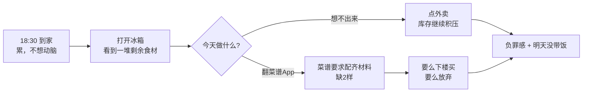
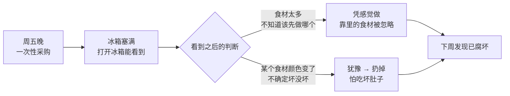
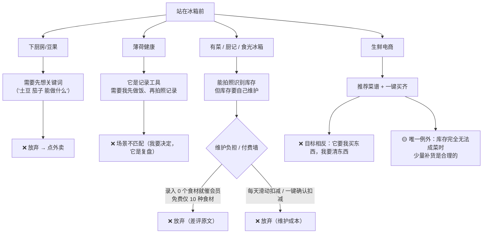

# 五看洞察报告：冰箱清库存食谱助手

> 方法论：华为 IPD 概念阶段「五看」（看行业/趋势、看市场/客户、看竞争、看自己、看机会）
> 文档版本：**v4.0**
> 编制日期：2026-09-21
> 上游输入：`requirements.md`《产品用户画像与原始需求说明书》、`修改建议.md`、`web_results/` 调研成果集（28 份）
> 下游文档：`docs/需求规格说明书.md` **v4.0**（依赖本报告）

## 版本变更记录

| 版本 | 日期 | 变更摘要 | 变更依据 |
| --- | --- | --- | --- |
| v1.0 | 2026-09-17 | 首次产出 | `requirements.md` |
| v2.0 | 2026-09-17 | ① 补货定位由「不做」改为**受约束的补货分支**（新增 §5.4 商业模式）；② 库存由「持久账本」改为**单次快照 + 带时间戳只读历史**；③ 画像表修正「对省钱反感」的表述；④ 画像 B 痛点重写；⑤ 市场规模改为真实数据导向 + 数据缺口清单；⑥ 团队能力与资源回填；⑦ 便当能力改由模型承担场景判断 | `修改建议.md` #1–#9、澄清决策 D1–D7 |
| **v3.0** | 2026-09-17 | ① 以 `web_results/` 真实数据**替换全部估算**（§1/§2/§3/§4/§5）；② **空白点第 1 条被证伪**（国内已有 3 款同类产品），§3.4 重写为 4 条有效空白点；③ **新增 4 家竞品**（有菜/厨记/食光冰箱/SuperCook），§3.1/§3.2 重写；④ 库存模型明确为**快照重写 + 自动差集**（§2.2/§5.2）；⑤ Demo 成功判据因**备案周期**调整，上架体验降为加分项（§0）；⑥ `$APPEALS` 重算与载体结论下放至 SRS §5.1（§6.4 关联）；⑦ 市场规模由缺口表改为**真实测算 + 保守下限声明**（§2.4）；⑧ 新增**附录 E 更正记录** | `web_results/` 28 份、官方查证（DeepSeek 文档、E-05） |
| **v4.0** | 2026-09-21 | ① 载体收敛为**鸿蒙原生 APP**单一载体，§0 载体行与 §4/§5 相关表述同步；② 删除 §1.1 服务形态趋势行与 §1.3 生态认知条目；③ §3.1 有菜行去掉平台专属形态；④ §4.3 上架体验改为生产加分项；⑤ §5.4 变现改为「Demo 应用内来源卡片（Mock）→ 生产跳转分佣」；⑥ 附录 A 删除入口研究来源、附录 D 改写上架规则缺口、附录 E 删除/改写依赖平台专属形态的更正条目；⑦ 停止引用旧形态调研档案（含 E 系列前四份），`E-05`（大模型能力）续用 | 本轮载体收敛决策 |

---

## 0. 结论先行

**一句话机会点**

> 在「一二线城市自炊年轻人」这个人群里，**"决定今天吃什么"这一步仍未被有效解决**。同类产品已经出现（有菜、厨记、食光冰箱），但它们都要求用户手动维护库存、都要求配齐材料、都不覆盖带饭场景。
>
> 因此我们的机会不是"第一个拍冰箱"，而是**把"拍完就覆盖、消耗自动推导"做成零维护**，并让缺一两样食材时仍然**可执行**。

**载体**：鸿蒙原生 APP（HarmonyOS 原生应用）单一载体。详见需求规格说明书 §5。

**成功判据（Demo 阶段）**
1. 从拍照到出现 3 张可执行菜谱卡片，**无需任何文字输入**。
2. 缺少 1–2 样食材仍给出**可执行方案**；仅当库存**完全无法成菜**时才提示 ≤2 样补货。
3. **在演示设备上无需指导完成一次完整链路**（本地 HAP 安装即可；上架为生产加分项，非 Demo 前提）。
4. **第二次拍照后自动算出"本次消耗"**（零维护的证明点）。

**最关键的取舍**

> 默认目标函数是**清空库存**。补货只作为**受约束的补货分支**存在：仅当现有库存不足以构成任何一道可执行菜时（例如冰箱里只剩葱姜蒜和一大块肉）才出现，上限 **≤2 样**，且**绝不改变默认清库存结果的排序**。我们不做"一键买齐"，也不做以补货为目的的主动推销。

**商业化**

> **Demo** 的变现形态为补货分支内的**应用内来源卡片（Mock）**，卡片标明来源（美团、盒马等）与合作 / 推广性质，**不拉起外部 App、不调真实 API**；**生产**演进为向生鲜平台的**真实跳转分佣**。公开可核实的口径只有**美团联盟 CPS 3%–6%**（盒马仅 B2B 商家入驻，叮咚未找到开放合作）。按单笔补货 GTV 15–30 元（≤2 样）估算，佣金约 **0.45–1.8 元/单**——**这是一个弱点**，依赖订单量，本报告不给收入数值。隔离原则不变：**变现只能存在于补货分支内部，不得回流影响默认路径的排序与展示。**

---

## 1. 看行业/趋势

### 1.1 价值正在往哪转移

| 趋势 | 观察（含数据年份） | 对我们的含义 |
| --- | --- | --- |
| 交互入口从"搜索"转向"拍照" | 多模态识别已成为消费级 AI 产品的默认交互；健康管理类产品已把"拍照识餐"作为核心功能（薄荷 AI 相机，2026） | 拍照识别食材不再是技术差异化，**只是入场券**。差异化必须落在识别之后（库存维护成本与决策） |
| 内容型菜谱平台增长见顶 | 下厨房、豆果美食、懒饭、美食杰、丁香医生五家合计占据 **2025 年全行业 68.5% 活跃用户份额**（D-06，行业报告口径） | 与头部拼内容量必败；应避开内容维度正面竞争 |
| 系统级 AI 能力下沉 | **HarmonyOS 7 于 2026-09-07 正式发布**（人民日报 2026-09-17 第 12 版；其开发者测试版于 2026-06-12 HDC 发布，新华网）。截至 9-7，HarmonyOS 6+7 设备 **8,500 万台**、注册开发者 **1,100 万**、应用与服务 **40 万+**；系统开放 **20+ AI 能力**（含 GUI 操控） | 系统会承担更多"意图理解"工作，第三方产品应聚焦在**领域数据与领域约束**（库存、临期、忌口、便当场景） |
| **模型可承担场景化判断，产品只需暴露一个开关** | 既然模型能做场景推理，产品就不该把"少汤水 / 可复热 / 隔夜不变味"做成三个待勾选的筛选器 | 便当能力改为**单一场景开关**（「明天要带饭」），由模型一次性施加三项约束，标签在卡片上**只读展示** |
| 隐私与数据最小化成为系统级原则 | HarmonyOS 7 个人智能计算系统 **HPIC** 坚持"**本地优先、数据最小化、用户可控**" | 冰箱照片默认本地处理、明示用途、一键删除；作为 NFR-04 的设计依据 |

### 1.2 外部环境

**政策环境（依据已补齐）**
- 《中华人民共和国反食品浪费法》全文 32 条已取得原文（A-01，中国人大网，2021-04-29 通过并施行）。与本产品相关的条款：
  - **第七条第二款**：餐饮服务经营者不得诱导、误导消费者超量点餐；
  - **第十条**：餐饮外卖平台应以显著方式提示消费者适量点餐；
  - **第十四条第二款**：家庭及成员应"按照日常生活实际需要采购、储存和制作食品"；
  - **第二十八条**：诱导超量点餐造成明显浪费，拒不改正处 **1,000–10,000 元**罚款。
- 执法口径已可溯源：**台州必胜客外卖起送价案**（2023-05 市场监管总局第四批典型案例，A-02）被责令取消起送价并警告；**第九批**（2025-06，F-02）含北京"自取起购价 25 元"案、上海"一打起售"案等。经济日报 2023-04-05 评论明确"**法律并未明确外卖能否设置起送门槛**"，监管口径是"科学合理设置"——这正是我们把补货上限定为 **≤2 样**、且**不得引导凑单**的合规依据。
- 政策进展：2024-11《粮食节约和反食品浪费行动方案》（F-02）；南通"光盘兑换"参与餐厅厨余垃圾量平均减少约 **18%**，江西安福县厨余垃圾同比下降 **8%**（F-02，2026-05）。

**⚠️ 反证记录**
- 清华大学环境学院等研究显示，四种就餐场景人均浪费：**家庭 24.6 g/餐**、外卖 57.5、食堂 60.4、餐厅 84.6——**家庭端最低**（F-01，新华网 2024-02）。郑州 1315 份样本研究亦显示城市家庭人均食物浪费 **15.47 g/人·天**（F-01，《自然资源学报》2024）。
- 需注意：这些测的是**就餐剩饭**，不是"冰箱食材腐坏丢弃"——后者全网无权威数据。
- **因此，本报告不以"减少食物浪费"作为量化价值承诺，因其在家庭端缺乏数据支撑。** 「清库存」仅作为产品目标函数（算法优先消耗临期项）保留，与浪费规模无关。

**技术环境**
- 识别能力：生鲜食材分类准确率约 **87%**（已基本解决）；但**生鲜果蔬分量估算 MAPE 高达 100–196%**、包装食品识别仅 42–57%、营养估算 MAPE 24–42%、**6 种以上食材定量趋近失效**（F-03，DiningBench / OmniFood-Bench 等，2026）。→ 直接决定 R1.1「不猜重量」是正确决策，也决定营养数据只能标注"估算值"。
- 多模态 API 可用性：已核实可用（详见 §4.1）。

**商业合作环境**
- **美团联盟**开放 CPS，佣金率 **3%–6%**，新用户首单佣金可达 6 元（D-08）。
- **盒马开放平台**仅是 B2B 商家入驻（HEMA.OS），**未找到 C 端 CPS 导流页**；**叮咚买菜未找到开放平台/联盟**（D-08）。
- 因此商业化**只有美团一条公开可接入口径**，且单笔收益极低（见 §5.4）。

### 1.3 不利于我们的趋势（正面承认）

1. **即时零售削弱了"做饭省钱"的叙事**。生鲜电商把"买菜"变得极快，用户"用库存做饭"的机会成本被抬高。
2. **外卖的替代效应在增强**：截至 **2025-12**，网上外卖用户 **6.30 亿人**、使用率 **56.0%**（CNNIC 第 57 次，B-07）；居民 **人均饮食服务支出 2,335 元**，比 2020 年**增长 103.7%**，占食品烟酒支出比重由 17.9% 升至 **27.1%**（国家统计局"十四五"成就报告，2026-06，C-03）。我们无法在"省事"上正面击败外卖。

---

## 2. 看市场/客户

### 2.1 客户画像

| | 画像 A：周中带饭通勤党 | 画像 B：周末做饭清库存党 |
| --- | --- | --- |
| 频次 | 高频刚需 | 低频消耗 |
| 核心目的 | 带饭替代外卖（省钱 + 健康） | 消耗库存（避免腐坏） |
| **对省钱反馈** | **强需求**，会主动查看省钱进度 | **不反感省钱本身**，仅反感**强制曝光方式**（弹窗、占据核心主页）；主动查看意愿低 |
| 对品质检测 | 加分项 | **强加分项**（解决"囤久了不敢吃"） |
| **对补货的态度** | 优先消耗库存；可接受"只差一两样"的**少量补货**；反感多品项采购清单 | 同样可接受少量补货；**反感被推销**；若补货提示出现在清库存结果里会立即失去信任 |
| 心智模型 | "赶紧清掉，明天还要带饭" | "看看还剩什么，别让它坏了" |

> **对 R3.2 的佐证**：`requirements.md` R3.2 原文为"周末做饭人群对此（省钱）无感甚至反感"。G-02 用**五个维度**验证了修正方向——**不反感省钱 / 反感强制自律 / 反感被评价曝光 / 反感过度计算焦虑 / 反感与既得利益冲突**（每维度均有原话佐证）。故画像 B 的省钱态度维持"低主动性、反感强制曝光"。

### 2.2 场景复现

#### 用户什么时候打开冰箱？

| 场景 | 描述 | 是否涉及做菜 | 我们的承接方式 |
| --- | --- | --- | --- |
| 场景 1 | 从超市买回菜之后，把菜放进冰箱 | 否（是场景 3 的前置） | 可选：顺手拍一张入库，形成带时间戳的快照 |
| **场景 2（主力）** | 做饭前打开冰箱，观察现有的菜 | 是 | 拍照 → 识别 → 生成可执行菜谱 |
| 场景 3 | 准备用 App 或去超市买菜前，想看一下现有的菜 | 否（但直接指向补货决策） | 展示**带时间戳的历史快照**（只读，明确标注"可能已过期"）+ 补货分支 |

> **结论**：如果完全不考虑补货，等于主动放弃场景 3，并连带使场景 1 失去意义。补货分支因此被纳入概念边界。

#### 画像 A：下班后 18:30 → 21:00



**关键观察**：用户的失败点不是"不会做菜"，而是**在"看到食材之后"卡住**，且卡住后的默认结果是"点外卖"。产品要解决的是**缩短从"站在冰箱前"到"开始动手"的决策时间**。

#### 画像 B：周五 20:00 → 周末



**关键观察**：画像 B 的痛点**不是"看不见库存"**——打开冰箱门就能看见，那是"库存可见性"问题，我们既解决不了也不该声称能解决。真正的痛点是：
1. **看到一堆食材后仍需动脑排序**——不知道该先消耗哪个；
2. **不敢确认品质**——"颜色变了但不确定坏没坏"，只能扔掉。

> **库存模型声明**
>
> **我们不让用户维护库存记忆——拍照即覆盖、消耗自动推导，用户零交互。**
>
> 具体机制（快照重写 + 自动差集）：
> - **当前库存 = 最近一次用户确认过的快照**（带时间戳；超过过期阈值自动标"可能已过期"并提示重拍）；
> - **拍照 → 确认 → 覆盖**，不需要用户逐项扣减；
> - 系统**自动 diff 上一张快照**：**消失项 = 本次消耗**（零交互）；**新增项记首次出现时间**，按品类默认保鲜天数自动推断临期；
> - **不做** 350+ 食材保质期模板库，**不做**家庭共享冲突处理，**不做**精确临期天数倒计时。
>
> 该模型同时是**主动的差异化**：竞品（食光冰箱要滑动扣减、厨记要一键确认扣减）都需要用户维护，我们不需要。
>
> 相应地，`requirements.md` R1.2 中"不用自己翻冰箱"的表述修正为"**不用在翻完冰箱之后再费脑决定做什么**"（见需求规格说明书 §3.1）。

### 2.3 客户需求收集十问（关键条目作答）

| 访谈问题 | 回答 |
| --- | --- |
| 客户什么时候打开冰箱？ | 放菜后 / 做饭前 / 出门或去超市前，共三类场景（见 §2.2） |
| 客户目前如何解决？ | 翻冰箱 → 凭记忆想 → 失败则点外卖（画像 A）；凭目测丢弃（画像 B） |
| 目前方案的不足？ | 需要动脑、需要维护、需要"配齐材料"，且**不产生任何积累**（清了多少库存、省了多少钱） |
| 哪些是**必须具备**的？ | 拍照识别 + **可手动修正**（R1.1）；基于现有食材生成（R2.1）；缺材宽容（R2.2）；无注册登录（R4.1） |
| 哪些是**更好的**？ | 便当场景适配（R2.3）、营养数据（R3.1）、清库存进度（R3.3）、口味记忆与忌口清单（R2.5） |
| 哪些会让客户**放弃**？ | 猜重量、强制配齐、反常识菜谱（"草莓炒肉"）、繁重数字输入、强制弹窗式省钱提醒、**多品项采购推荐**、**过早上付费墙** |
| 客户愿意付出什么代价？ | 拍一张照 + 几次滑动确认；**不接受**任何文字表单 |
| 客户在什么情况下**接受**额外采购？ | 仅当现有库存**无法构成任何一道可执行菜**时，接受"只差一两样"的少量采购 |
| 决策者/影响者是谁？ | 使用者本人；但受"合口味"约束（家人、同住者忌口） |

**真实痛点语料（G-01，用于校准"决策效率"价值论据）**
- 时间成本：广州 95 后女生每天清晨提前 1 小时、晚上买菜洗切做饭"一来一回最少 2 小时"，**带饭 9 天即放弃**；白领时薪 50 元起，做便当每天 1.5 小时价值七八十元。
- 成本对比：外卖 **30 元/顿** vs 带饭**食材 10–20 元/顿**（36 氪，2023）；北京案例"一天省 40 元，一个月省 880 元"（**两餐口径**，见 §5.3）。自炊 10–20 元/餐可与 **C-02** 的上海零售单价（青菜 7.28、鸡蛋 12.28、猪精瘦肉 35.08 元/kg，2026-09）交叉验证。
- 一次性备餐是常见模式："带饭践行者通常会在周末制作一周的菜肴"（B-06，前程无忧 2024）。
- 安全焦虑："隔夜菜亚硝酸盐超标"是高频讨论话题（央广网 2025-05）；"#开始吃剩菜#"登上微博热搜（2026-02）。
- 群体效应："一旦办公室有一个人开始带饭，就会有一群人开始带饭"（36 氪案例 3）。
- 社交压力：带饭被同事笑"不嫌烦""上个世纪"（永康日报 2026-03）；极端案例被老板禁止（搜狐 2026-05）。

> 说明：以上为 G-01 中**弱来源**（抖音/微博/搜狐转载）的语料，**仅用于痛点描述，不用于任何量化结论**；量化数字（时间成本、月省金额）已在括注中标注来源与口径。

### 2.4 市场规模测算

**口径声明**

> 人口、年龄、自炊率、带饭率均可溯源，故给出**保守下限**测算；仍无数据的分支明确标为缺口。

```
全国 2024 年末总人口                                140,828 万      (B-01 统计年鉴2025 表2-1，2024)
19 城（一线4 + 新一线15）2024 年末常住人口           28,697.92 万    (B-02，已修正求和；原文件 29,654.72 有误)
  ├ 一线 4 城                                        8,360.21 万
  └ 新一线 15 城                                    20,337.71 万
× 20–34 岁占比 17.58%                                = 5,045 万      ← TAM（B-03 统计年鉴2025 表2-8，2024）
× 每周做饭≥3 次 56.7%                                = 2,861 万      ← SAM 上限（B-05 中国青年报 2026-04，n=1333）
× 一线带饭率 20%                                     = 572 万        ← 画像 A（B-06 上海总工会 2025-05）
   区间：全国 15% → 429 万 ；一线 24% → 687 万
画像 B（周末清库存党）                                 = 无数据 → 保留为缺口
SOM                                                  = 不给数值（无依据）
```

**B-02 修正说明**：`web_results/B-02` 原文件将新一线 15 城合计写为 21,294.51 万、19 城写为 29,654.72 万、占全国比重写为 21.1%，且排序错误（长沙 1061.65 被排在青岛 1044.25 之后）。本报告采用修正值 **20,337.71 万 / 28,697.92 万 / 20.38%**；正确降序中**长沙应在青岛之前**。一线 4 城合计 8,360.21 万（无误）。

**结构性背景（支撑"一人食 / 小型家庭"场景，B-04）**：全国家庭户 49,416 万户，平均家庭户规模 2.62 人/户（2020 七普）→ **2.51 人/户（2024 抽样）**；**一人户约 1.25 亿户、占家庭户 25.39%**（2020 七普，B-04）。家庭小型化直接支撑"一个人也要自己做饭、且容易剩菜"的画像前提。注：以上为全国口径，**城镇家庭户户数官方未单列**（B-04 自述），故不作为城镇侧精确分母。

**口径说明**
1. **保守下限**：城市年龄结构未按城市校正，一线青年占比通常高于全国平均，故 **5,045 万是保守下限**。
2. **不可混算**：带饭率来自不同年份与不同口径的调查（2024 全国 15% / 2025 上海 20% / 2025-10 一线 24%），只作区间旁证，**不得相加或取平均**；B-06 上海总工会行合计 >100%，引用时**只取"自带饭 20%"单元格**。
3. **SOM 明确写"在取得可比产品数据前不给数值"**——现有三家国内竞品均无公开 MAU/下载量，App Store 评分仅 42/144 条（D-04）。

**商业化测算**

```
收入 = 触发补货分支用户数 × 补货转化率 × 单次 GTV × 佣金率
```

- 佣金率已有公开口径：**美团联盟 CPS 3%–6%**（D-08）。
- 单次 GTV 无数据，按"≤2 样补货"假设 **15–30 元** → 单笔佣金约 **0.45–1.8 元**。
- **补货转化率仍无法核实**，且单笔收益极低，故**本报告不给收入数值**。

> ⚠️ 数据引用须带可溯源链接与统计年份，不得以"数量级估算"替代。

---

## 3. 看竞争

### 3.1 本次可溯源的竞品事实

| 产品 | 已核实事实（含数据年份） | 来源（访问日期 2026-09-17） | 对我们的含义 |
| --- | --- | --- | --- |
| **有菜**（最近似我们） | iOS / Android / **HarmonyOS 三端**；**AI 拍冰箱一次识别** + 临期提醒 + **现有食材推菜谱** + 家庭共享冰箱(最多 4 人) + 蔬菜图鉴；官网明示"**不强制注册手机号、不设基础功能付费墙**" | 官网 `maaker.cn/youcai`（D-04） | **概念几乎被复刻**：拍冰箱识别 + 临期 + 现有食材推菜谱 + 三端 + 无基础付费墙。但**无公开规模数据**，未跑出赢家 |
| **厨记** | iOS/iPad；按食材找菜谱 + 冰箱库存管理 + 临期提醒 + 购物清单 + **做完菜一键扣减库存** + 厨房日志 + Siri；App Store **42 个评分 / 4.8 分** | App Store `apps.apple.com/cn/app/id6753860151`（D-04） | 差评暴露机会：**录入 0 个食材就催会员**；**免费仅 10 种食材**；年付六十几元 |
| **食光冰箱** | iOS only；**350+ 食材模板** + 拍照识别 + 过期预警 + **消耗进度追踪（滑动标记减少存量）** + 120+ 食谱（含营养成分） + **购物车（基于食谱缺失食材生成采购清单）** + 饮食分析；App Store **144 个评分 / 4.8 分** | App Store `apps.apple.com/cn/app/id6742053950`（D-04） | 已有"滑动减少存量"（≈我们的余量滑动条）与"缺材生成采购清单"（≈我们的补货分支）；弱点是**终身会员偏贵、不支持多冰箱、开发者响应慢** |
| **SuperCook**（海外品类标杆） | 2011 年上线的反向菜谱搜索引擎，100 万+ 菜谱库，完全免费、**无账号**、实时过滤；App Store **1.8 万评分 / 4.8 分** | `mealift.app` 评测 + App Store（D-05） | 明确 **"no substitution suggestions"（无替代品建议）**——这是 FR-09 缺材宽容的直接对照证据；另有**广告多**、无营养数据、无购物清单 |
| 下厨房 | 站内 3,589,262 道菜谱 / 80,326,164 个作品；导航以「菜谱分类」「菜单」「作品动态」为主；会员价格：年卡 ¥168、连续包月 ¥12、连续包年 ¥228、月卡 ¥30 | 官网 `xiachufang.com`、会员中心（D-06） | 内容是它的资产，也是它的组织方式——**按菜谱组织，不按库存组织** |
| 豆果美食 | 官方口径 500 万+ 菜谱、5000 万+ 用户；"智能找菜"为搜索式入口 | 官网 `douguo.com`（D-06） | 仍是搜索式入口，不是库存式入口 |
| 薄荷健康 | **1.8 亿用户**、160 万+ 食物营养数据；**"薄荷 AI 相机，一拍餐食，即知重量、热量、营养构成"**；薄荷科学.ai 日 API 调用 3000 万+ | 官网 `boohee.com`（D-07） | 反证 R1.1：面向"已做好的餐食"估重可行，但**面向"冰箱里的生食材"估重不可靠**（F-03 佐证），两者不是同一问题 |

### 3.2 竞品功能对标矩阵

图例：✅ 具备｜🟡 部分/弱｜❌ 不具备｜❓ 未核实

| 对标维度 | 下厨房 | 豆果 | 薄荷 | **有菜** | **厨记** | **食光冰箱** | **SuperCook** | 生鲜电商 | 我们 |
| --- | --- | --- | --- | --- | --- | --- | --- | --- | --- |
| 拍照识别食材 | ❓ | 🟡 | ✅（识餐食，非生食材） | ✅ | 🟡 | ✅ | ❌（手动勾选） | 🟡 | ✅ |
| 识别结果手动修正 | ❓ | ❓ | 🟡 | ❓ | ✅ | ✅ | ✅（勾选） | ❌ | ✅ **必须** |
| **要求用户手动维护库存** | ❌ | ❌ | ❌ | 🟡（拍完入库，仍偏账本） | ✅（一键扣减确认） | ✅（滑动扣减） | ❌ | ❌ | ❌（**自动差集**） |
| 临期优先 | ❌ | ❌ | ❌ | ✅ | ✅ | ✅ | ❌ | ❌ | ✅ **核心** |
| **缺材宽容（可省略/可替代）** | 🟡 | 🟡 | ❌ | ❓ | ❓ | ❓ | ❌ | ❌ | ✅ **核心** |
| **是否提供替代品建议** | 🟡（UGC 自评） | 🟡 | ❌ | ❓ | ❓ | ❓ | **❌ 明确无** | ❌ | ✅ **核心** |
| **便当场景适配** | ❌ | ❌ | ❌ | ❌ | ❌ | ❌ | ❌ | ❌ | ✅ **核心**（单一场景开关） |
| **是否有广告 / 付费墙** | 付费会员 | 付费会员 | 付费会员重 | **无基础付费墙** | **付费墙过早** | 终身会员偏贵 | **广告多** | 不适用 | **无广告、无付费墙** |
| 营养数据 | 🟡 | 🟡 | ✅（强） | ❓ | ❓ | ✅（120+ 食谱含成分） | ❌ | ❌ | ✅（轻量 + "估算值"标注） |
| 省钱反馈 | ❌ | ❌ | ❌ | ❌ | ❌ | ❌ | ❌ | ❌ | ✅（克制呈现） |
| 消耗进度 | ❌ | ❌ | ❌ | ❓ | ✅（手动） | ✅（手动） | ❌ | ❌ | ✅ **自动推导** |
| 家庭共享 | ❌ | ❌ | ❌ | ✅（4 人） | ❌ | ❌ | ❌ | ❌ | ❌（Demo 期不做） |
| 无需注册登录 | ❌ | ❌ | ❌ | ✅ | ❌ | ❌ | ✅ | ❌ | ✅ **硬约束** |
| 额外购买食材 | ❌ | ❌ | ❌ | ❓ | ✅（购物清单） | ✅（缺材采购清单） | ❌ | ✅（业务本质） | 🟡 **受约束补货：仅完全无法成菜时，≤2 样，不改默认排序** |
| 反常识菜谱风险 | 用户自评 | 用户自评 | 不适用 | ❓ | ❓ | ❓ | ❓ | 不适用 | **Prompt 硬约束规避** |

> **关键差异**：仅凭"拍照识别 + 库存 + 临期"这三列，**我们与有菜、厨记、食光冰箱没有区别**。我们的差异只出现在三行：**要求用户手动维护库存 = ❌（自动差集）**、**缺材宽容/替代品建议 = ✅（竞品明确缺）**、**便当场景 = ✅（六家竞品无一具备）**。

### 3.3 客户视角：现有产品在哪一步让用户放弃



**结论**：**新出现的国内竞品已经在做"库存式入口"，它们的失败点变成了"维护负担与付费墙"**。这既是威胁也是机会：需求被验证，但没有赢家。

### 3.4 空白点

> 以下四条空白点均有竞品对照证据（第 1 条旧空白点被 D-04 证伪的过程见附录 E）。

1. **缺材宽容的生成逻辑**：行业默认"缺材料 = 提示购买"。**SuperCook 明确"no substitution suggestions"**（D-05）；国内三家均未提及替代品策略。我们把"缺材料"当作**生成约束**，策略优先级为"可省略 / 可替代 > 需购买"。
2. **便当场景的可执行性**：**六家竞品（下厨房/豆果/薄荷/有菜/厨记/食光冰箱）无一具备**带饭场景约束。我们把"少汤水 / 适合二次加热 / 隔夜不变味"作为**模型必须满足的生成约束**，只用单一开关表达。
3. **零维护的消耗与临期**：食光冰箱需**滑动标记减少存量**、厨记需**一键确认扣减**；我们通过**自动差集**推导本次消耗，用户零交互。
4. **无广告 + 无付费墙**：SuperCook **广告多**（D-05）；厨记**录入 0 个食材就催会员、免费仅 10 种食材**（D-04）。我们不做广告、不设基础功能付费墙。

> 一致性要求：以上四条空白点必须在 `docs/需求规格说明书.md` 中找到对应需求编号（见该文档 §6.1 追溯表）。

---

## 4. 看自己

### 4.1 资源与能力盘点

| 能力项 | 现状 | 对我们的含义 |
| --- | --- | --- |
| 团队规模 | **9 人，全部为华为终端 BG 新员工** | 有平台背景与内部资源，但无产品化经验 |
| 鸿蒙开发经验 | **弱** —— 仅有 HarmonyOS 底座与 OpenHarmony 开源项目经验，无完整应用交付经验 | 工程量**必须压到最小**；交互层不做自定义视觉资产 |
| 多模态识别接入经验 | **无** | 识别链路只能依赖现成 API，不能自研；失败降级（NFR-02）必须做实 |
| 设计/交互资源 | **无经验**，基本使用 ArkTS 系统资源 | 只能用系统组件拼装 → 支撑「便当能力改为单一场景开关」与整体极简交互 |
| 时间盒 | **5 天，9 月 24 日验收，必须有可展示的 Demo** | 一切非 P0 需求应默认放弃；P1 仅在有明确余量时做 |
| 华为开发者帐号 / 环境 | **均有鸿蒙开发者证书** | 环境阻断项**解除**；账号侧无障碍 |
| 多模态 API 可用性 | ✅ **已通过前置门**。可用模型 **`deepseek-flash`**（DeepSeek-V4.1-Flash）**原生支持 Vision**；`deepseek-v4-pro` 的 Vision 标注 **Not supported**，故 flash 是唯一可行选择。关键约束：图片**单张固定 ≤1024 token**（自动缩放到约 1300×1300 等效）；格式 JPEG/PNG/GIF/WebP；**图片只能放在 `user` 消息**（system/assistant 会返回 400）；`detail:low` 先压到 512×512；1M 上下文、384K 最大输出、支持 JSON Output、并发 2500 | **FR-01 前置依赖已解除**。Prompt 必须输出结构化 JSON；冰箱全景照**慎用 `detail:low`**（会漏小件食材） |
| 调用成本 | 单次识别约 **¥0.0027（闲时）–¥0.0054（高峰）**；**¥100 可支撑 1.86 万–3.7 万次识别 / 完整链路 3,500–6,800 次**（高峰时段 = 北京时间 09:00–12:00、14:00–18:00，9/24 白天验收落入高峰） | 成本不构成阻断（理由见附录 E）；固定输入集改为**回归一致性**目的 |
| token 量级口径 | 团队"数十亿 token"的说法仅在**缓存命中**口径成立；本项目每次新照片**必然缓存未命中**，应按 **$0.15/1M** 口径 → 约 **0.9 亿输入 token**，与原说法**差约 50 倍** | 引用额度时以本口径为准，"数十亿 token"不可作为容量结论 |

### 4.2 我们能赢在哪 / 短板在哪

**能赢在哪**
- 我们**没有内容包袱**，可以完全按"刚拍到的库存"组织产品结构（头部产品无法自我颠覆）。
- 我们**目标人群足够窄**（自炊 + 有剩余食材的年轻人），可以做深而非做广。
- 团队有**华为终端 BG 背景与鸿蒙开发者证书**，载体落地阻力低于外部团队。
- 需求已被验证：三家国内竞品证明"拍冰箱 → 出菜谱"成立，且**无一家跑出赢家**——窗口仍在。

**短板在哪**
- **鸿蒙工程经验弱**，5 天内交付一个可演示的 APP 本身即是风险。
- **无多模态接入经验**，识别链路的首次打通可能消耗掉大部分时间预算。
- **无设计资源**，产品观感只能靠系统组件与信息结构取胜。
- **形态不构成护城河**：SRS §5.1 显示最近似竞品有菜 `$APPEALS` 4.22，载体形态本身不构成差异化。
- **识别名称稳定性未验证**：自动差集（FR-20）依赖同一照片连拍 3 次品类名一致（NFR-12），不达标则需降级为手动确认。

### 4.3 5 天 Demo 期的可信边界

| 能力 | Demo 期定位 | 理由 |
| --- | --- | --- |
| 拍照识别食材品类 | **可实装**（前置门已过） | `deepseek-flash` 原生 Vision（§4.1）；但冰箱全景照的有效准确率仍需 5 张真实照片实测 |
| **零维护差集（本次消耗自动推导）** | **可实装**，但以 **NFR-12（名称稳定性）**为前提 | 依赖同一照片识别结果的名称一致性；不达标时走 FR-20 降级路径（用户确认消耗项） |
| 食材重量估计 | **不做** | R1.1 明确禁止；F-03 显示分量估算 MAPE 100–196% |
| 新鲜度/品质检测（R1.3） | **仅 UI 逻辑展示，不实装算法**；"降级为固定文案"是默认预期 | 缺乏低成本可靠方案（NFR-08） |
| LLM 食谱生成 + 缺材宽容 + 便当场景约束 | **可实装**（Prompt 约束为主） | 成本可控，是 Demo 的核心说服力 |
| **补货分支** | **可实装为 UI + 固定数据**（真实分佣接口不作为 Demo 前提） | 分佣合作仅美团可接入（D-08），Demo 只需演示交互与边界约束 |
| 营养数据 | 可实装（查表/估算） | **必须显著标注"估算值"**（F-03 显示 MAPE 24–42%） |
| 省钱累计 | **可实装但需克制** | 仅以徽章/周报呈现；画像 B 反感的是强制曝光 |
| 口味记忆 / 忌口清单 | 可实装（轻量）或 UI 演示 | 取决于时间预算 |
| 历史快照（带时间戳只读） | **可实装** | 也是自动差集的输入 |
| **应用市场上架体验** | **不作为 Demo 前提（生产加分项）** | 软著 30–60 工作日 + 工信部 APP 备案 15–20 工作日（不可压缩）+ 华为技术审核 3–5 工作日，5 天内上架不现实 |

---

## 5. 看机会

### 5.1 候选机会点与收敛

| # | 候选机会点 | 目标客群 | 未满足痛点 | 我们的差异化 | 为什么是现在 | 判定 |
| --- | --- | --- | --- | --- | --- | --- |
| O1 | **以"刚拍到的库存"为输入的"今天吃什么"决策器** | 画像 A 为主，B 为辅 | 站在冰箱前无法快速决策（R2.1/R2.4）；现有竞品要用户手动维护库存 | 拍一下 → 3 张卡 → 缺材也能做 → 消耗自动推导 | 多模态识别成本已可承受；同类需求已被验证但无赢家 | ✅ **锚定** |
| O2 | 食材品质检测助手 | 画像 B | 囤久了不敢吃（R1.3） | 拍照提示新鲜度 | 技术尚不成熟 | ❌ 排除（转为 O1 的"惊喜卖点"） |
| O3 | 带饭备餐规划工具 | 画像 A | 便当复热难吃（R2.3） | 便当场景约束 | 需求真实，但频次低于 O1 | 🟡 保留为 O1 的**场景约束子能力**，不单独立项 |
| O4 | 家庭食物浪费记账 | 画像 B | 浪费负罪感（R3.3） | 消耗进度 | 无法独立支撑产品；且家庭浪费规模缺乏数据支撑（§1.2） | ❌ 排除（转为 O1 的激励层） |
| O5 | 临出门 / 超市前的补货决策 | 画像 A + B | 场景 3：出门前想知道"还缺什么" | 带时间戳的历史快照 + 受约束补货分支 | 生鲜即时零售已成熟，补货动作本身有承接方 | 🟡 判定为 **O1 的分支**，不单独立项；同时是唯一明确的商业化入口 |

**收敛结论**：**锚定 O1**。O2/O3/O4 降级为 O1 的功能特性；**O5 作为 O1 的补货分支**，承担场景 1/3 与商业化。

### 5.2 差异化价值主张

> **对于每周为"冰箱里有剩菜但不知道做什么"而最终点外卖的年轻人，
> 我们是一个"拍一下冰箱就给出今天能做的菜"的鸿蒙 APP。**
>
> **三点差异**：
> 1. 以**你刚拍到的库存**为第一输入，**拍完就覆盖、不用维护**（自动差集推导消耗）；
> 2. **缺一两样也能做**——"缺材料"对我们是生成约束，不是购买提示；
> 3. **当天要带饭也合适，用完不用记**——便当约束一次开关表达，消耗自动累计。

### 5.3 我们不做什么（战略级取舍）

| 不做 | 原因 |
| --- | --- |
| **多品项（>2 样）采购清单 / 一键买齐** | 与"清库存"第一原则直接冲突。补货只在无法成菜时出现，且上限 2 样 |
| **以补货为目的的主动推销** | 补货入口不得出现在默认路径；不得改变默认清库存结果的排序 |
| **把不准确/已过期的快照当成当前库存** | 当前库存仅以"最近一次用户确认过的快照"为准，必须带时间戳并标"可能已过期" |
| 猜食材重量 | 不准确且不符合用户预期（R1.1；F-03 佐证 MAPE 100–196%） |
| 内容社区（晒图/评论/关注） | 无法与头部内容平台竞争，且消耗本就不足的开发资源 |
| 注册登录体系 | 与"无脑操作"DNA 冲突（R4.1） |
| 精确临期天数倒计时 | 只按"新增项首次出现时间 + 品类默认保鲜天数"推断，不做精确倒计时 |
| **350+ 食材保质期模板库** | 维护成本高、覆盖永远不全；改用"品类默认保鲜天数 + 允许手动覆盖" |
| **家庭共享冰箱（Demo 期）** | 引入冲突处理与同步复杂度；有菜虽有此功能，但不是我们的差异化点 |
| **广告变现** | 与"不推销、克制"的信任基础冲突 |

### 5.4 商业模式

| 项 | 内容 |
| --- | --- |
| Demo 变现形态 | 补货分支内的**应用内来源卡片（Mock）**：卡片标明来源（美团、盒马等）与合作 / 推广性质；**不拉起外部 App、不调真实 API** |
| 生产变现路径 | 补货分支向生鲜平台的**真实跳转分佣**（网关签名不变，无侵入替换） |
| 可接入口径 | **美团联盟 CPS 3%–6%**，新用户首单佣金可达 6 元（D-08）——**唯一公开可接入口径** |
| 不可接入口径 | 盒马开放平台为 **B2B 商家入驻（HEMA.OS）**，未找到 C 端 CPS 页；**叮咚买菜未找到开放合作**（D-08） |
| 单笔收益 | 单笔补货 GTV 假设 **15–30 元**（≤2 样）→ 佣金约 **0.45–1.8 元/单** |
| **弱点** | **单笔收益极低，依赖订单量**；转化率无数据。**本报告不给收入数值** |
| 触发位置 | **仅**补货分支内部；默认清库存路径中**不存在**任何来源卡片或推广入口 |
| 隔离原则 | ① 补货分支不得改变默认结果的排序与展示；② 来源卡片必须**明示合作/推广性质并标明来源**（FR-27）；③ 关闭补货分支后主链路完全不受影响 |
| 收入公式 | `触发补货分支用户数 × 补货转化率 × 单次 GTV × 佣金率` |
| 待决策 | 是否引入付费订阅或其他变现方式（列入需求规格说明书 §7.2） |

---

## 附录 A：调研来源清单

**访问日期均为 2026-09-17。**

### A.1 一手官方 / 权威来源（可用于量化结论）

| # | 来源 | 链接 | 用于章节 |
| --- | --- | --- | --- |
| A1 | 中国人大网《中华人民共和国反食品浪费法》原文（2021-04-29 通过施行） | http://www.npc.gov.cn/c2/c30834/202104/t20210429_311300.html | §1.2 |
| A2 | 国家市场监督管理总局第四批制止食品浪费典型案例（2023-05-19，含台州必胜客起送价案） | https://www.samr.gov.cn/xw/zj/art/2023/art_8d43768fcb8245b0bcee2df89e080072.html | §1.2 |
| A3 | 经济日报《整改外卖起送门槛要算好成本账》（2023-04-05） | http://www.ce.cn/xwzx/gnsz/gdxw/202304/05/t20230405_38481355.shtml | §1.2 |
| A4 | 市场监管总局、商务部《有效防范外卖食品浪费的指导意见》（2023-06-09） | https://www.gov.cn/zhengce/zhengceku/202306/content_6886289.htm | §1.2 |
| A5 | 中国统计年鉴 2025（表 2-1 人口数及构成 / 表 2-8 年龄结构 / 表 2-9 户规模） | https://www.stats.gov.cn/sj/ndsj/2025/indexch.htm | §2.4 |
| A6 | 第七次全国人口普查公报（第二号） | https://www.stats.gov.cn/sj/tjgb/rkpcgb/qgrkpcgb/202302/t20230206_1902002.html | §2.4（一人户） |
| A7 | 中国青年报社社会调查中心青年做饭调查（2026-04，n=1333） | https://m.cyol.com/gb/articles/2026-04/03/content_NVXxGLc8wv.html | §2.4 |
| A8 | 上海市总工会"申工社"职工午餐调查（2025-05） | https://shszgh.cn/ghxx/szxw/20250516/2908.html | §2.4 |
| A9 | 前程无忧 51job 职场人用餐调查（2024） | http://www.bj.chinanews.com.cn/news/2024/0928/96611.html | §2.4 |
| A10 | CNNIC《第 57 次中国互联网络发展状况统计报告》（数据截止 2025-12） | https://www.cnnic.net.cn/NMediaFile/2026/0304/MAIN1772588317069TUXN3827X8.pdf | §1.3 |
| A11 | 国家发改委价格监测中心 36 城外卖菜品平均价（2025-01） | https://www.jgjcndrc.org.cn/detail?clmId=1832298422796087298&tId=1888119824985407489 | §5.3 |
| A12 | 上海市发展和改革委员会主要主副食品价格信息表（2026-09-17） | https://www.shanghai.gov.cn/nw17239/20260917/719988841b0b43018226c606686530ba.html | §5.3 |
| A13 | 农业农村部市场与信息化司全国农产品批发价格（2026-09-16） | http://www.agri.cn/zx/zxfb/202609/t20260916_8871585.htm | §5.3 |
| A14 | 国家统计局《2025 年居民收入和消费支出情况》（2026-01-19） | https://www.stats.gov.cn/sj/zxfbhjd/202601/t20260119_1962321.html | §1.3 |
| A15 | 国家统计局"十四五"成就系列报告之十五（饮食服务支出，2026-06） | https://www.stats.gov.cn/sj/sjjd/202606/t20260604_1963891.html | §1.3 |
| A16 | 人民日报《鸿蒙操作系统 7 开启智能化新篇章》（2026-09-17 第 12 版） | http://paper.people.com.cn/rmrb/pc/content/202609/17/content_30181461.html | §1.1 |
| A17 | 新华网《HDC 2026 在东莞启幕》（2026-06-12） | http://www.news.cn/tech/20260612/db3aa662add841dbace227633d40d9c7/c.html | §1.1 |
| A18 | DeepSeek 开放平台 API 文档（多模态 Vision / token 与定价） | https://api-docs.deepseek.com/ | §4.1 |
| A19 | 新华网（经济参考报）清华环境学院四场景食物浪费研究（2024-02） | http://www.news.cn/20240206/11fc73b3f9a14d8b9bf4a855864e890f/c.html | §1.2（反证） |
| A20 | 《自然资源学报》城市家庭食物浪费实证研究（郑州，2024） | https://www.jnr.ac.cn/EN/PDF/10.31497/zrzyxb.20241010 | §1.2（反证） |
| A21 | arXiv：DiningBench（2026） | https://arxiv.org/html/2604.10425 | §1.2 |
| A22 | arXiv：OmniFood-Bench（2026） | https://arxiv.org/html/2607.08423v1 | §1.2 |
| A23 | 国家市场监管总局第九批制止食品浪费典型案例（2025-06） | https://www.samr.gov.cn:8085/xw/zj/art/2025/art_dade187e1e5d4da79eeca4c2cabc496f.html | §1.2 |
| A24 | 发改委环资司 + 市场监管总局食品协调司典型经验做法（第八批，2026-05） | https://www.ndrc.gov.cn/fggz/hjyzy/stwmjs/202605/t20260511_1405150_ext.html | §1.2 |
| A26 | 各竞品官网 / App Store 页面：有菜 `maaker.cn/youcai`；厨记 `apps.apple.com/cn/app/id6753860151`；食光冰箱 `apps.apple.com/cn/app/id6742053950`；SuperCook `mealift.app` 评测；下厨房 `xiachufang.com`；豆果 `douguo.com`；薄荷 `boohee.com` | 见 D-04 / D-05 / D-06 / D-07 | §3.1 / §3.2 |
| A27 | 美团联盟（CPS 3%–6%） | https://union.meituan.com/ | §5.4 |

### A.2 未能获取的渠道

| 渠道 | 目标内容 | 失败表现 |
| --- | --- | --- |
| 维基文库 `zh.wikisource.org` | 《反食品浪费法》原文 | 返回 "site not supported for access"（已改用中国人大网） |
| 国家法律法规数据库 `flk.npc.gov.cn` | 法律条文 | JS 渲染单页应用，`webfetch` 仅返回标题 |
| 艾瑞咨询 `iresearch.com.cn` | 行业报告 | JS 渲染，提示未启用 JavaScript |
| `data.stats.gov.cn` / 统计年鉴内容页 | 表值 | JS 渲染，仅取到目录页 |
| 百度百科 | 法律条文 | HTTP 403 |
| Bing 搜索（webfetch） | 多类查询 | 返回大量无关结果，**不可依赖搜索，改用直链** |

### A.3 弱来源（仅可用于 §2.3 语料佐证，**不得用于数字**）

| 来源类型 | 具体 | 用途限制 |
| --- | --- | --- |
| 抖音 / 微博 / 微头条 | 带饭话题热帖、#开始吃剩菜# | 仅作痛点语料 |
| 百度文库 / 豆丁网 | 行业报告摘要（如一线客单价 38 元） | 仅作旁证，不进入主口径 |
| 搜狐 / 永康日报等转载 | 带饭社交压力案例 | 仅作痛点语料 |

---

## 附录 B：假设与估算口径清单

> 本报告所有"估算/假设"类数字均在此登记。**任何未登记的数字视为缺陷。**
> 多数估算已被真实数据替换；下表保留替换说明与仍为假设的项。

| # | 假设/估算项 | 状态 | 说明 |
| --- | --- | --- | --- |
| B1 | 一二线 + 新一线常住人口 | ✅ **已替换为真实数据** | 28,697.92 万（B-02，2024；已修正原文件求和错误） |
| B2 | 20–34 岁占比 | ✅ **已替换** | 17.58%（B-03，2024，抽样比 1.028‰） |
| B3 | 有自炊条件比例 | 🟡 **部分替换** | 以"每周做饭≥3 次 56.7%"作上限代理（B-05，2026-04）；"有厨房/冰箱"仍无口径 |
| B4 | 画像 A / B 的结构比 | 🔴 **仍缺（缺口 D-04）** | 无实测；建议团队以 30–50 份问卷自建 |
| B5 | SOM 占 SAM 比例 | ⚫ **删除** | 无可比产品数据，不取证 |
| B6 | 付费率 / ARPU | ⚫ **已废弃** | 商业模式已改为跳转分佣 |
| B7 | 外卖单餐价格基准 | ✅ **已替换为有源数据** | 主口径 **25–30 元/餐**：发改委 36 城菜品均价中位≈25 元（A11，2025-01）+ 艾媒主流价位 20–39 元占 64.46%（C-01，2025）+ 36 氪 30 元/顿案例（G-01，2023）。其余口径（约 38 元 / 上海 42 元 / 美团 48.3 元 / 大战期 30 元）仅作旁证并逐条标注口径 |
| B8 | 竞品矩阵中标 ❓/🟡 的单元格 | 🟡 **部分填充** | 有菜/厨记/食光冰箱/SuperCook 已回填；下厨房/豆果的 ❓ 仍未核实，禁止作为结论引用 |
| B9 | `$APPEALS` 权重与评分 | 🔴 **团队主观，非用户调研** | 见 SRS §5.1；已重算并新增竞品基线 |
| B10 | `deepseek-flash` 可用 token 量级 | 🔴 **口径修正** | "数十亿 token"仅在**缓存命中**口径成立；本项目每次新照片缓存未命中，按 $0.15/1M 约 **0.9 亿输入 token**，差约 50 倍 |
| B11 | 佣金率 / 补货转化率 / 单次 GTV | 🟡 **部分解决** | 佣金率 = 美团联盟 3%–6%（D-08）；转化率与 GTV 仍缺 |
| B12 | 单笔补货 GTV（≤2 样） | 🔴 **团队假设** | 假设 15–30 元 → 佣金 0.45–1.8 元/单；无外部数据 |
| B13 | 单午餐替换月省金额 | ✅ **已计算** | (25~30 − 10~20) × 22 工作日 = **110–440 元/月**（中值≈264）。⚠️ G-01 的"月省 880 元"是两餐口径，不得混用 |

## 附录 C：原始素材索引与待补清单

| 素材 | 位置 | 状态 |
| --- | --- | --- |
| 产品用户画像（画像 A / 画像 B） | `requirements.md` 第一部分 | 已具备 |
| 原始需求说明书（R1.1–R4.3） | `requirements.md` 第二部分 | 已具备 |
| 修改建议 | `修改建议.md` | 已具备 |
| 画像 A/B 结构占比 | — | **TODO：需一手访谈或问卷验证（缺口 D-04）** |
| 单项需求采集卡（原始原话、提出人、**采集日期、采集人、渠道**） | 需求规格说明书 §3.3 | **TODO：采集日期/采集人/原话待团队回填** |
| 9 人团队能力矩阵 | 本报告 §4.1 | ✅ 已回填 |
| 华为开发者帐号 / 环境 | 本报告 §4.1 | ✅ 已确认 |
| 可调用大模型 API 与额度 | 本报告 §4.1 | ✅ 已回填：`deepseek-flash`，支持 Vision，成本口径见 B10 |
| 多模态 API 可用性验证 | 本报告 §4.1 | ✅ **已解决** |

## 附录 D：数据缺口清单

> 每一项都是**已尝试获取但失败**的数据。缺口未补齐前，正文中对应的主张不得作为结论使用。

| 缺口编号 | 缺口项 | 状态 | 说明 |
| --- | --- | --- | --- |
| D-01 | 《反食品浪费法》条文原文与生效日期 | ✅ **已解决** | A-01（中国人大网原文，32 条） |
| D-02 | 生鲜平台跳转分佣合作政策与佣金率 | 🟡 **部分解决** | 美团联盟 CPS 3%–6% 可得（D-08）；盒马仅 B2B、叮咚未找到 |
| D-03 | 全国及一二线城市常住人口、年龄结构 | ✅ **已解决** | B-01 / B-02 / B-03（2024，统计年鉴 2025） |
| D-04 | 自炊条件比例、冰箱剩余食材比例、画像 A/B 结构比 | 🟡 **部分解决** | 自炊率有数据（B-05）；**画像 B 规模仍缺**，建议问卷自建 |
| D-05 | 支持图像输入的多模态 API 可用性与单次成本 | ✅ **已解决** | E-05 / DeepSeek 文档：`deepseek-flash` 原生 Vision（§4.1） |
| D-06 | 竞品会员/定价页 | 🟡 **部分解决** | 下厨房会员价已获取（D-06）；豆果/懒饭未获取 |
| D-07 | APP 上架规则与资质要求官方文档 | 🔴 **仍缺** | 包体上限、Preferences 容量、备案与审核 Checklist 需登录开发者账号 |
| D-08 | 家庭食物浪费率的权威研究 | ✅ **已解决，但结论反向** | F-01：家庭端 24.6 g/餐为四场景最低 → 见 §1.2 反证记录 |
| D-09 | 竞品 MAU / 下载量 | 🔴 **仍缺** | 有菜/厨记/食光冰箱均无公开规模数据；App Store 评分 42/144 仅可粗推 |
| D-10 | 冰箱食材腐坏丢弃率 | 🔴 **全网无数据** | F-01 测的是就餐剩饭，非冰箱丢弃 |

## 附录 E：更正记录

> 本附录逐条列出**上一版中被数据推翻或修正的判断**，附更正依据。

| # | 原判断（出处） | 更正 | 依据 |
| --- | --- | --- | --- |
| 1 | 「谁先把入口从'搜索菜谱'换成'拍一下冰箱'，谁就拿到这个场景」；空白点 1「以"本次快照"为第一输入的决策入口」（§0 / §3.4） | **证伪**。国内已有 3 款同类产品实现"拍冰箱识别 + 临期提醒 + 现有食材推菜谱"（有菜几乎完整复刻）。空白点 1 删除，替换为 4 条有效空白点 | D-04 |
| 2 | 「**我们不解决库存记忆**问题」（§2.2 / §5.3 / RQ-08） | **改写**为「**我们不让用户维护库存记忆——拍照即覆盖、消耗自动推导，用户零交互**」。快照重写 + 自动差集实际提供了零维护记忆 | N2 决策、D-04（竞品均需手动扣减） |
| 3 | 「**约 100 元预算导致演示不可重复**」（§4.2 / 风险表） | **删除该风险**。实测单次识别 ¥0.0027–0.0054，¥100 可支撑 1.86 万–3.7 万次识别 / 完整链路 3,500–6,800 次。固定输入集改为**回归一致性**目的 | DeepSeek 官方文档、§4.1 成本测算 |
| 4 | 「多模态 API 可用性**待验证**，是 P0 前置依赖」（§4.1 / 缺口 D-05） | **已解决**。`deepseek-flash` 原生 Vision；`deepseek-v4-pro` Vision Not supported | E-05 回填、DeepSeek 官方文档 |
| 5 | 政策环境「**上一版定向调研仍未取到可信原文链接**，仅作背景陈述」（§1.2 / 缺口 D-01） | **已补齐**。A-01 取到中国人大网原文；A-02 取到市监总局处罚案例 | A-01 / A-02 |
| 6 | 市场规模「**不给出任何数值结论**」，全部列为缺口（§2.4） | **改为真实测算**，给出 TAM 5,045 万 / SAM 上限 2,861 万 / 画像 A 572 万的保守下限 | B-01 / B-02 / B-03 / B-05 |
| 7 | 「团队可用 token 量级为**数十亿**」（§4.1 / 附录 B10） | **口径修正**：仅在缓存命中口径成立；本项目每次新照片缓存未命中，约 0.9 亿输入 token，**差约 50 倍** | DeepSeek 定价口径（$0.15/1M） |
| 8 | 「库存快照**不持久化**」隐含为技术限制；RQ-08 排除跨会话账本 | **纠正为产品选择**：**鸿蒙原生 APP 本地持久化可行**（应用沙箱 Preferences / 关系库）；三个国内竞品都维护持久账本。我们选择快照模型是为了零维护，而非技术不能 | D-04 |
| 9 | §3.2 对标矩阵**缺少同类产品**，差异被高估 | **新增 4 家竞品**（有菜/厨记/食光冰箱/SuperCook）；§3.2 重写，"管理库存"行改为"**要求用户手动维护库存**"以拉开差异 | D-04 / D-05 |
| 10 | 「**不解决**家庭端质量/新鲜度」仅作展示级 | 维持展示级（FR-07/NFR-08），但**移除**任何"减少食物浪费"的量化暗示 | F-01（家庭浪费最低）、D-10 |
| 11 | 上一版以「轻量服务形态 vs 原生 APP」的双载体对比为决策框架（§0 / §4 / §5，SRS §5.2~§5.3） | **载体收敛为鸿蒙原生 APP 单一载体**。移除双方案对比与全部平台专属能力 / 入口 / 审核表述；Demo 基准为本地 HAP + 应用内来源卡片（Mock），生产演进为真实跳转分佣 | 本轮载体收敛决策 |
