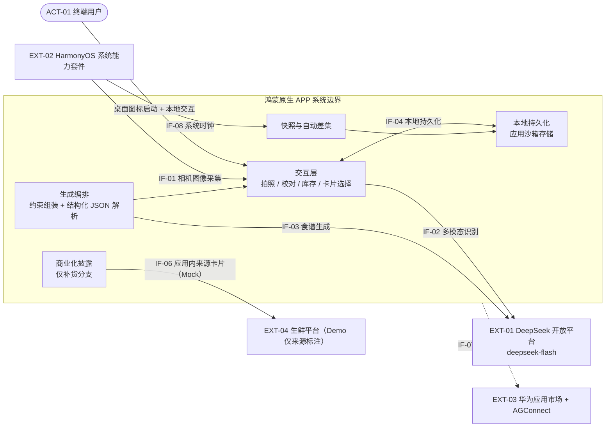

# 冰箱清库存食谱助手 · 系统设计说明书（第一版）—— 系统边界与上下文

> 文档版本：**v0.2**
> 编制日期：2026-09-21
> 上游依据：`docs/需求规格说明书.md`（**v4.0**）、`docs/洞察报告.md`（**v4.0**）、`requirements.md`、`web_results/E-05 可用多模态API`
> 下游文档：《架构设计说明书》（容器 / 组件 / 数据模型 / 接口契约 / 部署与运行）
> 覆盖范围：系统上下文与系统边界（C4 L1），含外部接口清单、边界内概念数据对象与需求追溯；不含架构分解与实现细节

## 版本变更记录

| 版本 | 日期 | 变更摘要 | 变更依据 |
| --- | --- | --- | --- |
| v0.1 | 2026-09-18 | 首次产出：设计基准与约束、系统上下文（A/B 双方案）、系统边界与 A/B 差异矩阵、信任与安全边界、外部接口 IF-01 ~ IF-08、概念数据对象 DO-01 ~ DO-11、需求追溯表 | `docs/需求规格说明书.md` v3.0、`docs/洞察报告.md` v3.0、`web_results/E-05` |
| v0.2 | 2026-09-21 | ① 载体收敛为**鸿蒙原生 APP**，移除双方案上下文与 A/B 边界差异矩阵；② 删除「系统入口与卡片」接口行并释放其编号，`IF-01 ~ IF-08` 其余编号不重排；③ `IF-04`/`IF-06`/`IF-07` 按应用沙箱、应用内来源卡片（Mock）、APP 上架改写；④ 删除双方案边界差异编号族；⑤ 章节号随删节同步（原 §3.3→§3.2、§3.4→§3.3；原 §4.4→§4.3） | 本轮载体收敛决策、`docs/需求规格说明书.md` v4.0、`web_results/E-05` |

---

## 1. 文档说明

### 1.1 目的

界定「冰箱清库存食谱助手」在 Demo 基准下的**系统上下文**与**系统边界**：明确参与者、外部系统、跨边界交互、外部接口、边界内概念数据对象，以及信任与安全边界。本文是《需求规格说明书》的需求结论向技术设计过渡的第一份交付物，为后续《架构设计说明书》提供边界输入。

### 1.2 范围

- **本文件覆盖**：系统上下文图与交互清单、范围内 / 范围外边界、信任与安全边界、外部接口清单、概念数据对象、需求追溯。
- **本文件不覆盖**：容器与组件分解（C4 L2/L3）、数据模型与存储实现（字段 / 类型 / ER / 存储表）、接口报文字段与错误码、部署与运行、代码实现——统一归入《架构设计说明书》。

### 1.3 术语

需求侧术语（库存、本次快照、历史快照、自动差集、本次消耗、过期阈值、粗粒度余量、缺材宽容、补货分支、触发补货条件、便当场景开关、临期、识别名称稳定性、反常识组合）沿用 `docs/需求规格说明书.md` §1.3 的定义，本文不再重复。本文新增的编号族见 §1.4。

### 1.4 编号与引用规范

| 编号族 | 含义 |
| --- | --- |
| `ACT-xx` | 参与者（Actor） |
| `EXT-xx` | 外部系统（External System） |
| `IF-xx` | 外部接口（Interface） |
| `DO-xx` | 边界内概念数据对象（Data Object，仅概念） |

需求引用一律沿用上游编号：`FR-xx`（功能性需求）、`NFR-xx`（非功能性需求）、`RQ-xx`（反向需求）、`UC-xx`（验收用例）、`§x.y`（章节）。调研依据沿用 `web_results/` 文件名编号（如 `E-05`）与 `docs/洞察报告.md` 附录 A 来源编号（如 `A-01`）。本文件不新增、不修改任何上游需求编号。

---

## 2. 设计基准与约束

### 2.1 Demo 基准与生产演进

边界以 **Demo 基准**定义；生产演进点作为**边界外延**单独标注，不混入 Demo 边界。

| 维度 | Demo 基准（本文边界以此为准） | 生产演进（边界外延，不计入 Demo 边界） |
| --- | --- | --- |
| 形态 | **鸿蒙原生 APP**（本地 HAP 安装） | 正式上架、灰度与运营 |
| 交付周期 | 5 天，9 月 24 日验收 | 迭代周期 |
| 服务端 | **无自建服务端**；客户端直连 DeepSeek 开放平台（API Key 内置，仅演示用途） | 预留 BFF / 网关代理，收敛 API Key 与调用治理 |
| 账号 | 无账号体系，匿名本地会话 | 账号与跨端同步（如需） |
| 分佣 | 补货分支仅展示**应用内来源卡片**与标注，**不拉起外部 App、不做真实结算** | 接入生鲜平台联盟，完成真实跳转分佣结算 |
| 上架 | **本地安装即可演示**；上架非 Demo 前提 | 软著 + 工信部备案 + 华为审核后上架 |
| 数据 | 应用沙箱持久化，卸载应用或删除数据即清除 | 服务端留存与合规策略 |

### 2.2 共同约束

| 编号 | 类别 | 约束内容 |
| --- | --- | --- |
| NFR-01 | 性能 | 拍照识别从提交照片到返回品类清单 ≤5 秒（P90，正常网络）；`detail` 参数可调优，冰箱全景照慎用 `detail:low` |
| NFR-03 | 可靠性 | 弱网 / 无网时展示带时间戳的历史快照（只读），标注「可能已过期」与「离线」，引导「重新拍一张」；不得让用户误以为是当前库存 |
| NFR-04 | 隐私 | 冰箱照片默认本地处理 / 本地留存；首次上传前明示用途；提供一键删除全部照片、库存与历史快照；设计依据为 HarmonyOS 7 的 HPIC「本地优先、数据最小化、用户可控」原则 |
| NFR-10 | 可安装 / 可服务 | 评审者在演示设备上无需指导即可完成一次完整链路（本地 HAP 安装）；**上架为生产路径，不作为 Demo 前提** |
| NFR-12 | 可测试 | 同一张照片连拍 3 次，输出品类名一致或可规范化对齐；这是自动差集（FR-20）的前提，不达标则走「用户确认消耗项」降级路径 |

### 2.3 载体结论

- 按 `docs/需求规格说明书.md` §5.2，本产品**收敛为鸿蒙原生 APP 单一载体**：入口为桌面图标启动，持久化为应用沙箱，上架为生产演进。
- $APPEALS 显示最近似竞品有菜 4.22，**载体形态不构成护城河**；差异化落在需求逻辑（FR-09 缺材宽容、FR-12 便当场景、FR-20 自动消耗）。
- 本文的参与者、外部系统、概念数据对象与接口语义均面向该单一载体定义；Demo 基准为本地 HAP 安装，生产演进点（BFF / 网关、真实分佣、上架）单独标注。

---

## 3. 系统上下文（C4 L1）

### 3.1 参与者与外部系统定义

| 编号 | 名称 | 角色 / 说明 |
| --- | --- | --- |
| ACT-01 | 终端用户 | 匿名会话使用者；画像 A（周中带饭通勤）/ 画像 B（周末清库存）；不做注册登录（RQ-05） |
| EXT-01 | DeepSeek 开放平台 | `deepseek-flash`（DeepSeek-V4.1-Flash）：同一 API 兼任 Vision 识别与 LLM 食谱生成；HTTPS / REST |
| EXT-02 | HarmonyOS 系统能力套件 | Camera Kit、Preferences / RelationalStore、OpenLink / Want、系统时钟 |
| EXT-03 | 华为应用市场 + AGConnect | 签名、上架、审核、备案；Demo 使用本地 HAP，EXT-03 为生产依赖 |
| EXT-04 | 生鲜平台（美团联盟 CPS） | 补货分支跳转目标；Demo 仅占位，盒马 / 叮咚无可接入口径 |

### 3.2 运行时上下文图（鸿蒙原生 APP）

### 3.3 上下文交互清单

| # | 发起方 → 接收方 | 内容 | 时机 / 频率 | 协议 / 通道 | 对应需求 |
| --- | --- | --- | --- | --- | --- |
| 1 | ACT-01 → 客户端 | 拍照、校对增删改、余量确认、开便当开关、选卡片 | 每次使用（高频） | 本地 UI | FR-01、FR-02、FR-04、FR-12、FR-13、FR-15 |
| 2 | EXT-02 → 客户端 | 相机图像采集 | 每次盘点 1 次 | Camera Kit（IF-01） | FR-01 |
| 3 | 客户端 → EXT-01 | 多模态识别，返回食材品类 JSON | 每次拍照确认后 1 次 | HTTPS / REST（IF-02） | FR-01、NFR-01 |
| 4 | 客户端 → EXT-01 | 食谱生成（含缺材 / 便当 / 反常识 / 忌口约束） | 每次生成 1 次 | HTTPS / REST（IF-03） | FR-08 ~ FR-14 |
| 5 | 客户端 ↔ EXT-02 | 本地持久化读写（快照 / 历史 / 偏好 / 进度） | 每次会话多次 | Preferences / 关系库（IF-04） | FR-20、FR-24、FR-25、NFR-04 |
| 6 | 客户端 → EXT-04 | 补货分支展示**应用内来源卡片**并标注来源（Mock，不拉起外部 App） | 仅补货分支内 | 生鲜平台网关接口（IF-06，Mock） | FR-26、FR-27、NFR-11 |
| 7 | EXT-02 → 客户端 | 系统时钟（快照时间戳与过期判断） | 快照写入与展示时 | 系统时钟 API（IF-08） | FR-24、FR-25 |
| 8 | 构建产物 ↔ EXT-03 | 签名、上架、审核、备案 | 生产发布 | 应用市场 / AGConnect（IF-07） | NFR-10 |

---

## 4. 系统边界

### 4.1 范围内（In-scope）

| # | 能力块 | 范围定义 | 对应需求 |
| --- | --- | --- | --- |
| 1 | 拍照与识别 | 相机采集 + 多模态食材品类识别，输出不含重量 | FR-01 |
| 2 | 识别结果校对 | 手动增、删、改（改品类、合并重复、补充未识别项） | FR-02 |
| 3 | 余量确认 | 档位滑动 / 点选，无数字键盘 | FR-04 |
| 4 | 快照管理 | 当前快照 + 时间戳 + 过期标注（暂定 24h，可配置）+ 历史快照只读 | FR-03、FR-24、FR-25 |
| 5 | 临期推断 | 新增项首次出现时间 + 品类默认保鲜天数自动推断，允许手动覆盖 | FR-05、FR-06 |
| 6 | 生成编排 | 人数 / 饭量 + 便当场景开关 + 缺材宽容 + 忌口 / 反常识 / 临期优先 + 卡片化呈现 | FR-08 ~ FR-15、FR-18 |
| 7 | 自动差集与消耗反馈 | 消失项 = 本次消耗（零交互）；单次进度条 + 本次新增单列 + 周度计数 | FR-20、NFR-12 |
| 8 | 反馈层 | 省钱徽章 / 周报（克制呈现）、品质提示（展示级） | FR-07、FR-19 |
| 9 | 本地持久化 | 快照 / 历史 / 偏好 / 进度的本地读写，跨会话保留 | NFR-04 |
| 10 | 免登录交互 | 匿名会话，主链路无文本表单 | FR-21、FR-22、FR-23 |
| 11 | 补货分支 | 触发条件 + 上限 ≤2 样 + 排序隔离 + 应用内来源卡片披露 | FR-26、FR-27、NFR-11 |

### 4.2 范围外（Out-of-scope）

| 编号 | 范围外定义 | 依据 |
| --- | --- | --- |
| RQ-01 | 不做食材重量估计 / 称重输入 | 需求规格说明书 §4.3 |
| RQ-02 | 不做多品项（>2 样）采购清单；不做一键买齐；不做以补货为目的的主动推销；补货分支不得改变默认排序；补货入口不得出现在默认路径；不得引导凑单 | 需求规格说明书 §4.3 |
| RQ-03 | 不做内容社区（晒图、评论、关注、食谱投稿） | 需求规格说明书 §4.3 |
| RQ-04 | 不做「必须配齐材料」的食谱推荐 | 需求规格说明书 §4.3 |
| RQ-05 | 不做注册登录体系、不做第三方账号绑定 | 需求规格说明书 §4.3 |
| RQ-06 | 不做记账 / 营养摄入记录表单 | 需求规格说明书 §4.3 |
| RQ-07 | 不做省钱反馈的强制弹窗与主动推送，不置于核心主页 | 需求规格说明书 §4.3 |
| RQ-08 | 不做逐项手动扣减 / 确认库存、不做 350+ 食材保质期模板库、不做家庭共享冰箱（Demo 期）、不做广告变现、不做精确临期天数倒计时 | 需求规格说明书 §4.3 |
| RQ-09 | 不主张「减少食物浪费」的量化价值承诺 | 需求规格说明书 §4.3 |
| — | 自建服务端与账号体系（Demo） | §2.1、D-3 |
| — | 真实分佣结算（Demo 仅应用内来源卡片 Mock） | §2.1、FR-27 |
| — | 上架主路径（Demo 非前提，生产依赖 EXT-03） | §2.1、NFR-10 |
| — | 家庭共享（Demo 期） | RQ-08 |

### 4.3 信任与安全边界

| 边界项 | 边界定义 | 依据 / 状态 |
| --- | --- | --- |
| 照片隐私 | 冰箱照片默认本地处理 / 本地留存；首次上传前明示用途；支持一键删除全部照片、库存与历史快照 | NFR-04、HPIC 原则 |
| API Key | **Demo 限制**：客户端直连 DeepSeek 开放平台，API Key 内置，仅演示用途；生产以 BFF / 网关代理收敛 Key 与调用治理 | D-3、§2.1 |
| 匿名会话 | 无账号体系，会话标识仅存应用沙箱，跨会话保留；卸载应用或删除数据后沙箱数据清除 | FR-21 |
| 分佣披露 | 来源卡片展示前须标注合作 / 推广性质并标明来源；披露入口仅存在于补货分支内；默认路径中不存在任何来源卡片或推广入口 | FR-27、NFR-11 |
| 备案约束 | Demo 以本地 HAP 安装为主；上架为生产路径，APP 备案 15–20 工作日不可压缩 | NFR-10 |
| 模型能力未获取项 | 团队账户可用额度上限、端侧识别能力（是否可用于本应用）、是否支持多图同请求 | E-05 §六（未获取） |

---

## 5. 外部接口清单

| 编号 | 接口 | 方向 | 关键约束 | 对应需求 | 基准 |
| --- | --- | --- | --- | --- | --- |
| IF-01 | 相机图像采集 | EXT-02 → 客户端 | 需在 `module.json5` 声明 `ohos.permission.CAMERA`，运行时动态申请授权；与普通应用一致，非自由无限制调用 | FR-01 | Demo / 生产 |
| IF-02 | 多模态识别 | 客户端 → EXT-01 | 使用 `deepseek-flash` 原生 Vision（`deepseek-v4-pro` Vision Not supported）；**单图固定 ≤1024 token**（自动缩放约 1300×1300 等效）；**图片只能放在 `user` 消息**（放 `system` / `assistant` 返回 400）；格式 JPEG / PNG / GIF / WebP；Prompt 必须输出结构化 JSON；`detail:low` 先压到 512×512，**冰箱全景照慎用 `detail:low`**（会漏小件食材）；1M 上下文、384K 最大输出、并发 2500 | FR-01、NFR-01 | Demo / 生产 |
| IF-03 | 食谱生成 | 客户端 → EXT-01 | 同一 `deepseek-flash`；Prompt 输出结构化 JSON；含缺材三策略、便当三项约束、忌口与反常识硬约束、临期优先 | FR-09、FR-10、FR-11、FR-12、FR-14 | Demo / 生产 |
| IF-04 | 本地持久化 | 客户端 ↔ EXT-02 | Preferences / 关系型数据库；**应用沙箱**内可跨会话保留，卸载应用或删除数据后沙箱数据清除；Demo 不依赖服务端 | FR-20、FR-24、FR-25、NFR-04 | Demo / 生产 |
| IF-06 | 生鲜平台来源卡片 | 客户端 → EXT-04 | **应用内来源卡片（Mock）**：复用生成通道产出虚拟补货 JSON，卡片标明来源（美团 / 盒马等）与合作 / 推广性质；**不拉起外部 App、不调真实 API、不做真实结算**；仅存在于补货分支内；生产演进为真实跳转分佣，分佣口径为美团联盟 CPS **3%–6%** | FR-26、FR-27、NFR-11 | Demo（Mock）/ 生产（真实跳转） |
| IF-07 | 分发与上架 | EXT-03 ↔ 构建产物 | 生产路径：软著 30–60 工作日 + 工信部 APP 备案 **15–20 工作日**（不可压缩）+ 华为技术审核 3–5 工作日 | NFR-10 | 生产（Demo 非前提） |
| IF-08 | 系统时钟 | EXT-02 → 客户端 | 用于快照时间戳与过期阈值判断；过期阈值**暂定 24h（可配置）** | FR-24、FR-25 | Demo / 生产 |

> **IF-02 / IF-03 未获取项**（`web_results/E-05` §六，均标注「未获取」，不编造）：① 团队实际账户可用额度上限（是否有硬性配额）；② 端侧识别能力（HarmonyOS 7 开放的 20+ AI 能力中是否含视觉识别并可用于本应用）；③ 是否支持多图同请求（多角度冰箱照合并识别）。

---

## 6. 边界内概念数据对象

**说明**：以下仅定义每个概念对象的含义、产生时机、生命周期、是否跨会话与归属；**不展开字段、类型、ER 与存储表**，相关内容归入《架构设计说明书》。

| 编号 | 名称 | 含义 | 产生时机 | 生命周期 | 跨会话 | 归属 |
| --- | --- | --- | --- | --- | --- | --- |
| DO-01 | 当前库存快照 | 最近一次用户确认过的快照所记录的食材品项与粗粒度余量（不含精确重量） | 拍照 → 校对 → 余量确认后 | 至下一次快照覆盖；超期（暂定 24h，可配置）标「可能已过期」 | 是 | 边界内 · 本地 |
| DO-02 | 历史快照（只读） | 上一张已被覆盖的快照 | 新快照写入时，旧快照转为历史 | 至下一轮覆盖或用户删除全部数据 | 是 | 边界内 · 本地 |
| DO-03 | 本次消耗（自动差集结果） | 最近快照与上一张快照对比后消失的品项集合 | 第二次及以后快照确认时 | 随对应快照更新；明细被周度计数累计后可弃用 | 是 | 边界内 · 本地（推导结果） |
| DO-04 | 临期推断项 | 新增项按首次出现时间 + 品类默认保鲜天数推断的优先消耗标记，允许手动覆盖 | 快照写入时自动推断 | 随快照更新；可被用户覆盖 | 是 | 边界内 · 本地 |
| DO-05 | 候选食谱 / 卡片 | 由 EXT-01 生成、经客户端约束校验后展示的可执行方案集合 | 用户触发生成后 | 单次会话内有效 | 否 | 边界内 · 客户端持仓（生成能力来自 EXT-01） |
| DO-06 | 便当场景开关状态 | 用户单次点击表达的带饭意图状态 | 用户在生成前设置卡切换时 | 至本次生成结束或用户关闭 | 否 | 边界内 · 本地 |
| DO-07 | 口味偏好 / 忌口清单 | 个人口味偏好与家人 / 访客忌口条目 | 用户在「我的」中设置时 | 长期，至用户修改或删除 | 是 | 边界内 · 本地 |
| DO-08 | 消耗进度与周度计数 | 单次进度「本次用掉 X / Y 项」、本次新增单列与周度累计消耗事件数 | 快照差集产出后 | 单次进度随快照刷新；周度为纯事件累计，按周滚动 | 是 | 边界内 · 本地 |
| DO-09 | 省钱累计（徽章 / 周报） | 以「相比点外卖省下的钱」口径累计的节省金额与成就徽章 / 周报 | 用户完成消耗事件后累计 | 长期，用户可主动查看 | 是 | 边界内 · 本地 |
| DO-10 | 匿名会话标识（本地） | 本地生成、不关联真实身份的会话标识 | 首次启动时 | 与本地沙箱一致；卸载应用或删除数据即清除 | 是 | 边界内 · 本地 |
| DO-11 | 商业化披露上下文 | 补货分支的触发条件判定结果与来源卡片展示前的合作 / 推广标注状态 | 库存无法成菜且补货分支开启时 | 仅补货分支生命周期内有效 | 否 | 边界内 · 补货分支局部 |

---

## 7. 需求追溯表

### 7.1 边界 / 接口 ↔ 需求

| 边界 / 接口 | 覆盖需求 | 验收用例 | 边界说明 |
| --- | --- | --- | --- |
| IF-01 相机采集 + IF-02 识别（识别入口） | FR-01、FR-02 | UC-01、UC-02、UC-03 | 识别输出不含重量；结果可手动增删改 |
| DO-04 临期推断项 + IF-04 | FR-05 | UC-06 | 首次出现时间 + 品类默认保鲜天数，允许覆盖 |
| IF-03 生成编排（缺材宽容） | FR-09 | UC-07 | 三个策略：可省略 / 可替代 / 需购买极少量，优先展示前两者 |
| IF-03 + DO-07 忌口清单 | FR-10 | UC-08 | 规避忌口食材 |
| IF-03 Prompt 硬约束 | FR-11 | UC-09 | 规避反常识组合 |
| IF-03 + DO-06 便当开关 | FR-12 | UC-10 | 单次点击，三项约束，标签只读 |
| IF-03 生成编排（步骤约束） | FR-14 | UC-12 | 步骤 ≤8 步，可执行 |
| DO-09 省钱累计 | FR-19 | UC-15 | 仅徽章 / 周报，克制呈现 |
| DO-03 自动差集 + DO-08 进度计数 + IF-04 | FR-20、NFR-12 | UC-16、UC-32、UC-33 | 消失项 = 本次消耗；名称稳定性为前置，含降级路径 |
| DO-10 匿名会话 + 范围外 RQ-05 | FR-21 | UC-17 | 主链路 0 次登录拦截 |
| IF-01 + 交互层 | FR-22 | UC-18 | 仅拍照、滑动与卡片选择，无必填文字表单 |
| IF-04、IF-08 + DO-01（过期阈值 24h 可配置） | FR-24 | UC-04 | 时间戳 + 过期标注 + 重拍引导 |
| DO-02 历史快照 + IF-04 | FR-25 | UC-30 | 只读、带时间戳；不参与 FR-20 计数 |
| 补货分支边界 + IF-06 | FR-26 | UC-28 | 触发条件成立才出现，≤2 样，不改默认排序 |
| IF-06 + DO-11 披露上下文 | FR-27 | UC-31 | 来源卡片展示前合作 / 推广标注并标明来源；默认路径无入口 |
| IF-02 性能约束 | NFR-01 | UC-19 | 识别 ≤5s（P90） |
| DO-02 历史快照 + 离线边界 | NFR-03 | UC-21 | 弱网 / 无网展示带时间戳历史快照 |
| IF-04 + 信任边界（照片隐私） | NFR-04 | UC-22 | 本地优先 + 明示 + 一键删除 |
| IF-07 分发上架 + Demo 本地 HAP | NFR-10 | UC-25 | 演示设备自助；上架为生产路径 |
| DO-03 前提（名称稳定性） | NFR-12 | UC-33 | 连拍 3 次品类名一致或可规范化 |

### 7.2 反向需求 ↔ 边界声明

| 反向需求 | 边界声明 |
| --- | --- |
| RQ-01 | 识别输出不含重量（IF-02）；DO-01 仅有粗粒度余量档位 |
| RQ-02 | 补货分支仅在库存完全无法成菜时出现，上限 ≤2 样，不改变默认排序，默认路径无任何来源卡片或推广入口，无凑单引导 |
| RQ-03 | 边界内不存在内容发布 / 社区模块 |
| RQ-04 | 生成编排以缺材宽容为约束（IF-03），不要求配齐材料 |
| RQ-05 | 采用匿名会话（DO-10），边界内无账号与登录模块 |
| RQ-06 | 交互层无记账 / 营养记录表单，无文本输入 |
| RQ-07 | DO-09 仅以徽章 / 周报呈现，无主动推送与启动弹窗 |
| RQ-08 | 以自动差集（DO-03）替代逐项扣减；临期仅推断 + 允许覆盖；无保质期模板库、无家庭共享（Demo 期）、无广告变现、无精确倒计时 |
| RQ-09 | 边界内不产出「减少食物浪费」的量化指标或价值承诺 |

### 7.3 关键验收用例锚点

| 用例 | 边界锚点 | 说明 |
| --- | --- | --- |
| UC-32 | DO-03、DO-08、IF-04 | 第二次拍照并确认后，系统自动列出消失项为「本次消耗」，用户零交互，进度条自动更新 |
| UC-33 | NFR-12、DO-03 前提 | 同一张真实冰箱照（含遮挡 / 堆叠）连拍 3 次，品类名一致或可规范化对齐；不达标时 FR-20 降级路径可切换 |

---

## 8. 后续迭代大纲

《架构设计说明书》在本文件边界之内承接以下内容，不在本文件展开：

| # | 承接内容 | 输入 |
| --- | --- | --- |
| 1 | 容器视图（C4 L2）：客户端、本地存储、外部服务的容器划分与职责 | §3 上下文、§4 边界 |
| 2 | 组件视图（C4 L3）：识别、差集、生成编排、披露等组件的职责与协作 | §4.1 范围内能力块 |
| 3 | 数据模型：由 DO-01 ~ DO-11 推导存储结构、字段与关系 | §6 概念数据对象 |
| 4 | 接口契约：由 IF-01 ~ IF-08 推导请求 / 响应报文、错误码与降级语义 | §5 外部接口清单 |
| 5 | 部署与运行：Demo 本地 HAP 形态与生产 BFF / 网关外延 | §2.1 双层基准 |

**决策项（CDCP）**：生产是否引入 BFF / 网关；APP 上架资质路径（软著 / 备案 / 内部通道）；商业化变现形态（真实跳转分佣与其他方式的取舍）。

**未获取项（需开发者账号登录解锁）**：`Preferences` / 关系库单库容量上限、相机权限审核特殊要求；APP 备案与审核 Checklist、首次审核 SLA、备案号复用规则；账户可用额度上限、端侧识别能力、多图同请求支持（E-05）。上述项目在具备条件后纳入架构设计输入，当前不编造具体数值。
