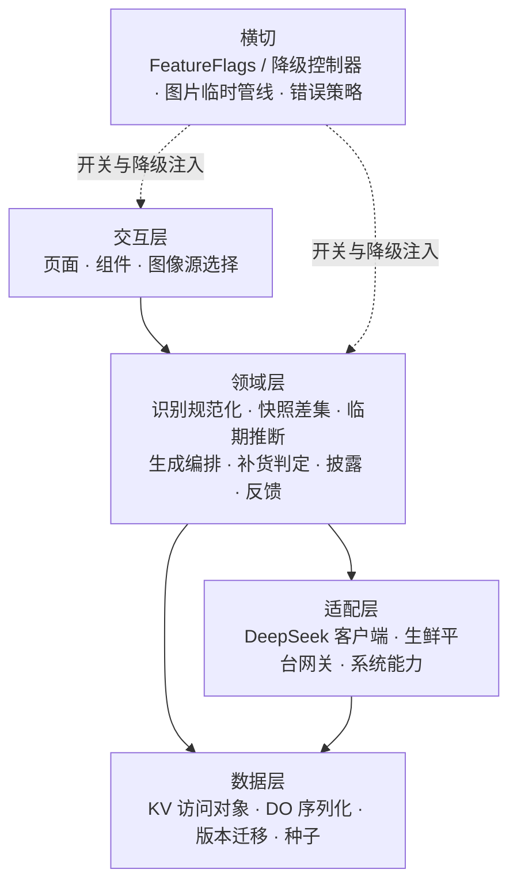
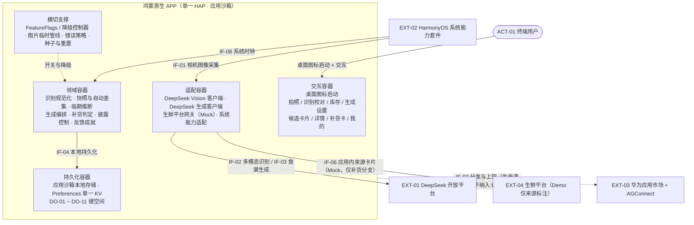
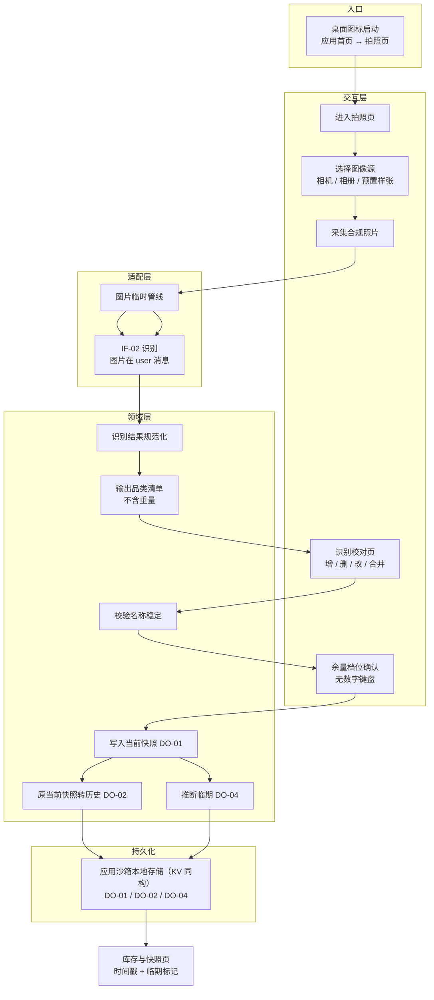
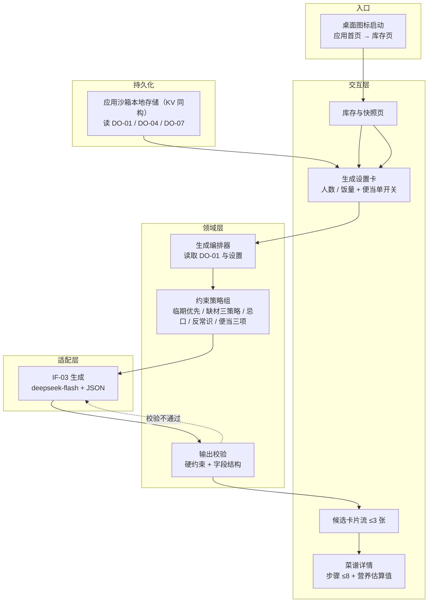
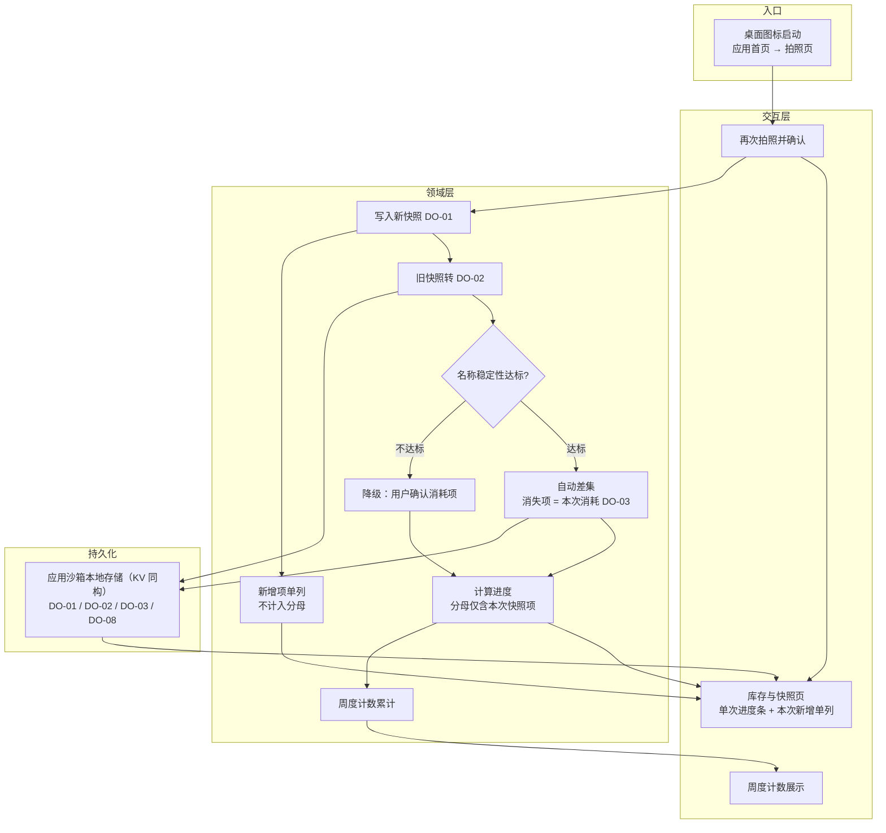
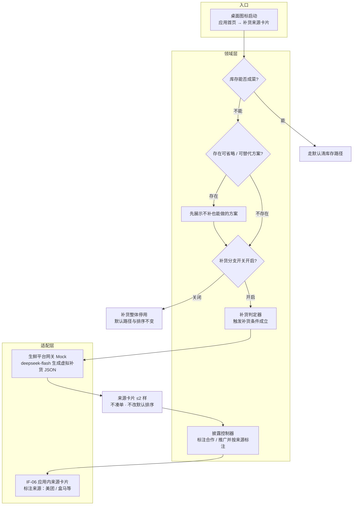
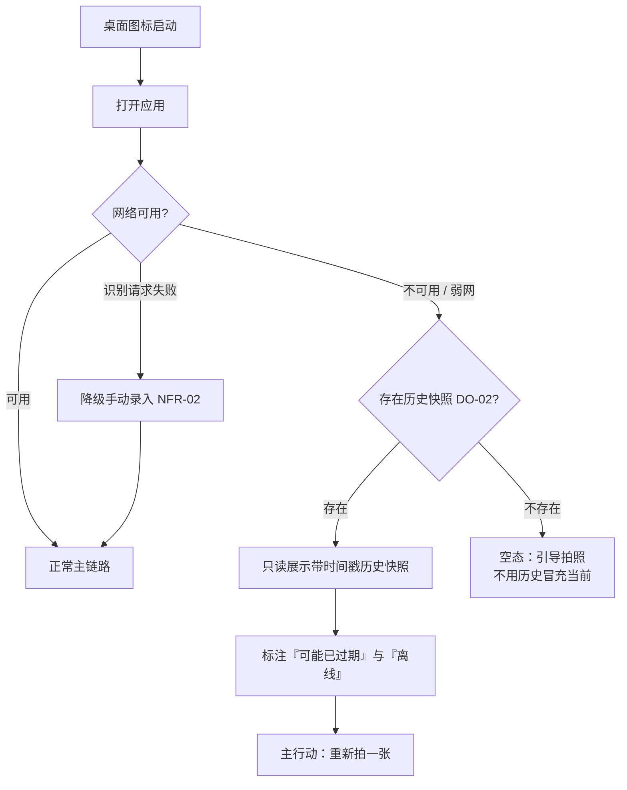
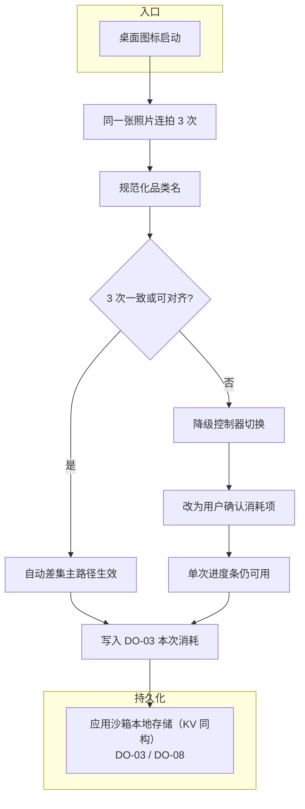

# 冰箱清库存食谱助手 · 需求串讲（内部参考）

> 文档版本：**v0.2**
> 编制日期：2026-09-21
> 上游依据：`docs/需求规格说明书.md`（**v4.0**）、`docs/洞察报告.md`（**v4.0**）、`docs/系统设计说明书.md`（**v0.2**）、`docs/架构设计说明书.md`（**v0.2**）、`requirements.md`、`web_results/E-05 可用多模态API`
> 文档性质：团队内部需求串讲与落地参考。对既有需求与设计做盘点、归并、串联，**不新增需求、不修改编号**
> 读者：参与 Demo 开发、联调与验收的产品、交互、开发与测试成员

## 版本变更记录

| 版本 | 日期 | 变更摘要 | 变更依据 |
| --- | --- | --- | --- |
| v0.1 | 2026-09-18 | 首次产出：需求总盘（FR/NFR/RQ/UC 全量索引与计数）、系统框架与交互对象、六条用户流程的 A/B 双方案图与组件协作、组件输入输出与八页展示数据需求、追溯矩阵、未决项与风险 | `docs/需求规格说明书.md` v3.0、`docs/洞察报告.md` v3.0、`docs/系统设计说明书.md` v0.1、`docs/架构设计说明书.md` v0.1 |
| v0.2 | 2026-09-21 | ① 载体收敛为**鸿蒙原生 APP**单载体，删除双方案图与入口差异两列，§3 十二条图收敛为六条；② 删除「载体」列与系统入口依赖，`IF-01 ~ IF-08` 其余编号不重排；③ `IF-06` 改写为应用内来源卡片（Mock，标明来源）；④ 新增 **§1.9 交付范围：MVP → Demo**；⑤ 未决项 / 风险删除旧平台形态前置项，改写 Mock 替换风险；⑥ 计数零漂移（FR 27 / NFR 12 / RQ 9 / UC 33；P0 27 / P1 11 / P2 1） | 本轮载体收敛决策、`docs/需求规格说明书.md` v4.0、`docs/系统设计说明书.md` v0.2、`docs/架构设计说明书.md` v0.2 |

---

## 0. 文档说明

### 0.1 目的

把「要做多少、边界在哪、谁和谁交互、点一下发生什么、前后端各自给什么」一次讲清，作为开发前的统一口径。本文件不承担需求定义与架构定义职责，只做盘点、归并、串联与引用。

### 0.2 读者与用法

| 读者 | 用法 |
| --- | --- |
| 产品 / 交互 | §1 需求总盘确认范围与优先级；§2.3 用户用例场景确认主链路与分支；§4.2 八页展示与数据需求确认页面口径 |
| 开发 | §2 交互对象、§3 流程与组件协作、§4.1 组件 I/O、§4.3 页面联动表确认职责边界 |
| 测试 / 验收 | §1.7 验收用例索引、§3 流程分叉、§5 追溯矩阵确认每条需求的落点 |

### 0.3 与上游文档的关系

| 上游 | 本文的承接方式 |
| --- | --- |
| `需求规格说明书.md` v4.0 | 计数、编号、优先级、验收标准的唯一权威来源；本文 §1 全量转述并归并 |
| `洞察报告.md` v4.0 | 场景与差异化依据来源；本文 §6 风险与未决项引用 |
| `系统设计说明书.md` v0.2 | `ACT / EXT / IF / DO` 编号族的定义来源；本文 §2.2 与 §3 沿用 |
| `架构设计说明书.md` v0.2 | 分层、容器、组件、数据键空间、流程的主要事实来源；本文转述并对齐，不重新定义 |

### 0.4 术语沿用

需求侧术语（库存、本次快照、历史快照、自动差集、本次消耗、过期阈值、粗粒度余量、缺材宽容、补货分支、触发补货条件、便当场景开关、临期、识别名称稳定性、反常识组合）沿用《需求规格说明书》§1.3；边界侧术语（参与者、外部系统、外部接口、概念数据对象）沿用《系统设计说明书》§1.3 / §1.4。本文不新增术语族。

### 0.5 编号与引用规范

- 需求引用沿用上游编号：`FR-xx`、`NFR-xx`、`RQ-xx`、`UC-xx`、`§x.y`。
- 边界与接口引用沿用《系统设计说明书》：`ACT-xx`、`EXT-xx`、`IF-xx`、`DO-xx`。
- 调研依据沿用 `web_results/` 文件名编号（如 `E-05`）。
- 本文以**章节号**作为落点锚点；用户用例场景只用**描述性名称**分组，**不新增任何编号族**。

### 0.6 DFX 口径声明

- **DFX = `NFR-01 ~ NFR-12`（共 12 条）**，按 性能 / 可靠性 / 隐私·安全 / 可测试性 / 可服务性 / 兼容性 / 可用性 / 可安装·可服务 / 隔离性 九个维度归类计数，见 §1.4。
- 模型与平台层面的硬约束（`≤1024 token`、图片只能放 `user` 消息、`detail:low` 慎用全景、`24h` 过期阈值、APP 备案 `15–20 工作日`、分佣 `3%–6%` 等）**单列于 §1.5「外部技术约束」，不计入 DFX 计数**。

---

## 1. 需求总盘：要做多少功能、遵守多少 DFX

### 1.1 计数总览

| 类别 | 数量 | 说明 |
| --- | --- | --- |
| 功能性需求 `FR` | **27**（FR-01 ~ FR-27） | 全部载体为**鸿蒙原生 APP** |
| 非功能性需求 `NFR`（即 DFX） | **12**（NFR-01 ~ NFR-12） | 维度归类见 §1.4 |
| 反向需求 `RQ` | **9**（RQ-01 ~ RQ-09） | 明确不做 |
| 验收用例 `UC` | **33**（UC-01 ~ UC-33） | 覆盖 FR / NFR |
| 优先级分布 | **P0 = 27；P1 = 11；P2 = 1** | P0 = 18 FR + 9 NFR |
| 外部技术约束 | 见 §1.5 | 不计入 DFX |

合计 39 条功能性 / 非功能性需求（FR 27 + NFR 12），全部有验收路径；9 条反向需求由概念边界与验收用例共同验证。

### 1.2 功能需求全量清单 `FR-01 ~ FR-27`

| 编号 | 名称 | KANO | 优先级 | 一句话验收要点 | 能力块 |
| --- | --- | --- | --- | --- | --- |
| FR-01 | 拍照识别食材品类（不含重量） | 基本型 | P0 | 含 ≥5 种食材照片输出 ≥4 品类项；无任何重量 / 克数；识别 ≤5s；前置门为 `deepseek-flash`、`user` 消息、单图 `≤1024 token`、结构化 JSON | 识别盘点 |
| FR-02 | 识别结果手动增删改 | 基本型 | P0 | 删除、新增、改品类（含合并重复）各 ≤2 次点击且生效 | 识别盘点 |
| FR-03 | 本次快照库存清单展示 | 期望型 | P0 | 进入即见库存；每项显示余量档位；无快照时展示引导拍照空态，不用历史快照冒充当前状态 | 识别盘点 |
| FR-04 | 余量档位滑动确认 | 期望型 | P0 | 全程无数字键盘；单品类确认 ≤1 次滑动；余量档位 ≤5 档 | 识别盘点 |
| FR-05 | 临期标记 | 期望型 | P0 | 新增项按首次出现时间 + 品类默认保鲜天数自动推断，可一键覆盖；临期项视觉可区分并在生成中被优先使用；不要求录入保质期数字 | 识别盘点 |
| FR-06 | 临期优先排序 | 期望型 | P1 | 开启排序后临期项出现在非临期项之前 | 识别盘点 |
| FR-07 | 品质 / 新鲜度提示（展示级） | 魅力型 | P1 | 仅建议性措辞，不输出「已变质」等确定性结论；算法不可用时降级固定文案 | 识别盘点 |
| FR-08 | 基于本次快照生成，临期优先使用 | 基本型 | P0 | 被使用食材 ≥ 库存清单的 60%；存在临期项时至少 1 个候选食谱使用临期项 | 生成 |
| FR-09 | 缺材宽容三策略 | 基本型 | P0 | 缺 1–2 样仍给出可执行方案；每个缺失项标注策略；「可省略 / 可用替代品」优先于「需额外购买」；需购买统一引用 FR-26 | 生成 |
| FR-10 | 规避忌口食材 | 基本型 | P0 | 生成结果中忌口食材出现次数 = 0 | 生成 |
| FR-11 | 规避反常识组合 | 基本型 | P0 | Prompt 含规避条款；5 组易触发库存 0 组产出反常识组合 | 生成 |
| FR-12 | 便当场景适配（单一开关） | 期望型 | P0 | 单次点击、无多选界面；开启后结果全部满足「少汤水 / 适合二次加热 / 隔夜不变味」；三标签只读可见；关闭时不施加 | 生成 |
| FR-13 | 人数 / 饭量选择 | 基本型 | P0 | 未选择不得开始生成；「大食量」与「1 人」的用量描述不同 | 生成 |
| FR-14 | 步骤简单可执行 | 基本型 | P0 | 每个食谱步骤 ≤8 步；每步单一动作且含明确火候 / 时长或不含歧义动词 | 生成 |
| FR-15 | 候选食谱卡片化 | 期望型 | P0 | 首屏 ≥3 张卡片；卡片含菜名、耗时、所用库存食材、缺失食材标识、便当标签；可直接进入详情 | 生成 |
| FR-16 | 个人口味记忆 | 期望型 | P1 | 设置「清淡」后再次生成不出现重辣菜式；偏好 ≤2 次点击内可改 | 生成 |
| FR-17 | 家人 / 访客忌口清单 | 魅力型 | P1 | 可为 ≥3 个联系人分别记录忌口；选中后生成结果不出现其忌口食材 | 生成 |
| FR-18 | 营养数据展示 | 期望型 | P0 | 热量 / 蛋白质 / 碳水三项可见；带显著「估算值」标注；数值来源可解释 | 健康省钱 |
| FR-19 | 省钱成就与周报 | 魅力型 | P2 | 存在可查看的累计节省金额；不出现于启动弹窗或首页首屏核心位置；计算口径可在页面内查看；无主动推送 | 健康省钱 |
| FR-20 | 消耗反馈（自动差集 + 单次进度 + 周度计数） | 魅力型 | P1 | 第二次拍照确认后消失项自动列为「本次消耗」、用户零交互；进度条分母仅含本次快照项；补货买入单列为「本次新增」且不进分母；无负数净值指标；周度为纯事件累计；历史快照不参与计数；降级路径可验证 | 健康省钱 |
| FR-21 | 无需注册登录（匿名会话） | 基本型 | P0 | 主链路 0 次登录拦截、0 次手机号 / 验证码输入；会话状态本地持久化 | 形态体验 |
| FR-22 | 仅拍照与卡片选择 | 基本型 | P0 | 主链路无文本输入框；所有决策点为点击 / 滑动 / 卡片选择；无记账类表单 | 形态体验 |
| FR-23 | 默认路径步数受限 | 期望型 | P0 | 余量确认 ≤1 屏前提下，默认清库存路径总交互步数 ≤4；补货分支不占用该预算 | 形态体验 |
| FR-24 | 库存快照有效期 | 基本型 | P0 | 库存页显示快照时间戳；超过过期阈值（暂定 `24h`，可配置）标「可能已过期」并给「重新拍一张」主行动；不得把过期快照当当前库存用于生成 | 形态体验 |
| FR-25 | 快照保留与自动差集 | 期望型 | P1 | 上一张快照可被读取用于差集；展示时页顶强制标注「截至 X 时刻，可能已过期」；历史快照不参与 FR-20 计数；历史食材不可直接用于生成 | 形态体验 |
| FR-26 | 补货分支 | 期望型 | P1 | 库存无法成菜（如只剩葱姜蒜 + 大半块肉）时出现补货卡；补货项 ≤2 样；存在「不补也能做」方案时先展示；不改变默认结果排序；无凑单引导 | 补货商业化 |
| FR-27 | 商业化披露 | 基本型 | P1 | 来源卡片展示前可见合作 / 推广标注并标明来源（美团 / 盒马等）；来源卡片仅存在于补货分支内；关闭补货分支后完全消失；分佣口径为美团联盟 CPS `3%–6%` | 补货商业化 |

### 1.3 功能需求按能力块归并

| 能力块 | 包含 FR | P0 | P1 | P2 | 归并说明 |
| --- | --- | --- | --- | --- | --- |
| 识别盘点 | FR-01 ~ FR-07 | FR-01 ~ FR-05（5） | FR-06、FR-07（2） | — | 拍照识别、结果校对、余量档位、临期推断与排序、品质提示 |
| 生成 | FR-08 ~ FR-17 | FR-08 ~ FR-15（8） | FR-16、FR-17（2） | — | 生成编排、缺材宽容、忌口 / 反常识硬约束、便当场景、人数饭量、卡片化、口味与忌口记忆 |
| 健康省钱 | FR-18 ~ FR-20 | FR-18（1） | FR-20（1） | FR-19（1） | 营养估算、省钱成就、自动差集消耗反馈 |
| 形态体验 | FR-21 ~ FR-25 | FR-21 ~ FR-24（4） | FR-25（1） | — | 匿名会话、无文本表单、步数受限、快照有效期、历史快照保留 |
| 补货商业化 | FR-26 ~ FR-27 | — | FR-26、FR-27（2） | — | 触发条件与上限、排序隔离、合作 / 推广披露 |
| **合计** | **27** | **18** | **8** | **1** | 与 §1.1 优先级分布一致 |

### 1.4 DFX 全量清单 `NFR-01 ~ NFR-12`

| 编号 | DFX 维度 | 要求 | 可测试验收要点 | 优先级 |
| --- | --- | --- | --- | --- |
| NFR-01 | 性能 | 拍照识别响应时间从提交照片到返回品类清单 ≤5 秒（P90，正常网络） | 10 次实测 ≥9 次 ≤5s；超时进入 NFR-02；可用 `detail` 调优，冰箱全景照慎用 `detail:low` | P0 |
| NFR-02 | 可靠性 | 识别失败 / 超时降级到手动录入模式，不阻断主链路 | 断网或接口失败后仍可手动新增品类并继续生成 | P0 |
| NFR-03 | 可靠性 | 弱网 / 无网展示带时间戳的历史快照（只读），标「可能已过期」与「离线」，引导「重新拍一张」 | 飞行模式下可见只读历史快照、双标注与重拍按钮；不得让用户误以为是当前库存 | P0 |
| NFR-04 | 隐私 / 安全 | 照片默认本地处理 / 本地留存；首次上传前明示用途；提供一键删除全部照片、库存与历史快照 | 首次上传前有明示；删除后本地无照片、无库存、无历史快照残留；依据 HPIC「本地优先、数据最小化、用户可控」 | P0 |
| NFR-05 | 可测试性 | 提供演示剧本，覆盖主力路径、补货分支、历史快照路径三条；使用固定输入集保证回归一致性 | 三条路径有脚本化步骤与预期输出；两名未参与开发者走查结果一致；记录识别结果一致性 | P0 |
| NFR-06 | 可服务性 | 具备降级开关：可关闭品质检测提示与省钱反馈而不影响主链路 | 分别关闭两项后主链路仍可完整走通 | P1 |
| NFR-07 | 兼容性 | 明确最低鸿蒙系统版本与支持设备范围 | 在声明的最低版本设备上完成一次全链路演示 | P0 |
| NFR-08 | 可测试性 | 品质检测降级为固定规则文案（按品类给出通用建议），文案库可配置 | 关闭算法模块后 FR-07 提示仍正常显示为通用建议 | P0 |
| NFR-09 | 可用性 | 全部交互元素触达区域 ≥44×44 vp；关键按钮不依赖精确点击；仅使用 ArkTS 系统组件 | 设计走查核对 | P1 |
| NFR-10 | 可安装 / 可服务 | 评审者在演示设备上无需任何指导即可完成一次完整链路（本地 HAP 安装）；上架为生产加分项，不作为 Demo 前提 | 外部评审者 5 分钟内无口头指导完成完整链路；依据为备案 `15–20 工作日` 不可压缩 | P0 |
| NFR-11 | 隔离性 | 补货分支隔离：关闭后默认清库存路径与全部主链路功能不受影响；补货分支不改变默认结果排序 | 关闭前后同一输入结果排序完全一致；默认路径检索不到任何来源卡片或推广标注 | P1 |
| NFR-12 | 可测试性 | 识别名称稳定性：同一张照片连拍 3 次，输出品类名一致或可规范化到统一品类表；是自动差集 FR-20 的前提 | 5 张真实冰箱照（含遮挡 / 堆叠）重复测试通过率 100%；不通过时降级路径可切换且可验证 | P0 |

**DFX 维度归类计数**

| DFX 维度 | 数量 | 编号 |
| --- | --- | --- |
| 性能 | 1 | NFR-01 |
| 可靠性 | 2 | NFR-02、NFR-03 |
| 隐私 / 安全 | 1 | NFR-04 |
| 可测试性 | 3 | NFR-05、NFR-08、NFR-12 |
| 可服务性 | 1 | NFR-06 |
| 兼容性 | 1 | NFR-07 |
| 可用性 | 1 | NFR-09 |
| 可安装 / 可服务 | 1 | NFR-10 |
| 隔离性 | 1 | NFR-11 |
| **合计** | **12** | NFR-01 ~ NFR-12 |

### 1.5 外部技术约束（单列，不计入 DFX）

| 约束 | 取值 / 结论 | 来源 |
| --- | --- | --- |
| 识别模型 | **`deepseek-flash`** 原生 Vision；**`deepseek-v4-pro` Vision Not supported**，flash 为唯一可行选择 | E-05 §二 |
| 单图 token | 固定 **`≤1024 token`**（自动缩放到约 1300×1300 等效；原图再大亦然） | E-05 §三 |
| 图片消息位置 | 图片**只能放在 `user` 消息**；放在 `system` / `assistant` 会返回 **400** | E-05 §三 |
| 支持格式 | JPEG / PNG / GIF / WebP | E-05 §三 |
| `detail` 参数 | `low` 先压到 512×512；**冰箱全景照慎用 `detail:low`**，会漏掉小件食材 | E-05 §三、NFR-01 |
| 上下文 / 输出 / 并发 | 1M 上下文、384K 最大输出、并发 2500 | E-05 §三 |
| 单次识别成本 | 约 ¥0.0027（闲时）– ¥0.0054（高峰）；高峰时段 = 北京时间 09:00–12:00 与 14:00–18:00，9/24 白天验收落入高峰 | E-05 §四 / §五 |
| 过期阈值 | **`24h`（可配置）**，超阈值标「可能已过期」并提示重拍 | FR-24、SRS §1.3 |
| 载体形态 | **鸿蒙原生 APP**；入口为桌面图标启动；Demo 使用本地 HAP 安装 | SRS §5.2 |
| 上架周期 | 软著 30–60 工作日 + 工信部 APP 备案 **`15–20 工作日`**（不可压缩）+ 华为技术审核 3–5 工作日；上架为生产路径，**Demo 非前提** | IF-07 |
| 分佣口径 | 美团联盟 CPS **`3%–6%`**（唯一公开可接入口径）；单笔约 **0.45–1.8 元/单**；Demo 用应用内来源卡片 Mock，属生产演进 | SRS §5.3、IF-06 |
| 补货约束 | 上限 **≤2 样**（暂定阈值，可配置）；不得引导凑单；不得改变默认清库存结果排序 | FR-26、RQ-02、NFR-11 |
| 隐私依据 | HPIC「本地优先、数据最小化、用户可控」；照片不落盘、卸载应用或删除数据即清除沙箱数据 | NFR-04 |

### 1.6 反向需求 `RQ-01 ~ RQ-09`

| 编号 | 明确不做 | 理由摘要 |
| --- | --- | --- |
| RQ-01 | 不做食材重量估计 / 称重输入 | 生食材分量估算 MAPE 100–196%，且不符合用户预期「别告诉我 200g 土豆」 |
| RQ-02 | 不做多品项（>2 样）采购清单；不做一键买齐；不做以补货为目的的主动推销；补货分支不得改变默认排序；补货入口不得出现在默认路径；不得引导凑单 | 与「清库存」第一原则冲突；补货仅在完全无法成菜时作为受约束补货分支 |
| RQ-03 | 不做内容社区（晒图、评论、关注、食谱投稿） | 无法与头部内容平台竞争，且挤占 P0 资源 |
| RQ-04 | 不做「必须配齐材料」的食谱推荐 | 用户放弃使用的主要原因；补货分支不等于强制配齐 |
| RQ-05 | 不做注册登录体系、不做第三方账号绑定 | 与「无脑操作」DNA 冲突 |
| RQ-06 | 不做记账 / 营养摄入记录表单 | 用户明确拒绝繁重输入 |
| RQ-07 | 不做省钱反馈的强制弹窗与主动推送，不置于核心主页 | 用户反感的是强制曝光方式，而非省钱本身（G-02 五维度验证） |
| RQ-08 | 不做逐项手动扣减 / 确认库存、不做 350+ 食材保质期模板库、不做家庭共享冰箱（Demo 期）、不做广告变现、不做精确临期天数倒计时 | 逐项维护是同质化负担；模板库维护成本高；共享引入冲突处理；广告与克制信任冲突；精确倒计时依赖不维护的账本 |
| RQ-09 | 不主张「减少食物浪费」的量化价值承诺 | 家庭端就餐浪费在四场景中最低（24.6 g/餐），冰箱食材腐坏丢弃率无数据；价值改由决策效率 + 省钱 + 零维护承担 |

### 1.7 验收用例索引 `UC-01 ~ UC-33`

| 用例 | 覆盖需求 | 前置 | 预期要点 |
| --- | --- | --- | --- |
| UC-01 | FR-01 | 含 ≥5 种食材的照片 | ≥4 个品类项；无重量数字；≤5s |
| UC-02 | FR-01、RQ-01 | 同上 | 输出中不存在重量 / 克数字段 |
| UC-03 | FR-02 | 已有识别结果 | 删 / 增 / 改三项操作各 ≤2 次点击且生效 |
| UC-04 | FR-03、FR-24 | 已完成一次盘点并关闭应用；将系统时间推过过期阈值 | 页顶显示时间戳；超阈值标「可能已过期」与「重新拍一张」；不得把过期快照当当前库存用于生成 |
| UC-05 | FR-04 | 库存中有一项 | 全程无数字键盘；≤1 次滑动 |
| UC-06 | FR-05、FR-08 | 库存含 2 项被推断为临期 | 至少 1 个候选使用临期项；覆盖临期状态后排序更新 |
| UC-07 | FR-09 | 库存缺少 2 样常见辅料 | 仍给出可执行方案；每项标策略；「可省略 / 可替代」优先于「需购买」 |
| UC-08 | FR-10 | 忌口清单含「香菜」且库存含香菜 | 结果中香菜出现 0 次 |
| UC-09 | FR-11 | 5 组易触发反常识的库存 | 0 组出现反常识组合 |
| UC-10 | FR-12 | 任意库存 | 单次点击开关、无多选；结果满足三项约束；三标签只读可见 |
| UC-11 | FR-13 | 任意库存 | 不选人数被阻止；「大食量」与「1 人」用量描述不同 |
| UC-12 | FR-14 | 任一候选食谱 | 步骤 ≤8 步；无歧义动作 |
| UC-13 | FR-15、FR-23 | 拍照完成 | 首屏 ≥3 张卡片；默认路径总交互步数 ≤4 |
| UC-14 | FR-18 | 进入食谱详情 | 三项指标可见且带显著「估算值」标注 |
| UC-15 | FR-19、RQ-07 | 使用一次以上 | 省钱数字不出现在启动弹窗或首页首屏核心位置；无主动推送；可在「我的」内查看 |
| UC-16 | FR-20 | 有本次快照，完成一次烹饪后再拍一张并确认，另有补货买入 | 消失项自动为「本次消耗」；分母仅含本次快照项；补货买入单列不进分母；无负数净值；周度累计不含历史快照；关闭自动差集后仍可用 |
| UC-17 | FR-21 | 全新环境 | 0 次登录拦截、0 次验证码 |
| UC-18 | FR-22 | 走主链路 | 无文本输入框、无记账表单 |
| UC-19 | NFR-01 | 正常网络 | 10 次识别计时 ≥9 次 ≤5s |
| UC-20 | NFR-02 | 人为让识别接口失败 | 自动进入手动录入，主链路可继续 |
| UC-21 | NFR-03 | 飞行模式 | 显示带时间戳历史快照、「可能已过期」与「离线」双标注、重拍引导 |
| UC-22 | NFR-04 | 首次上传前 | 上传前有明示；删除全部数据后本地无残留 |
| UC-23 | NFR-06 | 关闭品质检测与省钱反馈 | 主链路完整可用 |
| UC-24 | NFR-08 | 关闭品质算法模块 | FR-07 仍显示通用建议文案 |
| UC-25 | NFR-10 | 一位外部评审者 + 已安装 HAP 的演示设备 | 无口头指导下 5 分钟内完成完整链路 |
| UC-26 | NFR-05 | Demo Script 已编写 | 两人按剧本走查三条路径结果一致；同输入多次运行一致 |
| UC-27 | NFR-07 | 声明的最低鸿蒙版本设备 | 全链路可用，无崩溃与阻塞 |
| UC-28 | FR-26 | 构造「只剩葱姜蒜 + 大半块肉」的库存 | 出现补货卡；补货项 ≤2 样；存在「不补也能做」方案先展示；无凑单引导 |
| UC-29 | FR-26、NFR-11 | 同一输入，分别在补货分支开启与关闭状态下生成 | 默认结果排序完全一致；关闭后默认路径不受影响 |
| UC-30 | FR-25 | 已有一次历史快照，本次未拍摄 | 页顶「截至 X 时刻，可能已过期」；主按钮「重新拍一张」；历史可读用于差集但不参与 FR-20 计数 |
| UC-31 | FR-27、RQ-02 | 触发出补货卡 | 来源卡片展示前可见合作 / 推广标注并标明来源（美团 / 盒马等）；默认路径中不存在任何来源卡片与推广入口 |
| UC-32 | FR-20、NFR-12 | 两次可比对快照（第二次减少部分食材） | 系统自动列出消失项为「本次消耗」，用户零交互；进度条自动更新 |
| UC-33 | NFR-12 | 一张真实冰箱照（含遮挡 / 堆叠） | 连拍 3 次品类名一致或可规范化对齐；不达标时 FR-20 降级路径可切换 |

### 1.8 未获取项汇总

以下条目在原调研中标注「未获取」，本文**原样标注、不编造数值**。

| 来源 | 未获取项 |
| --- | --- |
| E-05 §六 | 团队实际账户可用额度上限；端侧识别能力（HarmonyOS 7 开放的 20+ AI 能力中是否含视觉识别并可用于本应用）；是否支持多图同请求 |

### 1.9 交付范围：MVP → Demo

> 本节只做范围映射，不改变 P0/P1/P2 口径（计数以 §1.1 为准）。

| 层级 | 范围 | 说明 |
| --- | --- | --- |
| **MVP** | 全部 P0（**27 条** = 18 FR + 9 NFR） | 识别盘点、生成链路、形态与体验、隐私与快照等主链路能力；缺则概念不成立 |
| **Demo** | MVP + 演示级 P1 | FR-07 / FR-20 / FR-25 / FR-26 / FR-27、NFR-06 / NFR-09 / NFR-11 以演示级 / 走查级覆盖（配合 NFR-05 演示剧本）；**FR-06 / FR-16 / FR-17 为时间余量项**，不列为 Demo 前提 |
| **P2** | 仅 UI | FR-19（省钱成就 / 周报）仅 UI 展示，不计入 Demo 前提 |

- **Demo 前提** = MVP（P0 27 条）+ 上表演示级 P1 可稳定复现。
- **演示形态**：本地 HAP 安装 + 应用内来源卡片（Mock），不依赖应用市场上架与真实外部接口。
- **非 Demo 前提**：生产上架与真实跳转分佣（`IF-06` 生产演进 / `IF-07`）。

---

## 2. 系统框架与交互对象

### 2.1 系统框架总览

逻辑依赖自外向内单向收敛：**交互层 → 领域层 → 数据层**；外部能力统一经**适配层**进入；横切能力以**降级控制器 / 开关**注入各层。

**鸿蒙原生 APP 容器图**

容器划分、领域模型、接口签名与数据键空间统一面向**鸿蒙原生 APP**单一载体；持久化容器为应用沙箱存储（KV 同构）。载体形态与入口说明见 §4.4。

### 2.2 交互对象清单

**参与者与外部系统**

| 编号 | 名称 | 角色 / 说明 |
| --- | --- | --- |
| ACT-01 | 终端用户 | 匿名会话使用者；画像 A（周中带饭通勤）/ 画像 B（周末清库存）；不做注册登录（RQ-05） |
| EXT-01 | DeepSeek 开放平台 | `deepseek-flash`：同一 API 兼任 Vision 识别与 LLM 食谱生成；HTTPS / REST |
| EXT-02 | HarmonyOS 系统能力套件 | Camera Kit、Preferences、系统时钟 |
| EXT-03 | 华为应用市场 + AGConnect | 签名、上架、审核、备案；Demo 使用本地 HAP，属生产依赖 |
| EXT-04 | 生鲜平台来源（Demo 仅来源标注） | 补货分支来源卡片的数据来源；Demo 不调用真实接口，盒马 / 叮咚无可接入口径 |

**外部接口**

| 编号 | 接口 | 方向 | 关键约束 | 对应需求 |
| --- | --- | --- | --- | --- |
| IF-01 | 相机图像采集 | EXT-02 → 客户端 | `module.json5` 声明 `ohos.permission.CAMERA` + 运行时授权；拒绝授权时回退相册 / 预置样张 | FR-01 |
| IF-02 | 多模态识别 | 客户端 → EXT-01 | `deepseek-flash`；单图 `≤1024 token`；图片只能放 `user` 消息；JPEG / PNG / GIF / WebP；`detail:low` 慎用全景；JSON Output；1M 上下文 / 384K 输出 / 并发 2500 | FR-01、NFR-01 |
| IF-03 | 食谱生成 | 客户端 → EXT-01 | 同一 `deepseek-flash`；结构化 JSON；缺材三策略、便当三项、忌口与反常识硬约束、临期优先 | FR-09 ~ FR-12、FR-14 |
| IF-04 | 本地持久化 | 客户端 ↔ EXT-02 | 应用沙箱 Preferences 单一 KV；同沙箱跨会话保留；卸载应用或删除数据即清除 | FR-20、FR-24、FR-25、NFR-04 |
| IF-06 | 生鲜平台来源卡片 | 客户端 → EXT-04 | **应用内来源卡片（Mock）**；标明来源（美团 / 盒马等）与合作 / 推广；仅补货分支内；不拉起外部 App；CPS `3%–6%` 为生产演进 | FR-26、FR-27、NFR-11 |
| IF-07 | 分发与上架 | EXT-03 ↔ 构建产物 | 软著 30–60 工作日 + 备案 `15–20 工作日` + 华为审核 3–5 工作日；Demo 以本地 HAP 安装为主，上架为生产路径 | NFR-10 |
| IF-08 | 系统时钟 | EXT-02 → 客户端 | 快照时间戳与过期阈值 `24h`（可配置）判断 | FR-24、FR-25 |

### 2.3 用户用例（User Case）总览

`UC-xx` 为上游验收用例编号，本文只按**描述性场景**分组，不新增编号。分组覆盖 UC-01 ~ UC-33 全部 33 条。

| 场景分组 | 涉及 UC | 参与对象 | 对应需求 |
| --- | --- | --- | --- |
| 主链路（拍照 → 校对 → 余量 → 生成 → 卡片 → 详情） | UC-01、UC-02、UC-03、UC-05、UC-06、UC-07、UC-08、UC-09、UC-10、UC-11、UC-12、UC-13、UC-14、UC-15、UC-17、UC-18、UC-19 | ACT-01、EXT-01、EXT-02、IF-01、IF-02、IF-03 | FR-01 ~ FR-18、FR-21 ~ FR-23、RQ-01、RQ-04、RQ-06、RQ-07 |
| 快照与自动差集（第二次拍照、历史快照只读） | UC-04、UC-16、UC-30、UC-32 | ACT-01、EXT-02、IF-04、IF-08 | FR-03、FR-20、FR-24、FR-25、NFR-12 |
| 补货分支与商业化披露 | UC-28、UC-29、UC-31 | ACT-01、EXT-04、IF-06 | FR-26、FR-27、RQ-02、RQ-04、NFR-11 |
| 离线 / 弱网 / 识别失败降级 | UC-20、UC-21、UC-23、UC-24 | ACT-01、EXT-02、IF-02 | NFR-02、NFR-03、NFR-06、NFR-08 |
| 隐私与数据删除 | UC-22 | ACT-01、IF-04 | NFR-04、RQ-08 |
| 兼容 / 安装 / 演示自助 | UC-25、UC-26、UC-27 | ACT-01、EXT-03、IF-07 | NFR-05、NFR-07、NFR-10 |
| 名称稳定性与降级切换 | UC-33 | ACT-01、EXT-01、IF-02 | NFR-12、FR-20（降级路径） |

### 2.4 DeepSeek 调用视角

Demo 为**客户端直连 DeepSeek 开放平台 + API Key 内置**（记为信任边界内的 Demo 限制，见 §6）；生产以 BFF / 网关收敛 Key 与调用治理，**不纳入 Demo 边界**。三条调用链如下。

**调用链一：`IF-02` 多模态识别**

| 项 | 内容 |
| --- | --- |
| 调用时机 | 用户在拍照页提交照片后 1 次 |
| 请求要点 | `model` = `deepseek-flash`；图片置于 **`user` 消息**的 `image_url`；Prompt 要求只输出结构化 JSON、禁止重量 / 克数；`response_format` = `json_object`；`temperature` 0.2；全景照使用 `detail.high`，慎用 `detail:low` |
| 返回结构 | `items[]{category, confidence}` + `notes` |
| 关键约束 | 单图 `≤1024 token`；格式 JPEG / PNG / GIF / WebP；图片放 `system` / `assistant` 返回 400；识别响应 ≤5s（NFR-01） |
| 失败与降级 | 图片位置错误修正后重试一次；超时 / 解析失败降级手动录入（NFR-02）；429 退避重试 |
| 成本口径 | 单次约 ¥0.0027（闲时）– ¥0.0054（高峰）；高峰 = 北京时间 09:00–12:00、14:00–18:00 |

**调用链二：`IF-03` 食谱生成**

| 项 | 内容 |
| --- | --- |
| 调用时机 | 用户在生成设置卡选定人数 / 饭量并确认后 1 次 |
| 请求要点 | `model` = `deepseek-flash`；Prompt 组装当前快照品类与余量、临期标记、人数 / 饭量、便当开关、口味与忌口；硬约束含忌口 0 次、反常识规避、步骤 ≤8、便当三项；软策略为缺材三策略且「可省略 / 可替代」优先；要求输出结构化 JSON |
| 返回结构 | `recipes[]{name, minutes, uses[], missing[]{name,strategy}, bento{}, steps[], nutrition{}}` |
| 关键约束 | 缺材三策略取值固定为「可省略 / 可用替代品 / 需额外购买」；「需额外购买」统一引用 FR-26；营养为估算值 |
| 失败与降级 | 输出校验不通过时重试一次，仍失败回退缓存候选（NFR-02） |
| 成本口径 | 与识别同一模型，按 token 计费 |

**调用链三：补货应用内来源卡片（Mock，复用生成通道）**

| 项 | 内容 |
| --- | --- |
| 调用时机 | 库存无法成菜（触发补货条件成立）且补货分支开关开启时 1 次 |
| 请求要点 | 复用 `IF-03` 通道，输入 `trigger` = `no_executable_dish`、库存摘要、`maxItems` = 2；Prompt 产出**虚拟补货 JSON** |
| 返回结构 | `replenishment{items[]{category,reason,quantityHint}, count, substituteShown, sources[], disclosure{partner,commission}}` |
| 关键约束 | `count ≤ 2`；不引导凑单；不改变默认排序；**应用内来源卡片标明来源（美团 / 盒马等）**并在展示前给出 `disclosure`（合作 / 推广）；**不拉起外部 App、不调真实 API** |
| 失败与降级 | Mock 失败时补货来源卡片可降级为固定占位提示；关闭补货分支后该链路整体停用（NFR-11） |
| 同构性 | 领域层依赖 `FreshPlatformGateway` 稳定签名（`buildReplenishment` + `showSourceCard`），生产替换真实跳转实现不改调用点；真实分佣 CPS `3%–6%`、单笔 0.45–1.8 元/单 |

---

## 3. 用户操作流程与组件协作

以下每条流程给出一张 `flowchart`（**鸿蒙原生 APP** 单载体），并附参与组件与协作表。入口统一为**桌面图标启动**，持久化统一为**应用沙箱存储**。

### 3.1 首次盘点建快照

**参与组件与协作**

| 层次 | 组件 | 本流程动作 | 输入 → 输出 | 对应 IF、DO、FR、NFR |
| --- | --- | --- | --- | --- |
| 交互层 | 拍照与图像源面板 | 选择图像源并采集 | 相机 / 相册 / 样张 → 合规照片 | IF-01、FR-01、FR-22 |
| 横切 | 图片临时管线 | 生成临时文件、base64、识别后清理 | 照片 → base64 载荷 | IF-02、NFR-04 |
| 适配层 | DeepSeek Vision 客户端 | 组装 `IF-02` 请求并解析 JSON | 图片 + Prompt → 品类 JSON | IF-02、FR-01、NFR-01 |
| 领域层 | 识别结果规范化器 | 品类名归一 | 原始品类名 → normalizedKey | FR-01、NFR-12 |
| 交互层 | 识别校对页 | 增、删、改、合并并确认 | 品类集合 → 已确认集合 | FR-02 |
| 领域层 | 快照管理器 | 写当前快照、转存历史、过期判定 | 已确认集合 → DO-01 / DO-02 | IF-04、IF-08、FR-24、FR-25 |
| 领域层 | 临期推断器 | 记首次出现时间并推断临期 | 新增项 → DO-04 | FR-05 |
| 数据层 | KV 访问对象 | 序列化落库与版本校验 | DO → JSON 字符串 | IF-04、NFR-04 |
| 交互层 | 库存与快照页 | 渲染时间戳与临期标记 | DO-01 / DO-04 → 列表视图 | FR-03、FR-24 |

### 3.2 生成主链路

**参与组件与协作**

| 层次 | 组件 | 本流程动作 | 输入 → 输出 | 对应 IF、DO、FR、NFR |
| --- | --- | --- | --- | --- |
| 交互层 | 生成设置卡 | 选人数 / 饭量、切换便当开关 | 用户选择 → DO-06 会话状态 | FR-12、FR-13 |
| 领域层 | 生成编排器 | 读取 DO-01 / DO-04 / DO-06 / DO-07 组装约束 | 库存 + 设置 → 生成输入 | IF-03、FR-08 |
| 领域层 | 约束策略组 | 施加临期优先、缺材三策略、忌口、反常识、便当三项 | 约束集 → 生成 Prompt | FR-09、FR-10、FR-11、FR-12 |
| 适配层 | DeepSeek 生成客户端 | 调 `IF-03` 并解析 recipes JSON | Prompt → 候选 JSON | IF-03、FR-15 |
| 领域层 | 生成编排器 | 输出校验（硬约束、字段结构、覆盖率） | 候选 JSON → 校验结果 | FR-08、FR-11、FR-14 |
| 交互层 | 候选卡片流与详情页 | 渲染 ≤3 张卡片与详情 | DO-05 → 卡片 / 详情视图 | FR-15、FR-14、FR-18 |
| 横切 | 错误与降级策略 | 校验 / 解析失败时重试或回退缓存候选 | 失败 → 缓存候选 | NFR-02 |

### 3.3 第二次拍照自动差集

**参与组件与协作**

| 层次 | 组件 | 本流程动作 | 输入 → 输出 | 对应 IF、DO、FR、NFR |
| --- | --- | --- | --- | --- |
| 交互层 | 拍照与图像源面板 | 再次采集并确认 | 新照片 → 新快照输入 | IF-01、FR-01 |
| 领域层 | 快照管理器 | 新快照覆盖、旧快照转历史 | 新快照 → DO-01 / DO-02 | IF-04、IF-08、FR-24、FR-25 |
| 领域层 | 识别结果规范化器 | 以 normalizedKey 对齐两次结果 | 两次品类集合 → 对齐键 | NFR-12 |
| 领域层 | 自动差集引擎 | 求差集，消失项 = 本次消耗、新增项记时间 | DO-01 + DO-02 → DO-03 | FR-20、FR-25 |
| 领域层 | 反馈与成就计算器 | 计算单次进度与周度计数 | DO-03 → DO-08 | FR-20 |
| 领域层 | 临期推断器 | 新增项推断临期 | 新增项 → DO-04 | FR-05 |
| 横切 | FeatureFlags / 降级控制器 | 名称不达标切「用户确认消耗项」 | 稳定性判定 → 降级分支 | NFR-12、FR-20 |
| 交互层 | 库存与快照页 | 展示进度条与本次新增单列 | DO-08 → 进度视图 | FR-20 |

### 3.4 补货触发与应用内来源卡片披露

**参与组件与协作**

| 层次 | 组件 | 本流程动作 | 输入 → 输出 | 对应 IF、DO、FR、NFR |
| --- | --- | --- | --- | --- |
| 领域层 | 补货判定器 | 判定库存是否完全无法成菜 | DO-01 → 触发标记 | FR-26 |
| 领域层 | 约束策略组 | 先给出「不补也能做」的可省略 / 可替代方案 | 库存 → 不补方案 | FR-09、FR-26 |
| 领域层 | 披露控制器 | 维护合作 / 推广与来源标注状态 | 触发 → DO-11 | FR-27、NFR-11 |
| 适配层 | 生鲜平台网关 + Mock | 复用 `IF-03` 通道生成虚拟补货 JSON | 输入 → 补货结果 | IF-06、FR-26 |
| 交互层 | 补货来源卡片 | 展示 ≤2 样、来源（美团 / 盒马等）与披露 | 补货结果 → 卡片视图 | FR-26、FR-27 |
| 适配层 | 系统能力适配 | 应用内来源卡片渲染（不拉起外部 App） | 来源数据 → 应用内卡片 | IF-06、FR-27 |
| 横切 | FeatureFlags / 降级控制器 | 关闭补货分支 | 开关状态 → 判定与披露停用 | NFR-11、NFR-06 |

### 3.5 弱网离线降级

**参与组件与协作**

| 层次 | 组件 | 本流程动作 | 输入 → 输出 | 对应 IF、DO、FR、NFR |
| --- | --- | --- | --- | --- |
| 交互层 | 拍照与图像源面板 / 首页 | 打开应用并探测网络 | 启动 → 网络状态 | FR-21、FR-22 |
| 领域层 | 快照管理器 | 读取历史快照与时间戳 | DO-02 → 只读快照 | IF-04、FR-25 |
| 数据层 | KV 访问对象 | 本地读取与空态返回 | DO-02 → JSON / 空态 | IF-04、FR-03 |
| 交互层 | 库存与快照页 | 展示「可能已过期」与「离线」、重拍引导 | DO-02 → 只读视图 | NFR-03 |
| 适配层 | DeepSeek Vision 客户端 | 识别失败 / 超时信号 | 失败 → 手动录入降级 | NFR-01、NFR-02 |
| 横切 | 错误与降级策略 | 统一超时、网络、解析处理 | 异常 → 降级动作 | NFR-02、NFR-03 |
| 横切 | FeatureFlags / 降级控制器 | 注入降级开关状态 | 开关状态 → 行为切换 | NFR-06 |

### 3.6 名称稳定性校验与降级切换

**参与组件与协作**

| 层次 | 组件 | 本流程动作 | 输入 → 输出 | 对应 IF、DO、FR、NFR |
| --- | --- | --- | --- | --- |
| 领域层 | 识别结果规范化器 | 三连拍结果归一 | 3 次品类集合 → 对齐判定 | NFR-12 |
| 领域层 | 自动差集引擎 | 达标时执行差集 | 对齐键 → DO-03 | FR-20 |
| 横切 | FeatureFlags / 降级控制器 | 不达标时切换降级 | 判定结果 → 降级开关 | NFR-12、NFR-06 |
| 领域层 | 反馈与成就计算器 | 用户确认消耗项后计算进度 | 确认项 → DO-08 | FR-20 |
| 交互层 | 我的 / 库存与快照页 | 展示降级开关状态与进度 | DO-08 → 视图 | FR-20、NFR-06 |
| 数据层 | KV 访问对象 | 记录降级状态与差集结果 | DO-03 / DO-08 → KV | IF-04 |

---

## 4. 组件输入输出 + 页面展示与数据需求

### 4.1 组件 I/O 总表（后端视角）

以《架构设计说明书》§4.1 组件清单为全集。逻辑组件统一面向**鸿蒙原生 APP**单一载体。

| 组件 | 所属层 | 输入 | 处理要点 | 输出 | 依赖 DO、IF | 对应 FR、NFR |
| --- | --- | --- | --- | --- | --- | --- |
| 识别结果规范化器 | 领域层 | `IF-02` 原始品类名 | 去空白与全半角差异、别名映射、量词剥离、对齐内置品类表 | 带 normalizedKey 的品类集合 | DO-01、IF-02 | FR-01、NFR-12 |
| 快照管理器 | 领域层 | 已确认品类与余量、`IF-08` 时间 | 当前快照覆盖、旧快照转历史、`24h` 过期判定 | DO-01、DO-02 | IF-04、IF-08 | FR-03、FR-24、FR-25 |
| 自动差集引擎 | 领域层 | DO-01、DO-02 | 以 normalizedKey 求差集，消失项 = 消耗、新增项记首次出现时间 | DO-03 | IF-04 | FR-20、FR-25 |
| 临期推断器 | 领域层 | 新增项、品类默认保鲜天数 | 记 firstSeenAt 并推断临期，允许覆盖 | DO-04 | IF-08 | FR-05、FR-08 |
| 生成编排器 | 领域层 | DO-01、DO-04、DO-06、DO-07、人数 / 饭量 | 组装约束、调用 `IF-03`、输出校验 | DO-05 候选候选食谱 | IF-03 | FR-08 ~ FR-15 |
| 约束策略组 | 领域层 | 库存、设置、偏好 | 缺材三策略、便当三项、忌口、反常识、临期优先、人数 / 饭量 | 生成 Prompt 约束集 | DO-01、DO-04、DO-06、DO-07 | FR-09 ~ FR-14、FR-16、FR-17 |
| 补货判定器 | 领域层 | DO-01 | 判定是否存在可成菜组合与触发补货条件 | 触发标记 | DO-01 | FR-26 |
| 披露控制器 | 领域层 | 补货触发状态 | 维护合作 / 推广标注状态 | DO-11 | IF-06 | FR-27、NFR-11 |
| 反馈与成就计算器 | 领域层 | DO-03、DO-08、DO-09 | 单次进度、周度计数、省钱累计与徽章 / 周报 | DO-08、DO-09 | IF-04 | FR-07、FR-19、FR-20 |
| KV 访问对象 | 数据层 | 键与值 | JSON 序列化 / 反序列化、schema 版本校验与迁移 | 持久化记录 | IF-04 | FR-20、FR-24、NFR-04 |
| 种子与重置 | 数据层 | 种子版本 | 加载固定输入集、一键删除全部数据 | 演示数据 / 空库 | IF-04 | NFR-04、NFR-05 |
| DeepSeek Vision 客户端 | 适配层 | 图片 + 识别 Prompt | 组装 `IF-02` 请求、解析结构化 JSON | 品类 JSON | IF-02 | FR-01、NFR-01、NFR-02 |
| DeepSeek 生成客户端 | 适配层 | 生成 Prompt | 组装 `IF-03` 请求、解析 recipes JSON | 候选 JSON | IF-03 | FR-09 ~ FR-15 |
| 生鲜平台网关 + Mock | 适配层 | 库存摘要、`maxItems` | 复用生成通道产出虚拟补货 JSON，并以**应用内来源卡片**呈现（标明来源：美团 / 盒马等）；与真实实现同签名 | 补货来源卡片数据 | IF-06 | FR-26、FR-27 |
| 系统能力适配 | 适配层 | 能力请求 | 相机权限、时钟、应用内来源卡片展示 | 图像、时间、来源卡片 | IF-01、IF-06、IF-08 | FR-01、FR-21、FR-22、FR-25、FR-26 |
| FeatureFlags / 降级控制器 | 横切 | 手动开关、稳定性判定 | 补货分支、省钱反馈、品质降级、自动差集降级 | 开关状态 | — | NFR-06、NFR-08、NFR-11、NFR-12 |
| 图片临时管线 | 横切 | 照片 | 临时文件生成、base64 编码、识别后清理 | base64 载荷 / 清理结果 | IF-01、IF-02 | NFR-04 |
| 错误与降级策略 | 横切 | 超时、网络失败、解析失败、名称不稳定 | 统一判定与降级动作 | 降级信号 | — | NFR-02、NFR-03、NFR-12 |

### 4.2 页面展示内容与数据需求（前端视角）

8 个页面，页面名与《架构设计说明书》§9 工程目录一致。每页给出展示元素、数据来源、交互动作、空态 / 降级态与**入口与呈现（鸿蒙原生 APP）**。

| 页面 | 展示元素 | 数据来源 | 交互动作 | 空态 / 降级态 | 对应 FR、NFR | 入口与呈现（鸿蒙原生 APP） |
| --- | --- | --- | --- | --- | --- | --- |
| 拍照与图像源 | 相机预览入口、相册导入、预置样张、首次上传隐私明示 | IF-01、图片临时管线（照片不落盘） | 拍摄 / 选择图像源 / 提交识别 | 无相机权限回退相册或预置样张；上传失败转手动录入 | FR-01、FR-21、FR-22、NFR-02、NFR-04 | 桌面图标启动后由首页导航进入拍照页（本地 HAP 安装） |
| 识别校对 | 品类项列表（品类名、置信度）、增删改 / 合并操作、识别备注 | IF-02 识别结果、规范化后的品类键 | 增、删、改、合并、确认 | 识别失败 / 超时进入手动录入空态 | FR-01、FR-02、NFR-01、NFR-02、NFR-12 | 由首页导航进入；校对后回到库存页 |
| 库存与快照 | 本次快照清单（品类 + 余量档位 + 临期标记）、快照时间戳、过期标注、历史快照只读区块、本次消耗区块、本次新增单列、单次进度条 | DO-01、DO-02、DO-03、DO-04、DO-08、IF-04、IF-08 | 余量滑动确认、临期覆盖、重新拍一张、查看历史 | 无快照时引导拍照空态（不用历史冒充当前）；弱网展示只读历史 +「可能已过期」+「离线」 | FR-03、FR-04、FR-05、FR-06、FR-20、FR-24、FR-25、NFR-03 | 持久化落应用沙箱；由首页进入库存页并展示最新快照 |
| 生成设置卡 | 人数 / 饭量选择、便当场景单开关、库存摘要 | DO-01、DO-06（会话内存）、DO-07 | 选人数 / 饭量、切换便当开关、开始生成 | 无库存引导拍照；未选人数阻止生成 | FR-08、FR-12、FR-13、FR-16、FR-17 | 由首页 / 库存页进入；默认路径步数受限（FR-23） |
| 候选卡片流 | 单屏 ≤3 张卡片：菜名、耗时、所用库存食材、缺失食材标识、便当标签（只读） | DO-05（会话内存）、IF-03 | 横向切换卡片、点击进详情 | 生成失败重试或回退缓存候选 | FR-08、FR-09、FR-11、FR-14、FR-15 | 应用内卡片流列表；单屏 ≤3 张 |
| 菜谱详情 | 步骤（≤8）、营养三指标（显著标注「估算值」）、缺材三策略（可省略 / 可替代优先） | DO-05、IF-03 | 查看步骤、返回卡片流 | 无候选时返回生成 | FR-09、FR-10、FR-14、FR-18 | 应用内导航；可被卡片点击直达 |
| 补货卡 | 补货项 ≤2 样与理由、先展示的「不补也能做」方案、来源标注（美团 / 盒马等）与合作 / 推广标注 | DO-11（会话内存）、生鲜平台网关 Mock、补货判定器、IF-06 | 查看不补方案、查看来源卡片与披露 | 补货开关关闭时入口消失；未触发时不出现 | FR-26、FR-27、RQ-02、NFR-11 | 仅应用内展示来源卡片；披露与来源标注一致 |
| 我的 | 口味偏好、家人 / 访客忌口、单次进度 + 周度消耗计数、省钱徽章 / 周报、品质提示降级文案、删除全部数据、补货 / 省钱 / 自动差集开关 | DO-07、DO-08、DO-09、DO-10、FeatureFlags | 设置偏好 / 忌口、查看进度 / 省钱、切换开关、删除全部数据 | 无历史数据为空；省钱反馈关闭时隐藏对应区块 | FR-07、FR-16、FR-17、FR-19、FR-20、NFR-04、NFR-06、NFR-08 | 入口来自桌面图标；删除数据清应用沙箱 |

### 4.3 页面 ↔ 组件 ↔ 接口 联动表

| 页面 | 用户动作 | 触发组件 | 调用 IF | 读写 DO | 对应需求 |
| --- | --- | --- | --- | --- | --- |
| 拍照与图像源 | 拍照 / 选图 | 系统能力适配、图片临时管线 | IF-01、IF-02 | —（照片不落盘） | FR-01、NFR-04 |
| 识别校对 | 增 / 删 / 改 / 合并 | 识别结果规范化器 | — | 暂存于校对态，确认后写入 DO-01 | FR-02、NFR-12 |
| 识别校对 | 确认盘点 | 快照管理器、临期推断器 | IF-04、IF-08 | 写 DO-01、DO-02、DO-04 | FR-03、FR-05、FR-24、FR-25 |
| 库存与快照 | 滑动确认余量 | 快照管理器 | IF-04 | 写 DO-01、DO-04 | FR-04、FR-05 |
| 库存与快照 | 再次拍照确认 | 自动差集引擎、反馈与成就计算器 | IF-04 | 写 DO-01、DO-02、DO-03、DO-08、DO-04 | FR-20、FR-25、NFR-12 |
| 库存与快照 | 查看历史快照 | 快照管理器、KV 访问对象 | IF-04 | 读 DO-02 | FR-25、NFR-03 |
| 生成设置卡 | 选人数 / 饭量、开便当 | 生成编排器、约束策略组 | — | 读写 DO-06（会话内存）、读 DO-07 | FR-12、FR-13、FR-16、FR-17 |
| 候选卡片流 | 开始生成 / 切换卡片 | 生成编排器、DeepSeek 生成客户端 | IF-03 | 写 DO-05（会话内存） | FR-08 ~ FR-15 |
| 菜谱详情 | 查看营养 / 缺材策略 | 生成编排器（输出校验结果） | — | 读 DO-05 | FR-09、FR-14、FR-18 |
| 补货卡 | 查看来源卡片 / 标注 | 补货判定器、披露控制器、生鲜平台网关 Mock、系统能力适配 | IF-06 | 读写 DO-11（会话内存） | FR-26、FR-27、NFR-11 |
| 我的 | 设置偏好 / 忌口 | 生成编排器（供后续生成读取） | IF-04 | 读写 DO-07 | FR-16、FR-17 |
| 我的 | 查看进度 / 省钱 | 反馈与成就计算器 | IF-04 | 读 DO-08、DO-09 | FR-19、FR-20 |
| 我的 | 切换开关 | FeatureFlags / 降级控制器 | — | 读开关状态 | NFR-06、NFR-08、NFR-11 |
| 我的 | 删除全部数据 | 种子与重置、KV 访问对象 | IF-04 | 清空 DO-01 ~ DO-10 与临时缓存 | NFR-04 |

### 4.4 载体形态与入口说明

- **形态**：鸿蒙原生 APP（HarmonyOS 原生应用），Demo 使用**本地 HAP 安装**；上架为生产演进（`IF-07`）。
- **入口**：**桌面图标启动**，进入首页后导航到拍照页 / 库存页 / 补货卡 / 我的；无平台级卡片或意图入口。
- **持久化**：应用沙箱存储（Preferences 单一 KV，KV 同构）；**卸载应用或删除数据即清除**。
- **来源卡片**：补货分支以**应用内来源卡片**呈现（标明来源：美团 / 盒马等），**不拉起外部 App、不调真实 API**。
- 系统能力：相机走标准 Camera Kit + 运行时授权；时钟用于快照时间戳与 `24h`（可配置）过期判断。

---

## 5. 追溯矩阵

以下矩阵保证 27 条 FR、12 条 NFR、9 条 RQ、33 条 UC 在本文均有落点；`IF-01 ~ IF-08`、`DO-01 ~ DO-11` 均可对应。

### 5.1 FR ↔ 本文章节

| 编号 | 名称 | 本文落点 | 覆盖用例 |
| --- | --- | --- | --- |
| FR-01 | 拍照识别食材品类 | §1.2、§1.5、§2.2、§2.4、§3.1、§4.1、§4.2 | UC-01、UC-02 |
| FR-02 | 识别结果手动增删改 | §1.2、§3.1、§4.1、§4.2、§4.3 | UC-03 |
| FR-03 | 本次快照库存清单展示 | §1.2、§3.1、§4.1、§4.2 | UC-04 |
| FR-04 | 余量档位滑动确认 | §1.2、§3.1、§4.2、§4.3 | UC-05 |
| FR-05 | 临期标记 | §1.2、§3.1、§4.1、§4.2、§4.3 | UC-06 |
| FR-06 | 临期优先排序 | §1.2、§1.3、§4.1、§4.2 | UC-06 |
| FR-07 | 品质 / 新鲜度提示 | §1.2、§4.1、§4.2 | UC-24 |
| FR-08 | 基于本次快照生成，临期优先 | §1.2、§1.3、§3.2、§4.1、§4.3 | UC-06 |
| FR-09 | 缺材宽容三策略 | §1.2、§3.2、§4.1、§4.2 | UC-07 |
| FR-10 | 规避忌口食材 | §1.2、§3.2、§4.1、§4.2 | UC-08 |
| FR-11 | 规避反常识组合 | §1.2、§3.2、§4.1、§4.2 | UC-09 |
| FR-12 | 便当场景适配 | §1.2、§3.2、§4.1、§4.2、§4.3 | UC-10 |
| FR-13 | 人数 / 饭量选择 | §1.2、§3.2、§4.1、§4.2、§4.3 | UC-11 |
| FR-14 | 步骤简单可执行 | §1.2、§3.2、§4.1、§4.2 | UC-12 |
| FR-15 | 候选食谱卡片化 | §1.2、§2.3、§3.2、§4.1、§4.2 | UC-13 |
| FR-16 | 个人口味记忆 | §1.2、§4.1、§4.2、§4.3 | 由 NFR-05 演示剧本覆盖 |
| FR-17 | 家人 / 访客忌口清单 | §1.2、§4.1、§4.2、§4.3 | 由 NFR-05 演示剧本覆盖 |
| FR-18 | 营养数据展示 | §1.2、§3.2、§4.1、§4.2 | UC-14 |
| FR-19 | 省钱成就与周报 | §1.2、§1.3、§4.1、§4.2、§4.3 | UC-15 |
| FR-20 | 消耗反馈 | §1.2、§1.3、§2.3、§3.3、§3.6、§4.1、§4.2、§4.3 | UC-16、UC-32 |
| FR-21 | 无需注册登录 | §1.2、§2.1、§4.2 | UC-17 |
| FR-22 | 仅拍照与卡片选择 | §1.2、§2.1、§4.2 | UC-18 |
| FR-23 | 默认路径步数受限 | §1.2、§2.3、§3.2、§4.2 | UC-13 |
| FR-24 | 库存快照有效期 | §1.2、§1.5、§3.1、§4.1、§4.2 | UC-04 |
| FR-25 | 快照保留与自动差集 | §1.2、§3.3、§4.1、§4.2、§4.3 | UC-30 |
| FR-26 | 补货分支 | §1.2、§1.3、§2.2、§3.4、§4.1、§4.2、§4.3 | UC-28、UC-29 |
| FR-27 | 商业化披露 | §1.2、§1.5、§3.4、§4.1、§4.2、§4.3 | UC-31 |

### 5.2 NFR ↔ 本文章节

| 编号 | DFX 维度 | 本文落点 | 覆盖用例 |
| --- | --- | --- | --- |
| NFR-01 | 性能 | §1.4、§1.5、§2.2、§2.4、§3.1、§4.1 | UC-19 |
| NFR-02 | 可靠性 | §1.4、§2.4、§3.1、§3.5、§4.1、§4.3 | UC-20 |
| NFR-03 | 可靠性 | §1.4、§3.5、§4.1、§4.2 | UC-21 |
| NFR-04 | 隐私 / 安全 | §1.4、§1.5、§3.1、§4.1、§4.2、§4.3 | UC-22 |
| NFR-05 | 可测试性 | §1.4、§4.1 | UC-26 |
| NFR-06 | 可服务性 | §1.4、§3.5、§3.6、§4.1、§4.2、§4.3 | UC-23 |
| NFR-07 | 兼容性 | §1.4、§2.3、§4.2 | UC-27 |
| NFR-08 | 可测试性 | §1.4、§3.2、§4.1、§4.2、§4.3 | UC-24 |
| NFR-09 | 可用性 | §1.4、§4.2 | 设计走查 |
| NFR-10 | 可安装 / 可服务 | §1.4、§1.5、§2.2、§4.2 | UC-25 |
| NFR-11 | 隔离性 | §1.4、§1.5、§3.4、§4.1、§4.2、§4.4 | UC-29、UC-31 |
| NFR-12 | 可测试性 | §1.4、§2.3、§3.3、§3.6、§4.1、§4.2、§6 | UC-32、UC-33 |

### 5.3 RQ ↔ 本文章节

| 编号 | 本文落点 | 边界声明 |
| --- | --- | --- |
| RQ-01 | §1.6、§1.5、§2.4、§4.1 | 识别契约不输出重量字段；DO-01.items 仅存粗粒度余量档位 |
| RQ-02 | §1.6、§1.5、§3.4、§4.2、§4.4 | 补货分支上限 ≤2 样、不改默认排序、默认路径无来源卡片或推广入口、无凑单引导 |
| RQ-03 | §1.6 | 工程目录与页面清单中不存在社区 / 内容模块 |
| RQ-04 | §1.6、§2.3、§3.2、§4.2 | 生成编排以缺材宽容为约束，不要求配齐（FR-09） |
| RQ-05 | §1.6、§1.2、§4.2 | 无账号模块；DO-10 仅本地匿名标识 |
| RQ-06 | §1.6、§2.3、§4.2 | 交互层无记账 / 营养记录表单，无文本输入 |
| RQ-07 | §1.6、§2.3、§4.2 | DO-09 仅以徽章 / 周报呈现；无启动弹窗与主动推送 |
| RQ-08 | §1.6、§2.3、§4.1、§4.2 | 图片不落盘；自动差集替代逐项扣减；无 350+ 模板库、无家庭共享、无广告、无精确倒计时 |
| RQ-09 | §1.6 | 本文不产出「减少食物浪费」量化指标或价值承诺 |

### 5.4 UC ↔ 本文章节

| 用例 | 场景分组 | 本文落点 |
| --- | --- | --- |
| UC-01 | 主链路 | §1.7、§2.3、§3.1、§4.2 |
| UC-02 | 主链路 | §1.7、§2.3、§3.1、§5.3 |
| UC-03 | 主链路 | §1.7、§2.3、§3.1、§4.2 |
| UC-04 | 快照与自动差集 | §1.7、§2.3、§4.2 |
| UC-05 | 主链路 | §1.7、§2.3、§3.1、§4.2 |
| UC-06 | 主链路 | §1.7、§2.3、§3.2、§4.1 |
| UC-07 | 主链路 | §1.7、§2.3、§3.2、§4.2 |
| UC-08 | 主链路 | §1.7、§2.3、§3.2、§4.2 |
| UC-09 | 主链路 | §1.7、§2.3、§3.2、§4.2 |
| UC-10 | 主链路 | §1.7、§2.3、§3.2、§4.2 |
| UC-11 | 主链路 | §1.7、§2.3、§3.2、§4.2 |
| UC-12 | 主链路 | §1.7、§2.3、§3.2、§4.2 |
| UC-13 | 主链路 | §1.7、§2.3、§3.2、§4.2 |
| UC-14 | 主链路 | §1.7、§2.3、§3.2、§4.2 |
| UC-15 | 主链路 | §1.7、§2.3、§4.2 |
| UC-16 | 快照与自动差集 | §1.7、§2.3、§3.3、§4.2 |
| UC-17 | 主链路 | §1.7、§2.3、§3.1、§4.2 |
| UC-18 | 主链路 | §1.7、§2.3、§3.1、§4.2 |
| UC-19 | 主链路 | §1.7、§2.3、§3.1、§4.2 |
| UC-20 | 离线 / 弱网 / 识别失败降级 | §1.7、§2.3、§3.5、§4.1 |
| UC-21 | 离线 / 弱网 / 识别失败降级 | §1.7、§2.3、§3.5、§4.2 |
| UC-22 | 隐私与数据删除 | §1.7、§2.3、§4.2、§4.3 |
| UC-23 | 离线 / 弱网 / 识别失败降级 | §1.7、§2.3、§3.5、§4.2 |
| UC-24 | 离线 / 弱网 / 识别失败降级 | §1.7、§2.3、§3.2、§4.2 |
| UC-25 | 兼容 / 安装 / 演示自助 | §1.7、§2.3、§4.2 |
| UC-26 | 兼容 / 安装 / 演示自助 | §1.7、§2.3、§4.1 |
| UC-27 | 兼容 / 安装 / 演示自助 | §1.7、§2.3、§4.2 |
| UC-28 | 补货分支与商业化披露 | §1.7、§2.3、§3.4、§4.2 |
| UC-29 | 补货分支与商业化披露 | §1.7、§2.3、§3.4、§4.4 |
| UC-30 | 快照与自动差集 | §1.7、§2.3、§4.2 |
| UC-31 | 补货分支与商业化披露 | §1.7、§2.3、§3.4、§4.2、§4.4 |
| UC-32 | 快照与自动差集 | §1.7、§2.3、§3.3、§4.1 |
| UC-33 | 名称稳定性与降级切换 | §1.7、§2.3、§3.6、§4.1、§6 |

### 5.5 IF / DO ↔ 本文章节

| 编号 | 本文落点 | 编号 | 本文落点 |
| --- | --- | --- | --- |
| IF-01 | §2.2、§3.1、§4.1、§4.2、§4.3 | DO-01 | §2.3、§3.1、§3.2、§3.3、§4.1、§4.3 |
| IF-02 | §2.2、§2.4、§3.1、§4.1、§4.2 | DO-02 | §3.1、§3.3、§3.5、§4.1、§4.2 |
| IF-03 | §2.2、§2.4、§3.2、§4.1、§4.2 | DO-03 | §3.3、§3.6、§4.1、§4.2 |
| IF-04 | §2.2、§3.1、§3.3、§4.1、§4.3 | DO-04 | §3.1、§3.3、§4.1、§4.2 |
| IF-06 | §1.5、§2.2、§3.4、§4.1、§4.3 | DO-05 | §2.3、§4.1、§4.2、§4.3 |
| IF-07 | §1.5、§2.2、§4.4 | DO-06 | §2.3、§3.2、§4.1、§4.2 |
| IF-08 | §2.2、§3.1、§3.3、§4.1 | DO-07 | §3.2、§4.1、§4.2、§4.3 |
| | | DO-08 | §3.3、§3.6、§4.1、§4.2 |
| | | DO-09 | §4.1、§4.2、§4.3 |
| | | DO-10 | §4.1、§4.2 |
| | | DO-11 | §2.3、§3.4、§4.1、§4.2 |

---

## 6. 未决项与风险提示

### 6.1 未决项

| # | 未决项 | 影响 | 当前处理 |
| --- | --- | --- | --- |
| 1 | 识别名称稳定性（NFR-12）未验证 | 自动差集（FR-20）主路径不可用 | 列为实测任务（UC-33）；不达标走「用户确认消耗项」降级路径（§3.6） |
| 2 | 未获取项 | 无法事前约束 | 包体 / 存储容量上限、审核细则、备案号复用、账户额度、端侧识别、多图同请求等，原样标注「未获取」，见 §1.8 |
| 3 | API Key 内嵌客户端 | 安全风险 | 记为 Demo 限制；生产以 BFF / 网关收敛（§2.4） |
| 4 | 5 天期范围收敛 | 范围膨胀 | 单一 entry HAP、仅系统组件、P1 默认可放弃 |

### 6.2 风险与缓解

| # | 风险 | 影响 | 缓解 / 标注 |
| --- | --- | --- | --- |
| 1 | 远程真机相机无法对准冰箱实物 | 无法实拍 | 图像源抽象 + 预置样张回退，标注为 Demo 输入回退 |
| 2 | 名称稳定性不达标 | FR-20 主路径失效 | 降级开关切「用户确认消耗项」，进度条仍可用 |
| 3 | 备案周期（`15–20 工作日`不可压缩） | 上架不确定 | NFR-10 改为演示设备本地 HAP 自助；上架为生产加分项 |
| 4 | 补货分支被感知为推销 | 信任风险 | FR-27 强制披露 + NFR-11 隔离 + UC-29 / UC-31 硬性验证 |
| 5 | **应用内来源卡片为纯模拟** | 生产替换成本 | 以 `FreshPlatformGateway` 签名隔离；生产替换真实跳转分佣时需**重做 UI 与披露** |
| 6 | 核心逻辑依赖云端模型稳定性 | 演示波动 | 固定输入集 + 缓存候选 + 降级路径（NFR-05、NFR-02） |
| 7 | 团队鸿蒙工程经验弱 + 无设计资源 | 交付风险 | 交互层仅用系统组件（NFR-09）；便当简化为单一开关；P1 默认放弃 |

### 6.3 与上游边界的一致性声明

- 本文所有计数、编号、优先级与验收标准均以《需求规格说明书》v4.0 附录 A / 附录 B 为准。
- 本文所有 `ACT / EXT / IF / DO` 均沿用《系统设计说明书》v0.2，不重新定义。
- 本文所有容器、组件、键空间与流程均对齐《架构设计说明书》v0.2，不新增编号族。
- DFX 仅计 `NFR-01 ~ NFR-12`；外部技术约束单列于 §1.5，不计入 DFX。
