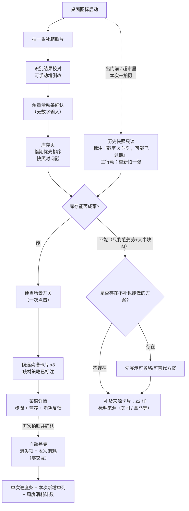

# 产品包需求与概念方案说明书（SRS）

> 方法论：华为 IPD 概念阶段输出物（产品包需求 + 设计需求 + 载体决策 + CDCP 评审材料）
> 文档版本：**v4.0**
> 编制日期：2026-09-21
> 上游文档：`docs/洞察报告.md` **v4.0**、`requirements.md`（原始需求说明书）、`修改建议.md`
> 需求溯源：本文保留 `requirements.md` 的 R1.1–R4.3 编号用于追溯，不自创替代编号

## 版本变更记录

| 版本 | 日期 | 变更摘要 | 变更依据 |
| --- | --- | --- | --- |
| v1.0 | 2026-09-17 | 首次产出 | `requirements.md` |
| v2.0 | 2026-09-17 | ① RQ-02 改写为受约束补货边界，新增 FR-26/FR-27；② FR-24 改写为单次快照模型，新增 FR-25；③ FR-12 改为单一场景开关；④ FR-20 改为单次进度条 + 周度计数；⑤ 新增 NFR-11；⑥ `$APPEALS` 重算；⑦ 新增 §5.4 商业模式；⑧ §4.1/§7 按团队真实能力重写 | `修改建议.md` #1–#9、洞察报告 v2.0 |
| **v3.0** | 2026-09-17 | ① **FR-05/20/24/25 按"快照重写 + 自动差集"（N2）改写**；② **新增 NFR-12（识别名称稳定性）**；③ 新增 UC-32（第二次拍照自动算消耗）、UC-33（名称稳定性）；④ FR-01 补前置门结论（`deepseek-flash` 原生 Vision，图片只能放 user 消息，单图 ≤1024 token）；⑤ FR-09/18/26/27 补行业与合规依据；⑥ `$APPEALS` 按调研结论上调 S 维度并新增有菜/SuperCook 基线；⑦ NFR-05 删除"100 元预算"误判，NFR-10 改为演示设备自助；⑧ §6.2 移除多模态阻断项、新增资质核查与两项实测任务；⑨ §7.1/7.3/7.4 重写；⑩ FR-21/FR-22 改为正向能力表述，FR-26 补货上限改为**暂定阈值（可配置）** | `docs/洞察报告.md` **v3.0**、`web_results/` 28 份 |
| **v4.0** | 2026-09-21 | ① 载体收敛为**鸿蒙原生 APP**，移除双方案对比及相关平台专属能力描述；② §5 改写为「载体决策 + $APPEALS 竞品对标」，删除双方案两节与推荐/降级结论；③ 商业模式改为「Demo 应用内来源卡片（Mock）→ 生产跳转分佣」；④ 新增交付范围映射（MVP → Demo）；⑤ 删除「系统入口与卡片」接口行与双方案边界差异编号族，其余编号不重排；⑥ 计数零漂移（FR 27 / NFR 12 / RQ 9 / UC 33；P0 27 / P1 11 / P2 1） | 本轮载体收敛决策 |

---

## 1. 文档说明

### 1.1 目的
把《洞察报告》锚定的机会点 O1（以"刚拍到的库存"为输入的"今天吃什么"决策器）转化为**可测试、可排序、可评审**的产品包需求，并给出**载体决策（鸿蒙原生 APP）**与 `$APPEALS` 竞品对标的量化依据，供 CDCP 决策。

### 1.2 范围
- **包含**：功能性需求、非功能性需求、反向需求、`$APPEALS` 竞品对标、载体决策、交付范围（MVP → Demo）、商业模式、设计需求、CDCP 评审材料。
- **不包含**：技术选型落地（框架/SDK 版本/接口设计）、代码实现、人员分工与排期、UI 高保真设计稿。

### 1.3 术语表

| 术语 | 定义 |
| --- | --- |
| **库存** | **最近一次用户确认过的快照**所记录的食材品项及其粗粒度余量（不含精确重量）。它带时间戳，超过过期阈值标"可能已过期"；**不是**逐项手动维护的账本 |
| **本次快照** | 用户本次拍摄并确认后的库存记录，覆盖为当前库存 |
| **历史快照（只读参考）** | 上一次快照，用途有二：① 供**自动差集**计算消耗；② 供场景 3 查看（带时间戳，标注"可能已过期"）。**不得**参与进度计数 |
| **自动差集** | 系统对比"最近一次确认的快照"与"上一张快照"，**消失项 = 本次消耗**（零交互），**新增项记首次出现时间**并据此推断临期 |
| **本次消耗（自动推导）** | 由自动差集得出、无需用户扣减或确认的消耗结果；是 FR-20 单次进度条的分子，也是 NFR-12 的直接依赖 |
| **过期阈值** | 快照被视为"可能已过期"的时间界限，**暂定 24h（可配置）**；超阈值时自动标注并提示重拍 |
| 粗粒度余量 | 以"少量 / 半盒 / 快没了 / 满"等档位表示的余量，由滑动条选择 |
| 缺材宽容 | 当推荐食谱所需食材不齐时仍能给出可执行方案的能力，包含"可省略""可用替代品""仅需额外购买极少量"三种策略 |
| **补货分支** | 仅当现有库存**完全无法构成任何一道可执行菜**时才出现的受约束路径；上限 ≤2 样；不得改变默认清库存结果的排序 |
| **触发补货条件** | 库存中不存在任何可成菜的组合（例如只剩葱姜蒜等调味料 + 大半块肉，缺少主料或配菜） |
| 便当场景开关 | 一次点击表达的带饭意图（如「明天要带饭」），由模型同时施加"少汤水 / 适合二次加热 / 隔夜不变味"三项生成约束 |
| 临期 | 按**新增项首次出现时间 + 品类默认保鲜天数自动推断**的优先消耗食材，**允许手动覆盖**；不做精确天数倒计时 |
| **识别名称稳定性**（见 NFR-12） | 同一张照片连拍 3 次，输出的品类名必须一致，或可规范化到统一品类表。这是自动差集（FR-20）的前提 |
| 反常识组合 | 明显不符合大众口味或低颜值的食材搭配（如"草莓炒肉"） |

### 1.4 需求编号与标注规则

| 编号族 | 含义 |
| --- | --- |
| `R1.1`–`R4.3` | `requirements.md` 原始需求，仅用于溯源，不再增改 |
| `FR-xx` | 功能性需求（Functional Requirement）。**FR-01 ~ FR-27 编号不变以保全溯源** |
| `NFR-xx` | 非功能性需求（Non-Functional Requirement） |
| `RQ-xx` | 反向需求（明确不做，Reverse Requirement） |
| `UC-xx` | 验收用例（Use Case），与 FR/NFR 一一或多对一关联 |

**KANO 属性**：`基本型` / `期望型` / `魅力型`（继承 `requirements.md` 的分级）。

**优先级**：`P0` = Demo 必须可见（缺则概念不成立）；`P1` = 时间允许则做；`P2` = 可仅为 UI 展示。

**载体统一**：全部需求均落在**鸿蒙原生 APP**（HarmonyOS 原生应用）单一载体上；Demo 基准为本地 HAP 安装，上架为生产演进。

---

## 2. 产品定位与目标用户

**一句话定位**：拍一下冰箱，给出今天能做的菜。

| | 画像 A：周中带饭通勤党 | 画像 B：周末做饭清库存党 |
| --- | --- | --- |
| 主要价值 | 省时决策 + 省钱反馈 + 便当适配 | 品质确认 + 消耗顺序建议 + 消耗进度 |
| 对省钱反馈 | 强需求 | **不反感省钱本身，仅反感强制曝光**（G-02 五维度验证） |
| 对品质检测 | 加分项 | 强加分项（→ FR-07 为 P1 展示级） |
| 对补货 | 可接受"只差一两样"的少量补货 | 同样可接受少量补货，**反感被推销** |

**核心边界**：**我们不让用户维护库存记忆——拍照即覆盖、消耗自动推导，用户零交互。** 当前库存 = 最近一次用户确认过的快照（带时间戳、超期标注）；系统自动 diff 上一张快照推导消耗与临期。详见 `docs/洞察报告.md` §2.2。

**差异化三点（引用洞察报告 §5.2）**：① 以刚拍到的库存为第一输入，**拍完就覆盖、不用维护**；② **缺一两样也能做**（缺材是生成约束，不是购买提示）；③ **当天要带饭也合适，用完不用记**。

---

## 3. 需求分层与需求收集记录

### 3.1 需求三层次映射（Requirement → Want → Pain）

| 原始编号 | Requirement（用户说的） | Want（用户真正想要的） | Pain（背后的痛） | 我们的对策 |
| --- | --- | --- | --- | --- |
| R1.1 | 拍照识别食材，且能手动改 | 不用动脑就能得到一份**信得过**的库存 | 识别错一个，后面全错，于是干脆不用 | FR-01 / FR-02 / RQ-01 |
| R1.2 | 看见冰箱里剩了什么、剩多少 | **看到之后立刻知道先消耗哪个** | 打开冰箱能看到，但看到一堆食材后**仍需动脑排序**；靠里的食材被忽略 | FR-03 / FR-04 / FR-05 / FR-06 |
| R1.3 | 提示食材新鲜度 | 敢吃囤久的东西 | 不确定坏没坏：扔了浪费，吃了怕 | FR-07 |
| R2.1 | 基于现有食材生成食谱 | 优先把快坏的消耗掉 | 想清库存但不知道先做什么 | FR-08 / FR-09 |
| R2.2 | 缺材料不能强制配齐 | 缺一两样也能做 | 被要求买一堆材料，索性放弃 | FR-09 / FR-10 / FR-26 |
| R2.3 | 便当场景标签 | 明天带的饭不塌、不腥、复热好吃；**不用每次勾选，一个开关就够** | 汤水多 / 复热难吃 → 还不如点外卖 | FR-12 / FR-14 / FR-15 |
| R2.4 | 食量与口味约束 | 够吃、合口味、是常见搭配 | 量不够吃不饱；推奇葩菜 → 直接卸载 | FR-13 / FR-14 / FR-15 |
| R2.5 | 记住口味偏好与忌口 | 不用每次重复说 | 每次都要重新解释一遍 | FR-16 / FR-17 |
| R3.1 | 展示热量与营养 | 知道自己吃得健不健康 | 有健康焦虑但不想做记录 | FR-18 |
| R3.2 | 累计省了多少钱 | **想省钱的时候能自己翻到**（把"反感"的对象精确化为**强制曝光方式**，而非省钱本身；G-02 五维度已验证） | 带饭很辛苦，但看不到收益；也**不想被反复提醒** | FR-19 / RQ-07 |
| R3.3 | 清库存进度 | 看到自己这次消耗了什么 | 一直在浪费，有负罪感 | FR-20 |
| R4.1 | 极简交互，无需注册登录 | 无脑操作 | 注册、表单、点很多层 → 烦 | FR-21 / FR-22 / RQ-05 / RQ-06 |
| R4.2 | 优先鸿蒙原生 APP | 随手可用 | 要下载、要找入口 | §5 载体决策 |
| R4.3 | 不推大量额外采购；不输入繁重数字 | **不接受多品项采购推荐，但接受"只差一两样"的提示** | 被要求买一堆 → 反感；被要求称重 → 荒谬 | FR-04 / FR-26 / RQ-01 / RQ-02 |
| —（新增） | **用户什么时候打开冰箱？**（放菜后 / 做饭前 / 出门或去超市前） | 出门前也能知道"还缺什么"，从而决定要不要补货 | 出门前没有依据，只能凭记忆猜 | FR-25 / FR-26 / FR-27（溯源：洞察报告 §2.2 三场景） |

> **G-02 佐证**：R3.2 的修正（"不反感省钱、反感强制曝光"）已由五个维度验证——**不反感省钱 / 反感强制自律 / 反感被评价曝光 / 反感过度计算焦虑 / 反感与既得利益冲突**，每维度均有原话佐证（G-02）。故 FR-19 / RQ-07 的理由按此表述。

### 3.2 需求收集渠道说明

| 渠道类型 | 本项目的实际来源 | 状态 |
| --- | --- | --- |
| 内部渠道 | 产品开发团队（9 人）概念讨论产出，见 `requirements.md`；修改建议见 `修改建议.md` | 已具备 |
| 外部渠道 · 用户访谈 | `requirements.md` 中的用户原话与访谈洞察 | **部分具备**（原始记录未附，需回填） |
| 外部渠道 · 竞品分析 | 见 `docs/洞察报告.md` §3 | 已具备（含 4 家新增竞品与未核实项标注） |
| 外部渠道 · 行业分析 | 见 `docs/洞察报告.md` §1 | 已具备（关键量化数据已可溯源；弱来源已单列） |
| 客户顾问委员会 / β测试 | 未开展 | **未开展**，不主张 |

### 3.3 单项需求采集卡汇总

> ⚠️ **TODO（团队回填）**：`采集日期`、`采集人`、`原始原话` 三项为原始记录字段，**不得推测填写**。未回填前，本表的"来源"列仅表示可追溯至 `requirements.md`。

| 卡号 | 原始需求（结构化转述） | 提出人画像 | 场景 | 来源渠道 | 采集日期 | 采集人 | 对应原始编号 |
| --- | --- | --- | --- | --- | --- | --- | --- |
| C-01 | 拍照识别冰箱食材，结果必须能手动增删改 | A / B | 站在冰箱前盘点 | 用户访谈（转述） | TODO | TODO | R1.1 |
| C-02 | 不要猜食材重量（原话方向："别告诉我 200g 土豆"） | A | 盘点库存 | 用户访谈（转述） | TODO | TODO | R1.1 |
| C-03 | 想看冰箱里剩什么、各剩多少 | B | 做饭前 | 用户访谈（转述） | TODO | TODO | R1.2 |
| C-04 | 提示食材新鲜度，"囤久了不敢吃" | B | 周末翻冰箱 | 用户访谈（转述） | TODO | TODO | R1.3 |
| C-05 | 优先消耗快坏的食材 | A / B | 决定今天做什么 | 用户访谈（转述） | TODO | TODO | R2.1 |
| C-06 | 缺一两样也能做，别强制配齐 | A | 下班后做饭 | 用户访谈（转述） | TODO | TODO | R2.2 |
| C-07 | 便当要少汤水、适合二次加热、隔夜不变味 | A | 晚上备次日午餐 | 用户访谈（转述） | TODO | TODO | R2.3 |
| C-08 | 生成前要选几个人吃 / 饭量大小 | A | 做饭前 | 用户访谈（转述） | TODO | TODO | R2.4 |
| C-09 | 推奇葩菜"碰都不想碰，直接卸载" | A | 浏览推荐结果 | 用户访谈（原话） | TODO | TODO | R2.4 |
| C-10 | 记住我口味清淡 | A | 长期使用 | 用户访谈（转述） | TODO | TODO | R2.5 |
| C-11 | 记录家人 / 朋友的忌口 | A / B | 多人就餐 | 用户访谈（转述） | TODO | TODO | R2.5 |
| C-12 | 想看热量、蛋白质、碳水 | A | 看食谱详情 | 用户访谈（转述） | TODO | TODO | R3.1 |
| C-13 | 想知道比外卖省了多少钱 | A | 周度回顾 | 用户访谈（转述） | TODO | TODO | R3.2 |
| C-14 | 省钱提醒别弹窗、别放主页 | B | 日常使用 | 用户访谈（转述） | TODO | TODO | R3.2 |
| C-15 | 想知道这次消耗掉了哪些食材 | B | 做饭前后 | 用户访谈（转述） | TODO | TODO | R3.3 |
| C-16 | 不要复杂注册登录，不要记账表单 | A / B | 首次使用 | 用户访谈（转述） | TODO | TODO | R4.1 |
| C-17 | 优先鸿蒙原生 APP | A / B | 载体选择 | 团队内部决策 | TODO | TODO | R4.2 |
| C-18 | 绝不推荐买大量额外食材 | A / B | 推荐结果 | 用户访谈（转述） | TODO | TODO | R4.3 |
| C-19 | 不要在库存管理上要求输入繁重数字 | A / B | 盘点库存 | 用户访谈（转述） | TODO | TODO | R4.3 |
| C-20 | 出门 / 去超市前想确认"还缺什么"，只差一两样时愿意顺手买 | A / B | 出门前 / 超市里 | 团队内部修订（`修改建议.md` #1/#4） | TODO | TODO | —（见 §3.1 末行） |
| C-21 | 不想手动维护库存 / 逐项扣减；希望拍完就自动知道消耗了什么 | A / B | 每次做饭后 | 竞品差评反推（D-04：食光冰箱要滑动扣减、厨记要一键确认） | TODO | TODO | —（见术语「自动差集」） |

---

## 4. 产品包需求

### 4.1 功能性需求

#### 4.1.1 维度一：食材识别与库存盘点

| 编号 | 需求描述 | KANO | 优先级 | 验收标准（可测试） | 溯源 |
| --- | --- | --- | --- | --- | --- |
| FR-01 | 用户拍摄冰箱内部照片后，系统输出**食材品类清单**（不含重量） | 基本型 | P0 | ① 输入一张含 ≥5 种常见食材的照片，输出 ≥4 个品类项；② **输出结果中不包含任何重量/克数/份量数字**；③ 单次识别在 NFR-01 时限内返回；④ **前置门已通过**：使用 **`deepseek-flash`**（DeepSeek-V4.1-Flash，原生 Vision；`deepseek-v4-pro` 不支持 Vision）；**图片必须放在 `user` 消息**；单图 **≤1024 token**，格式支持 JPEG（PNG/GIF/WebP 亦可）；**Prompt 必须输出结构化 JSON** | R1.1 |
| FR-02 | 识别结果可手动**增、删、改**（改品类、合并重复项、补充未识别项） | 基本型 | P0 | ① 每个识别项可删除；② 可新增自定义品类；③ 可把一项改成另一品类；④ 全部操作 ≤2 次点击 | R1.1 |
| FR-03 | 首页展示**本次快照的库存清单**（品类 + 粗粒度余量 + 临期标记） | 期望型 | P0 | ① 进入即见库存，无需额外跳转；② 每项显示余量档位；③ 无快照时展示引导拍照的空态（**不得**用历史快照冒充当前状态） | R1.2 |
| FR-04 | 余量以**档位**确认（如 少量 / 半盒 / 快没了 / 满），通过滑动条或点选完成 | 期望型 | P0 | ① 确认余量全程**不出现数字键盘**；② 单品类确认 ≤1 次滑动；③ 余量档位 ≤5 档 | R1.2 / R4.3 |
| FR-05 | **临期标记**：按**新增项首次出现时间 + 品类默认保鲜天数自动推断**临期；**允许手动覆盖**（标记/取消）。不做 350+ 食材保质期模板库，不做精确天数倒计时 | 期望型 | P0 | ① 新增项自动获得首次出现时间；② 自动推断结果可被用户一键覆盖；③ 临期项在列表中视觉可区分；④ 临期项在食谱生成中被优先使用（见 FR-08）；⑤ **不要求用户录入保质期数字** | R2.1 |
| FR-06 | 食材列表支持按"临期优先"排序 | 期望型 | P1 | 开启排序后，临期项必须出现在非临期项之前 | R2.1 |
| FR-07 | 品质/新鲜度提示：对指定食材给出建议文案（如"颜色偏暗，建议检查是否变质"） | 魅力型 | P1 | ① 提示出现在食材详情/识别结果处；② **文案必须为建议性措辞，不得输出"已变质"等确定性结论**；③ 算法不可用时降级为固定文案（见 NFR-08） | R1.3 |

#### 4.1.2 维度二：LLM 智能食谱生成

| 编号 | 需求描述 | KANO | 优先级 | 验收标准（可测试） | 溯源 |
| --- | --- | --- | --- | --- | --- |
| FR-08 | 基于**本次快照的库存**生成食谱；临期食材优先被使用 | 基本型 | P0 | ① 生成结果中，被使用食材 ≥ 库存清单的 60%（同一测试输入可复现）；② 存在临期项时，至少 1 个候选食谱使用了临期项 | R2.1 |
| FR-09 | 缺材宽容：为不齐的食材提供三种策略 —— 可省略 / 可用替代品 / 需额外购买**极少量且明确列出** | 基本型 | P0 | ① 当缺失 1–2 样食材时，必须仍给出**可执行**方案，不得只提示购买；② 每个缺失项标注其处理策略；③ **"可省略"与"可用替代品"的优先展示顺序高于"需额外购买"**；④ 需购买的处置统一引用 **FR-26**。**行业依据：SuperCook 明确"no substitution suggestions"、国内三家竞品均未提供替代品策略** | R2.2 |
| FR-10 | 生成结果硬约束：不使用用户明确标注不吃的食材 | 基本型 | P0 | 构造含"忌口食材"的库存输入，生成结果的食材清单中该食材出现次数 = 0 | R2.2 / R2.4 |
| FR-11 | 生成结果硬约束：不产生反常识组合（如"草莓炒肉"） | 基本型 | P0 | ① Prompt 中显式包含反常识规避条款；② 用 5 组易触发反常识搭配的库存做测试，0 组产出反常识组合 | R2.4 |
| FR-12 | **便当场景适配**：用户一次点击表达带饭意图（如「明天要带饭」），由模型同时施加「少汤水 / 适合二次加热 / 隔夜不变味」三项生成约束；三项标签在菜谱卡片上**只读展示** | 期望型 | P0 | ① 开关为**单次点击**，不出现多选勾选界面；② 开关打开后，候选结果全部满足三项约束（逐项可核）；③ 三个标签在卡片上可见且不可编辑；④ 开关关闭时不施加该组约束 | R2.3 |
| FR-13 | 生成前选择**人数 / 饭量大小**（如 1 人 / 2 人 / 大食量） | 基本型 | P0 | ① 未选择时不得开始生成；② 选择"大食量"与"1 人"的同一库存，生成结果的食材用量描述不同 | R2.4 |
| FR-14 | 食谱必须**步骤简单、可直接执行** | 基本型 | P0 | ① 每个食谱步骤数 ≤8 步；② 每步为单一动作且含明确火候/时长或不含歧义动词 | R2.4 |
| FR-15 | 候选食谱以**卡片**形式呈现，单屏候选 ≤3 张，可横向切换 | 期望型 | P0 | ① 首屏可见 ≥3 张卡片；② 卡片含菜名、耗时、用了哪些库存食材、缺失食材标识、便当标签；③ 从卡片可直接进入详情 | R4.1 |
| FR-16 | 记忆**个人口味偏好**（如清淡），并在生成时自动应用 | 期望型 | P1 | ① 设置"清淡"后再次生成，结果中不出现重辣菜式；② 偏好可在 ≤2 次点击内修改 | R2.5 |
| FR-17 | 记录**家人/访客忌口清单**，生成时自动规避 | 魅力型 | P1 | ① 可为 ≥3 个联系人分别记录忌口；② 选中联系人后生成结果中不出现其忌口食材 | R2.5 |

#### 4.1.3 维度三：健康、省钱与激励机制

| 编号 | 需求描述 | KANO | 优先级 | 验收标准（可测试） | 溯源 |
| --- | --- | --- | --- | --- | --- |
| FR-18 | 食谱详情页展示热量、蛋白质、碳水 | 期望型 | P0 | ① 三项指标均可见；② 显示单位与**"估算值"标注**；③ 数值来源可解释（查表/按食材量推算）。**F-03 显示营养估算 MAPE 24–42%，"估算值"标注必须在 UI 上显著，不得弱化** | R3.1 |
| FR-19 | 累计省钱反馈：以**成就徽章 / 周报**形式呈现，明确计入"相比点外卖省下的钱" | 魅力型 | P2 | ① 存在一个可查看的累计节省金额；② 该数字**不出现在任何启动弹窗或首页首屏核心位置**；③ 计算口径在页面内可查看（口径：外卖 **25–30 元/餐**〔发改委 36 城菜品均价中位≈25 元 + 艾媒主流价位 20–39 元占 64.46%，C-01〕vs 自炊 **10–20 元/餐**〔可与 C-02 上海零售单价交叉验证〕，单午餐替换 **110–440 元/月**；见洞察报告附录 B7/B13。⚠️ G-01 的"月省 880 元"为**两餐口径**，不得与单午餐口径混用）；④ 无主动推送/弹窗 | R3.2 / RQ-07 |
| FR-20 | **消耗反馈**：① **由自动差集推导"本次消耗"，用户零交互**（不做手动扣减）；② 单次进度条「本次用掉 X / Y 项」；③ 「本次新增 Z 项」单列（补货买入）；④ 周度成就「本周累计消耗 N 项」。**降级路径**：若 NFR-12 名称稳定性不达标，改为"用户确认消耗项" | 魅力型 | P1 | ① 第二次拍照确认后，系统自动列出消失项作为"本次消耗"，**无需用户点选**；② 单次进度条的分母仅含**本次快照**的库存项，补货买入项**不计入分母**；③ 补货买入单独显示为"新增"，**不与进度条混算**；④ **不出现任何可能为负数的净值指标**；⑤ 周度计数为纯事件累计，不依赖库存连续性；⑥ 历史快照不参与任何计数；⑦ **降级路径可验证**：关闭自动差集后，改为用户确认消耗项，进度条仍可用 | R3.3 |

#### 4.1.4 维度四：产品形态与体验底线

| 编号 | 需求描述 | KANO | 优先级 | 验收标准（可测试） | 溯源 |
| --- | --- | --- | --- | --- | --- |
| FR-21 | 系统支持匿名会话：未注册用户可直接完成"拍照 → 生成 → 查看详情"主链路，会话状态在本地持久化 | 基本型 | P0 | 全新安装/首次打开后，主链路全流程 0 次登录拦截、0 次手机号/验证码输入 | R4.1 |
| FR-22 | 主链路的输入方式为拍照、滑动与卡片选择；系统不提供任何必填文字表单 | 基本型 | P0 | ① 主链路无文本输入框；② 所有决策点均为点击/滑动/卡片选择；③ 无记账类表单 | R4.1 |
| FR-23 | 从"点击拍照"到"出现候选菜谱卡片"的路径步数受限 | 期望型 | P0 | 拍照完成后，在余量确认 ≤1 屏的前提下，**默认清库存路径**的总交互步数 ≤4 步。（注：补货分支不占用该步数预算） | R4.1 |
| FR-24 | **库存快照有效期**：当前库存 = **最近一次用户确认过的快照**，必须显示时间戳；超过**过期阈值（暂定 24h，可配置）**自动标"可能已过期"并提示重拍 | 基本型 | P0 | ① 库存页必须显示快照时间戳；② 超过过期阈值后出现"可能已过期"标注与"重新拍一张"主行动；③ 关闭应用后重新打开，**不得**把过期快照当作当前库存直接用于生成；④ 未拍摄时仅可展示历史快照并满足 FR-25 的标注要求 | R1.2 |
| FR-25 | **快照保留与自动差集**：保留上一张快照，**用途有二**：① 供**自动差集**计算本次消耗；② 供场景 3 查看（带时间戳只读） | 期望型 | P1 | ① 上一张快照可被系统读取用于差集；② 展示时页顶**强制标注**「截至 X 时刻，可能已过期」，主行动为「重新拍一张」；③ 历史快照**不得**直接参与 FR-20 的计数；④ 历史快照中的食材不可直接用于生成，除非用户先重新拍照或显式确认 | 洞察报告 §2.2 场景 1/3 |

#### 4.1.5 补货分支与商业化需求

| 编号 | 需求描述 | KANO | 优先级 | 验收标准（可测试） | 溯源 |
| --- | --- | --- | --- | --- | --- |
| **FR-26** | **补货分支**：仅当**触发补货条件**成立时才出现；上限 ≤2 样（暂定阈值，可配置）；若存在"不补也能做"的方案必须**先展示**；**不得引导凑单** | 期望型 | P1 | ① 构造"只剩葱姜蒜 + 大半块肉"的库存，出现补货卡；② 补货项数量 ≤2；③ 若存在可省略/可替代方案，"不补也能做"先于补货卡展示；④ 补货卡**不得改变**默认清库存结果的排序与展示；⑤ **不出现"再买 X 元凑单/满减"类引导**。**合规依据**：《反食品浪费法》第七条第二款 + 第二十八条；台州必胜客起送价案（A-02）；第九批"自取起购价"案（F-02）。**阈值校准留待计划阶段（可用性测试）** | R2.2 / R4.3 |
| **FR-27** | **商业化披露**：补货分支出现「应用内来源卡片」时，须标注为合作/含推广性质 | 基本型 | P1 | ① 来源卡片展示前可见合作/推广标注，并**标明来源（如美团、盒马等）**；② 该来源卡片**仅存在于补货分支内**，默认路径中不存在任何来源卡片或推广入口；③ 关闭补货分支后该卡片完全消失。**分佣口径**：美团联盟 CPS **3%–6%**（唯一公开可接入口径）。**Demo 仅应用内展示来源卡片，不拉起外部 App、不调真实 API、不做真实结算**；生产演进为真实跳转分佣 | 洞察报告 §5.4 |

### 4.2 非功能性需求

| 编号 | 类别 | 需求描述 | 优先级 | 验收标准（可测试） |
| --- | --- | --- | --- | --- |
| NFR-01 | 性能 | 拍照识别响应时间：从提交照片到返回品类清单 ≤5 秒（P90，正常网络） | P0 | 10 次实测中 ≥9 次 ≤5 秒；超时进入 NFR-02。可用 `detail` 参数调优（`low` = 先压到 512×512）；**冰箱全景照慎用 `detail:low`**，会漏小件食材 |
| NFR-02 | 可靠性 | 识别失败/超时必须**降级到手动录入模式**，不得阻断主链路 | P0 | 断网或人为让接口失败后，用户仍可手动新增品类并继续生成 |
| NFR-03 | 可靠性 | 弱网/无网时：展示**带时间戳的历史快照（只读）**，明确标注"可能已过期"与"离线"状态，并引导"重新拍一张"；**不得**让用户误以为这是当前库存 | P0 | 飞行模式下打开应用：① 可见带时间戳的历史快照；② 同时可见"可能已过期"与"离线"标注；③ 引导按钮为"重新拍一张" |
| NFR-04 | 隐私 | 冰箱照片默认本地处理/本地留存；如需上传，必须在首次上传前明示用途；提供一键删除全部照片、库存与历史快照。设计依据为 HarmonyOS 7 的 **HPIC「本地优先、数据最小化、用户可控」**原则 | P0 | ① 首次上传前出现明示；② 设置内存在"删除全部数据"，执行后本地无照片、无库存、无历史快照残留 |
| NFR-05 | 可测试 | 提供**演示剧本**，必须覆盖三条路径：① 主力路径（做饭前盘点 → 生成）；② 补货分支（只剩葱姜蒜 + 大半块肉 → 触发补货卡 → ≤2 样）；③ 历史快照路径（出门前查看带时间戳的旧快照）。剧本使用**固定输入集**是为了**回归一致性**（同一输入产生可比对结果），**不再以"预算所迫"为由**（实测单次识别 ¥0.0027–0.0054，¥100 可支撑 1.86 万–3.7 万次识别 / 完整链路 3,500–6,800 次） | P0 | ① 三条路径均有脚本化步骤与预期输出；② 两名未参与开发的人按剧本走查结果一致；③ 剧本记录每次运行的识别结果一致性 |
| NFR-06 | 可服务性 | 具备降级开关：可关闭"品质检测提示"与"省钱反馈"而不影响主链路 | P1 | 分别关闭两项后，主链路仍可完整走通 |
| NFR-07 | 兼容性 | 明确最低鸿蒙系统版本与支持设备范围 | P0 | 在声明的最低版本设备上完成一次全链路演示 |
| NFR-08 | 可测试（噱头降级） | 品质检测（FR-07）降级为**固定规则文案**（按品类给出通用建议），文案库可配置。**因团队无多模态接入经验，"算法不可用"是默认预期而非例外** | P0 | 关闭算法模块后，FR-07 的提示仍正常显示为通用建议 |
| NFR-09 | 可用性 | 全部交互元素触达区域 ≥ 44×44 vp；关键按钮不依赖精确点击；仅使用 ArkTS 系统组件（团队无设计资源） | P1 | 设计走查核对 |
| NFR-10 | 可安装/可服务 | 评审者在**演示设备**上无需任何指导即可完成一次完整链路（**本地 HAP 安装自助**）。**上架为生产路径（APP 备案 15–20 工作日、华为审核 3–5 工作日），不作为 Demo 前提** | P0 | 一位外部评审者在不接受任何口头指导的情况下，5 分钟内在演示设备上完成一次完整链路 |
| **NFR-11** | 隔离性 | 补货分支隔离性：关闭补货分支（降级开关）后，默认清库存路径与全部主链路功能必须完全不受影响；补货分支的存在不得改变默认结果的排序 | P1 | ① 关闭补货分支后，用同一输入生成的结果排序与关闭前**完全一致**；② 默认路径中检索不到任何来源卡片或推广标注 |
| **NFR-12** | 可测试 | **识别名称稳定性**：同一张照片连拍 3 次，输出的品类名必须一致（或可规范化到统一品类表）。这是**自动差集（FR-20）的前提**；不达标则 FR-20 走降级路径（用户确认消耗项） | P0 | ① 对同一张照片连续识别 3 次，3 次输出的品类名集合一致或可规范化对齐；② 用 5 张真实冰箱照（含遮挡/堆叠）重复测试，通过率 100%；③ 不通过时 FR-20 降级路径可切换且可验证 |

### 4.3 反向需求（明确不做）

| 编号 | 明确不做 | 理由 | 溯源 |
| --- | --- | --- | --- |
| RQ-01 | **不做食材重量估计/称重输入** | 面向生食材的重量估计不可靠（F-03：分量估算 MAPE 100–196%）；且不符合用户预期（薄荷健康的"识重量"面向已做好的餐食，与冰箱生食材不是同一问题） | R1.1 / R4.3 |
| RQ-02 | **不做多品项（>2 样）采购清单；不做一键买齐；不做以补货为目的的主动推销；补货分支不得改变默认清库存结果的排序；补货入口不得出现在默认路径中；不得引导凑单** | 与"清库存"第一原则直接冲突。补货只在**库存完全无法成菜**时出现，且上限 2 样，是"避免浪费"的延伸而非采购引导 | R4.3 / 洞察报告 §5.3 |
| RQ-03 | 不做内容社区（晒图、评论、关注、食谱投稿） | 无法与下厨房/豆果的内容规模竞争，且挤占 P0 资源 | 洞察报告 §5.3 |
| RQ-04 | 不做"必须配齐材料"的食谱推荐 | 用户明确痛点，是放弃使用的主要原因。**补货分支 ≠ 强制配齐**——前者仅在无法成菜时出现，且用户可拒绝 | R2.2 |
| RQ-05 | 不做注册登录体系、不做第三方账号绑定 | 与"无脑操作"DNA 冲突 | R4.1 |
| RQ-06 | 不做记账/营养摄入记录表单 | 用户明确拒绝繁重输入 | R4.1 / R4.3 |
| RQ-07 | 不做省钱反馈的强制弹窗与主动推送，不将其置于核心主页 | 用户反感的是**强制曝光方式**，而非省钱本身（G-02 五维度验证）；画像 B 对省钱反馈是"低主动性" | R3.2 / 洞察报告 §2.1 |
| RQ-08 | **不做逐项手动扣减/确认库存、不做 350+ 食材保质期模板库、不做家庭共享冰箱（Demo 期）、不做广告变现、不做精确临期天数倒计时** | 逐项维护是与竞品同质化的负担来源；模板库维护成本高且覆盖不全；家庭共享引入冲突处理复杂度；广告与"不推销、克制"的信任基础冲突；精确倒计时需要我们不维护的账本 | R1.2 / R4.3 / 洞察报告 §5.3 |
| RQ-09 | **本报告与产品不主张"减少食物浪费"的量化价值承诺** | 权威研究显示家庭端就餐浪费在四场景中最低（24.6 g/餐，F-01），冰箱食材腐坏丢弃率全网无数据（D-10）；价值改由决策效率 + 省钱 + 零维护承担 | 洞察报告 §1.2 反证记录 |

---

## 5. 载体决策与 $APPEALS 对标

### 5.1 $APPEALS 八维评分

**权重来源**：`$ 8 / A 17 / P包装 8 / P性能 14 / E 21 / A保证 10 / L 8 / S 14 = 100`。

**评分表（1–5 分，分数越高越好）**

| 对标产品 | $ | A | P包装 | P性能 | E | A保证 | L | S | 计算 | 总分 |
| --- | --- | --- | --- | --- | --- | --- | --- | --- | --- | --- |
| **有菜**（最近似竞品） | 5 | 5 | 4 | 3 | 5 | 3 | 4 | 4 | 40+85+32+42+105+30+32+56 | **4.22** |
| **SuperCook**（海外品类标杆） | 5 | 5 | 3 | 4 | 5 | 4 | 5 | 3 | 40+85+24+56+105+40+40+42 | **4.32** |
| 下厨房（内容型基线） | 4 | 5 | 4 | 4 | 3 | 4 | 4 | 5 | 32+85+32+56+63+40+32+70 | **4.10** |

**三条读数**
1. **SuperCook 4.32 最高** → 我们的形态与购买要素**打不过一个 2011 年的免费无账号产品**。
2. **有菜 4.22** → **载体形态不构成护城河**：可被复刻的是入口与形态，不可被复刻的是需求逻辑。
3. 因此载体裁决依据为「**对基本型 P0 需求的对齐度 + Demo 自助体验 + 团队能力现实**」；差异化**只在需求逻辑**（FR-09 缺材宽容 / FR-12 便当 / FR-20 自动消耗）。

> **方法论局限声明**：$APPEALS 衡量的是"购买关键要素"，捕捉不到"以刚拍到的库存为第一输入、且零维护"这一任务层面的差异。**载体选择的裁决不能依赖 $APPEALS 分数。**

### 5.2 载体决策：鸿蒙原生 APP

> **决定：本产品收敛为鸿蒙原生 APP（HarmonyOS 原生应用）单一载体。**

| 项 | 内容 |
| --- | --- |
| 形态与入口 | 鸿蒙原生应用，需下载安装；入口为**桌面图标启动** |
| 目标画像 | 画像 A 为主（高频、要快），画像 B 为辅 |
| 核心用户旅程 | 见下方流程图 |
| 关键页面 | ① 拍照入口页　② 识别结果校对页（含手动增删改）　③ 库存页（余量滑动条、临期标记、**自动差集区块 + 快照时间戳**、**「本次消耗」区块**、历史快照只读区块与"可能已过期"标注）　④ 生成前设置卡（人数/饭量 + 便当场景开关）　⑤ 候选菜谱卡片流　⑥ 菜谱详情（步骤 + 营养 + 缺材策略）　⑦ 补货来源卡片（仅触发补货条件时出现，≤2 样 + 来源标注）　⑧ 我的（口味偏好 / 忌口 / 单次进度 + 周度消耗计数 / 省钱徽章） |
| 技术依赖 | 相机能力（声明 `ohos.permission.CAMERA`）、多模态识别 API（`deepseek-flash`，**已通过前置门**）、LLM 生成 API、本地持久化（**应用沙箱** Preferences / 关系库）、网络可用性 |
| 主要风险 | ① **识别名称稳定性（NFR-12）未验证**，不达标则自动差集失效　② **上架受备案周期约束**（Demo 以本地 HAP 安装为主，上架为生产路径）　③ 团队鸿蒙工程经验弱，5 天交付风险 |

**载体决策理由**（不以 `$APPEALS` 分数为依据）：

1. **对齐基本型 P0 需求**：FR-21（无需注册登录）与 FR-22（仅拍照与卡片选择）均为**基本型 P0**，直接对应 21 分权重的"易用性"维度。
2. **Demo 自助体验（NFR-10，P0）**：**本地 HAP 安装**在演示设备上即可完成完整链路，不依赖上架与分发。
3. **团队内部工具体系支持、平台限制更少、能力上限更高**：原生 APP 在相机、本地持久化与后续 BFF / 网关扩展上的边界更宽，便于把 5 天资源留给真正的差异化（FR-09 / FR-12 / FR-20）。

### 5.3 商业模式

| 项 | 内容 |
| --- | --- |
| Demo 变现形态 | 补货分支内的**应用内来源卡片（Mock）**：展示 ≤2 样补货项，卡片**标明来源（美团、盒马等）**与合作 / 推广性质；**不拉起外部 App、不调真实 API、不做真实结算** |
| 生产演进 | 替换为向生鲜平台的**真实跳转分佣**（网关签名不变，无侵入替换） |
| 可接入口径 | **美团联盟 CPS 3%–6%**，新用户首单佣金可达 6 元（唯一公开口径） |
| 不可接入口径 | 盒马开放平台为 B2B 商家入驻（HEMA.OS），无 C 端 CPS；叮咚买菜未找到开放合作 |
| 收入公式 | `触发补货分支用户数 × 补货转化率 × 单次 GTV × 佣金率` |
| 单笔收益 | 单笔 GTV 假设 15–30 元（≤2 样）→ 佣金约 **0.45–1.8 元/单**；**单笔收益极低，依赖订单量**，不给收入数值 |
| 触发位置 | **仅**补货分支内部（FR-26）。默认清库存路径中不存在任何来源卡片或推广入口（RQ-02） |
| 合规披露 | 来源卡片展示前须标注合作 / 推广性质并标明来源（FR-27） |
| 隔离原则 | ① 补货分支不得改变默认结果排序（NFR-11）；② 关闭补货分支后主链路完全不受影响（NFR-11）；③ 默认路径中检索不到任何推广元素 |
| 数据状态 | 转化率、GTV 无外部数据；佣金率已有美团口径 → **本节仍不给收入数值** |
| 待决策 | 是否引入付费订阅或其他变现方式（见 §7.2） |

---

## 6. 设计需求（内部协同）

### 6.1 需求追溯表（洞察报告空白点 → 需求编号）

| 洞察报告空白点 / 结论 | 对应需求编号 | 覆盖状态 |
| --- | --- | --- |
| 空白点 1：缺材宽容的生成逻辑 | FR-09、FR-10、FR-11、FR-26、RQ-02、RQ-04 | 已覆盖 |
| 空白点 2：便当场景的可执行性 | FR-12、FR-14、FR-15 | 已覆盖 |
| 空白点 3：零维护的消耗与临期 | FR-05、FR-20、**NFR-12**、**UC-32**、FR-25 | 已覆盖 |
| 空白点 4：无广告 + 无付费墙 | RQ-08（不做广告变现）、FR-21/FR-22（无注册） | 已覆盖 |
| 洞察报告 §2.2「不让用户维护库存记忆」声明 | FR-24、**FR-25**、FR-20、NFR-03、NFR-12、RQ-08 | 已覆盖 |
| 洞察报告 §2.2 场景 1/3（出门前补货） | FR-25、FR-26、FR-27 | 已覆盖 |
| 洞察报告 §5.4 商业模式与隔离原则 | FR-27、NFR-11 | 已覆盖 |
| 洞察报告 §4.3「仅 UI 展示」的能力 | FR-07 + NFR-08 | 已覆盖 |
| 洞察报告 §5.3「战略级取舍」 | RQ-01 ~ RQ-09 | 已覆盖 |
| 洞察报告 §1.2 反证记录（不主张减少浪费量化） | RQ-09 | 已覆盖 |

### 6.2 可生产（Demo 前需提前准备的素材/接口）

| 项 | 内容 | 状态 |
| --- | --- | --- |
| **多模态 API 前置验证** | ✅ **已确认**：`deepseek-flash` 原生 Vision；图片只能放 user 消息；单图 ≤1024 token；格式 JPEG 支持；Prompt 输出结构化 JSON | 🟢 **已确认（阻断解除）** |
| **资质核查（高优先）** | 确认团队/公司**是否已有软著、APP 备案，或华为内部企业号通道**；这决定能否上架，进而决定 NFR-10 走"上架主路径"还是"演示设备本地 HAP 自助" | 🔴 **未核查** |
| 识别接口 | 确定多模态识别 API 及其额度（`deepseek-flash`） | 🟡 模型已知，额度与并发确认中 |
| 生成接口 | 确定 LLM API（`deepseek-flash`）、Prompt 模板（含反常识硬约束 + 便当场景约束 + **结构化 JSON 输出**条款） | 🟡 模型已知，Prompt 未准备 |
| 调用预算控制 | 预算不是阻断（¥100 可支撑 1.86 万–3.7 万次识别）；固定输入集用于**回归一致性**，非预算所迫 | 🟢 口径已澄清 |
| **5 张真实冰箱照实测** | 含遮挡/堆叠场景，用于验证 FR-01 有效准确率与 FR-02 兜底必要性 | 🔴 未准备 |
| **名称稳定性测试** | 同一照片连拍 3 次比对品类名（NFR-12 / UC-33） | 🔴 未准备 |
| 应用内来源卡片 + 合规披露文案 | Demo 以应用内来源卡片（Mock）呈现并标明来源（美团、盒马等）与合作/推广性质；**真实分佣为生产演进**，不影响 FR-26/FR-27 成立 | 🟡 Demo 自足，生产待核实 |
| 图片素材 | 冰箱内部标准测试照片 ≥5 张（含"只剩葱姜蒜 + 大半块肉"的补货触发用例） | 🔴 未准备 |
| 营养数据源 | 热量/蛋白质/碳水查表数据（需标注"估算值"） | 🔴 未准备 |
| 文案库 | FR-07 品质提示的降级通用文案库（按品类） | 🔴 未准备 |
| 演示剧本 | NFR-05 要求的三条路径固定输入与预期输出 | 🔴 未准备 |
| 开发环境 | 华为开发者帐号 + DevEco Studio | 🟢 已确认：团队均有鸿蒙开发者证书 |
| 交互实现约束 | 团队无设计资源 → 仅使用 ArkTS 系统组件，不做自定义视觉资产（对应 NFR-09） | 🟡 约束已知 |

### 6.3 可测试（验收用例清单）

> 每条 P0 需求至少 1 条用例。

| 用例 | 覆盖需求 | 前置条件 | 步骤（摘要） | 预期结果 |
| --- | --- | --- | --- | --- |
| UC-01 | FR-01 | 准备含 ≥5 种食材的照片 | 拍照 → 提交 | ≥4 个品类项；**无任何重量数字**；≤5s |
| UC-02 | FR-01 / RQ-01 | 同上 | 检查输出字段 | 输出中不存在重量/克数字段 |
| UC-03 | FR-02 | 已有识别结果 | 删除一项 / 新增一项 / 改一项品类 | 三项操作各 ≤2 次点击且生效 |
| UC-04 | FR-03 / **FR-24** | 已完成一次盘点并关闭应用；将系统时间推过过期阈值 | 重新打开应用 | 页顶显示快照时间戳；超过阈值显示"可能已过期"与"重新拍一张"；**不得**把过期快照当作当前库存直接用于生成；仅可展示历史快照（走 UC-30） |
| UC-05 | FR-04 | 库存中有一项 | 为其确认余量 | 全程无数字键盘；≤1 次滑动 |
| UC-06 | FR-05 / FR-08 | 库存含 2 项被自动推断为临期 | 触发生成 | 至少 1 个候选食谱使用临期项；手动覆盖临期状态后排序随之更新 |
| UC-07 | FR-09 | 库存缺少 2 样常见辅料 | 触发生成 | 仍给出可执行方案；每个缺失项标注策略；"可省略/可替代"优先于"需购买" |
| UC-08 | FR-10 | 忌口清单含"香菜"，库存含香菜 | 触发生成 | 结果中香菜出现 0 次 |
| UC-09 | FR-11 | 5 组易触发反常识的库存 | 分别触发生成 | 0 组出现反常识组合 |
| UC-10 | **FR-12** | 任意库存 | 打开便当场景开关后生成 | 开关为单次点击、无多选界面；结果全部满足三项约束；三标签只读可见 |
| UC-11 | FR-13 | 任意库存 | 不选人数直接生成 / 选"大食量"与"1 人" | 被阻止；两种选择的用量描述不同 |
| UC-12 | FR-14 | 任一候选食谱 | 查看步骤 | 步骤 ≤8 步；无歧义动作 |
| UC-13 | FR-15 / FR-23 | 拍照完成 | 走默认路径 | 首屏 ≥3 张卡片；默认路径总交互步数 ≤4 |
| UC-14 | FR-18 | 进入食谱详情 | 查看营养区 | 三项指标可见且带**显著**"估算值"标注 |
| UC-15 | FR-19 / RQ-07 | 使用一次以上 | 启动应用并查看首页；检查是否有推送 | 省钱数字不出现于启动弹窗或首页首屏核心位置；无主动推送；可在"我的"内查看 |
| UC-16 | **FR-20** | 有本次快照，完成一次烹饪后再拍一张并确认，另有补货买入 | 查看消耗反馈 | ① **消失项被自动列为"本次消耗"，用户未点选**；② 单次进度条分母仅含本次快照项；③ 补货买入显示为"新增"且**不进分母**；④ 无任何负数净值指标；⑤ 周度计数为累计值且不含历史快照；⑥ 关闭自动差集后降级为"用户确认消耗项"仍可用 |
| UC-17 | FR-21 | 全新环境 | 走主链路 | 0 次登录拦截、0 次验证码 |
| UC-18 | FR-22 | 走主链路 | 检查输入控件 | 无文本输入框、无记账表单 |
| UC-19 | NFR-01 | 正常网络 | 10 次识别计时 | ≥9 次 ≤5s |
| UC-20 | NFR-02 | 人为让识别接口失败 | 提交照片 | 自动进入手动录入，主链路可继续 |
| UC-21 | **NFR-03** | 飞行模式 | 打开应用 | ① 显示带时间戳的历史快照；② 同时显示"可能已过期"与"离线"标注；③ 引导按钮为"重新拍一张" |
| UC-22 | NFR-04 | 首次上传前 | 检查提示与删除入口 | 上传前有明示；"删除全部数据"后本地无照片、无库存、无历史快照残留 |
| UC-23 | NFR-06 | 关闭品质检测与省钱反馈 | 走主链路 | 主链路完整可用 |
| UC-24 | NFR-08 | 关闭品质算法模块 | 查看 FR-07 提示 | 仍显示通用建议文案 |
| UC-25 | **NFR-10** | 一位外部评审者 + 演示设备（已安装 HAP） | 不提供任何口头指导 | 5 分钟内在演示设备上完成一次完整链路 |
| UC-26 | NFR-05 | Demo Script 已编写 | 两名未参与开发的人按剧本走查三条路径 | 两人走查结果一致；同输入多次运行结果一致 |
| UC-27 | NFR-07 | 声明的最低鸿蒙版本设备 | 完成一次全链路演示 | 全链路可用，无崩溃与阻塞 |
| UC-28 | FR-26 | 构造"只剩葱姜蒜 + 大半块肉"的库存 | 触发生成 | 出现补货卡；补货项 ≤2 样；若存在"不补也能做"方案则先展示；无凑单引导 |
| UC-29 | FR-26 / NFR-11 | 同一输入，分别在补货分支开启与关闭状态下生成 | 对比两次默认结果排序 | 排序完全一致；关闭补货分支后默认路径不受影响 |
| UC-30 | **FR-25** | 已有一次历史快照，本次未拍摄 | 打开库存页 | 页顶出现「截至 X 时刻，可能已过期」；主按钮为"重新拍一张"；历史快照**可被读取用于差集**但不参与 FR-20 计数 |
| UC-31 | FR-27 / RQ-02 | 触发出补货卡 | ① 检查来源卡片展示前的标注；② 在默认路径全局检索来源卡片与推广入口 | ① 可见合作/推广标注并标明来源；② 默认路径中不存在任何来源卡片与推广入口 |
| **UC-32** | **FR-20 / NFR-12** | 有两次可比对的快照（第二次快照减少了部分食材） | 拍照并确认第二次快照 | 系统**自动列出消失项为"本次消耗"，用户零交互**；进度条自动更新 |
| **UC-33** | **NFR-12** | 一张真实冰箱照片（含遮挡/堆叠） | 连续识别 3 次 | 3 次输出的品类名一致或可规范化对齐；不达标时 FR-20 降级路径可切换 |

### 6.4 可安装/可服务

| 项 | 要求 |
| --- | --- |
| 分发 | 满足 NFR-10：**演示设备本地 HAP 安装**，评审者无需指导即可自助完成链路；**上架为生产路径**（不作为 Demo 前提） |
| 帐号与环境 | 团队均有鸿蒙开发者证书（环境已具备） |
| 调用预算 | 演示前预置固定输入集与缓存结果，用于**回归一致性**（非预算所迫；成本口径见 NFR-05） |
| 回归 | 演示前保留一个可回退的稳定版本（满足 NFR-06 的降级思路） |
| 数据准备 | 演示设备预置：① 一份完整库存（主力路径）；② "只剩葱姜蒜 + 大半块肉"的库存（补货分支）；③ 一份带时间戳的历史快照（场景 3）；④ 一组可用于自动差集的"前后两张快照"（本次消耗演示） |

---

## 7. CDCP 概念决策评审材料

### 7.1 一页纸决策摘要

| 项 | 内容 |
| --- | --- |
| **做什么** | 面向一二线城市自炊年轻人的"冰箱清库存"决策助手：拍照识别 → 快照盘点（零维护）→ 基于快照与临期优先的食谱生成（含缺材宽容与便当场景开关）→ **自动差集推导本次消耗**。另含受约束的补货分支（仅库存无法成菜时，≤2 样） |
| **不做什么** | 不做多品项采购清单与一键买齐、不做主动推销与凑单引导、不做重量估计、不做内容社区、不做注册登录、不做记账表单、不做强制省钱弹窗、**不做逐项手动扣减、不做 350+ 保质期模板库、不做家庭共享（Demo 期）、不做广告变现、不做精确临期倒计时**（RQ-01 ~ RQ-09） |
| **为什么是现在** | 多模态识别已成为可负担的入场能力（`deepseek-flash` 原生 Vision，单次 ¥0.0027–0.0054）；同类需求已被 3 家国内产品验证但**无一家跑出赢家** |
| **成功判据（4 条）** | ① 拍照→3 张可执行卡片，无文字输入；② 缺 1–2 样仍可执行，仅完全无法成菜时提示 ≤2 样补货；③ **在演示设备上无需指导完成一次完整链路**（上架为生产加分项，非 Demo 前提）；④ **第二次拍照后自动算出"本次消耗"**（零维护证明点） |
| **载体决策** | **鸿蒙原生 APP**（单一载体）。**$APPEALS：SuperCook 4.32 最高、有菜 4.22** → 载体形态不构成护城河，裁决依据是对 P0 需求的对齐度、Demo 自助体验与团队内部工具体系支持 |
| **最大风险** | ① **识别名称稳定性（NFR-12）未验证**，不达标则自动差集失效　② **备案周期（15–20 工作日不可压缩）导致上架不确定**　③ 竞品已存在（有菜几乎复刻），**但均未跑出赢家**——窗口仍在但需速度　④ **分佣单笔收益仅 0.45–1.8 元**，商业模式脆弱　⑤ 团队鸿蒙经验弱 + 无设计资源 + 5 天周期 |

### 7.2 待决策项

| # | 待决策 | 决策依据 | 影响 |
| --- | --- | --- | --- |
| **D1** | **是否已有软著 / APP 备案，或华为内部企业号通道** | §6.2 资质核查结果 | **决定能否上架**，进而决定 NFR-10 走"上架主路径"还是"演示设备本地 HAP 自助" |
| **D2** | 商业化模式：跳转分佣 vs 付费订阅 vs 两者 | 补货分支实际流量、佣金率可得性 | 影响 §5.3；已知美团联盟 3%–6% 为唯一口径 |
| **D3** | 补货分支的合规与披露要求 | 生鲜平台合作条款 + 广告/推广标识要求 | 影响 FR-27 的落地形态 |
| **D4** | 是否补充一手数据（问卷）以验证画像结构与自炊率 | 缺口 D-04 的补齐成本 vs 收益 | 影响画像 B 规模是否能收敛（§2.4） |
| **D5** | 品质检测（FR-07）维持固定文案，还是接轻量算法 | 时间盒 vs 噱头效果；团队无多模态经验 | 影响 P1 范围 |
| **D6** | Demo 是否仅演示应用内来源卡片与标注，还是进一步演示生产跳转形态 | 合作未落地（缺口 D-02） | 影响 FR-26/FR-27 的演示形态 |
| **D7** | **名称稳定性（NFR-12）不达标时的降级决策** | §6.2 "连拍 3 次"实测结果 | 决定 FR-20 走自动差集主路径还是"用户确认消耗项"降级路径 |

### 7.3 风险与假设

| 类型 | 内容 | 缓解 |
| --- | --- | --- |
| **技术风险（P0 级）** | **识别名称稳定性（NFR-12）未验证**，不达标则自动差集失效 | 列为 §6.2 实测任务 + UC-33；不达标时走 FR-20 降级路径（用户确认消耗项） |
| **交付风险** | 团队鸿蒙经验弱 + 无设计资源 + 5 天交付 | 交互层仅用系统组件（NFR-09）；便当能力简化为单一开关（FR-12）；P1 需求默认可放弃 |
| **上架风险** | 软著 30–60 工作日 + 工信部 APP 备案 15–20 工作日不可压缩 + 华为审核 3–5 工作日 | NFR-10 改为演示设备本地 HAP 自助；D1 资质核查；上架作为生产加分项 |
| **竞争风险** | 与有菜 $APPEALS 同分（4.22），**形态与购买要素无护城河**；竞品已复刻核心概念 | 差异化只押在需求逻辑（FR-09 缺材宽容 / FR-12 便当 / FR-20 自动消耗）；以速度与体验取胜 |
| **商业风险** | 分佣单笔收益仅 **0.45–1.8 元**，依赖订单量 | §5.3 明写为弱点，不给收入数值；D2 保留其他变现待决策 |
| **信任风险** | 补货分支被感知为推销，摧毁"不推销"的信任基础 | FR-27 强制披露 + NFR-11 隔离性 + UC-29/UC-31 硬性验证 |
| 数据风险 | 画像 B 规模、竞品 MAU、转化率仍缺（D-04/D-09） | D-04 建议以问卷自建；SOM 不给数值 |
| 产品风险 | 识别准确率不足会直接摧毁信任 | NFR-02 强制手动修正兜底；FR-02 使修正成本极低 |
| 隐私风险 | 冰箱照片属家庭私密空间影像；历史快照为额外数据 | NFR-04 本地优先 + 明示 + 一键删除（含历史快照）；对齐 HPIC 原则 |
| 内容风险 | 生成反常识菜谱 | FR-11 + UC-09 硬性验证 |

### 7.4 进入计划阶段的条件

- [ ] **资质核查完成（D1）**：确认是否已有软著/备案或内部通道，并据此确定 NFR-10 的主路径
- [ ] **APP 上架资质与审核路径确认（D1）**：明确 APP 备案与华为审核的时间线，作为生产前置而非 Demo 前提
- [ ] §6.2 中识别接口与生成接口两项确认
- [ ] §6.3 中 **UC-01、UC-07、UC-25、UC-28** 四条必过用例在 Demo 中可稳定复现
- [ ] **UC-29（补货隔离性）与 UC-31（商业化披露）通过**，确认补货分支未污染默认路径
- [ ] **UC-32（第二次拍照自动算消耗）与 UC-33（名称稳定性）通过**；若 UC-33 不通过，须记录 FR-20 降级决策（D7）
- [ ] 洞察报告附录 D 的 **D-09（竞品规模）与 D-10（冰箱腐坏丢弃率）** 已评估：前者可作为开放项，后者不再主张
- [ ] RQ-01 ~ RQ-09 九条反向需求在评审中被明确接受

---

## 附录 A：验收用例覆盖检查表

| 优先级 | 需求 | 覆盖用例 | 覆盖状态 |
| --- | --- | --- | --- |
| P0 | FR-01 ~ FR-05、FR-08 ~ FR-15、FR-18、FR-21 ~ FR-24（共 18 条） | UC-01 ~ UC-14、UC-17、UC-18 | ✅ 全覆盖 |
| P0 | NFR-01 ~ NFR-05、NFR-07、NFR-08、NFR-10、**NFR-12**（共 9 条） | UC-19、UC-20、UC-21、UC-22、UC-24、UC-25、UC-26、UC-27、**UC-32、UC-33** | ✅ 全覆盖 |
| P1 | FR-06、FR-07、FR-16、FR-17、FR-20、FR-25、FR-26、FR-27（共 8 条） | UC-16（FR-20）、UC-30（FR-25）、UC-28（FR-26）、UC-31（FR-27）、**UC-32（FR-20 自动差集）**；FR-06/07/16/17 由 NFR-05 演示剧本覆盖 | 🟡 演示级覆盖 |
| P1 | NFR-06、NFR-09、NFR-11（共 3 条） | UC-23（NFR-06）、UC-29（NFR-11）；NFR-09 由设计走查覆盖 | 🟡 走查级覆盖 |
| P2 | FR-19（共 1 条） | UC-15 | ✅ 全覆盖 |

**结论**：全部 **39 条**功能性/非功能性需求（FR 27 + NFR 12）均有验收路径，其中 P0 的 **27 条**为用例级全覆盖，P1/P2 为演示级或走查级覆盖。9 条反向需求（RQ-01 ~ RQ-09）通过 UC-02、UC-08、UC-15、UC-18、UC-29、UC-31 及 §5.3 商业模式隔离声明共同验证。

## 附录 B：需求编号全量索引

| 编号 | 名称 | KANO | 优先级 | 现行状态 |
| --- | --- | --- | --- | --- |
| FR-01 | 拍照识别食材品类（不含重量） | 基本型 | P0 | **验收标准补前置门结论（deepseek-flash / user 消息 / ≤1024 token / JSON）** |
| FR-02 | 识别结果手动增删改 | 基本型 | P0 | 不变 |
| FR-03 | 本次快照的库存清单展示 | 期望型 | P0 | 不变 |
| FR-04 | 余量档位滑动确认 | 期望型 | P0 | 不变 |
| FR-05 | 临期标记 | 期望型 | P0 | **现行要点**：首次出现时间 + 品类默认保鲜天数自动推断，允许手动覆盖 |
| FR-06 | 临期优先排序 | 期望型 | P1 | 不变 |
| FR-07 | 品质/新鲜度提示（展示级） | 魅力型 | P1 | 不变 |
| FR-08 | 基于本次快照生成，临期优先使用 | 基本型 | P0 | 不变 |
| FR-09 | 缺材宽容三策略 | 基本型 | P0 | **现行要点**：SuperCook 无替代品建议的行业依据 |
| FR-10 | 规避忌口食材 | 基本型 | P0 | 不变 |
| FR-11 | 规避反常识组合 | 基本型 | P0 | 不变 |
| FR-12 | 便当场景适配（单一场景开关） | 期望型 | P0 | 不变 |
| FR-13 | 人数/饭量选择 | 基本型 | P0 | 不变 |
| FR-14 | 步骤简单可执行 | 基本型 | P0 | 不变 |
| FR-15 | 候选食谱卡片化 | 期望型 | P0 | 不变 |
| FR-16 | 个人口味记忆 | 期望型 | P1 | 不变 |
| FR-17 | 家人/访客忌口清单 | 魅力型 | P1 | 不变 |
| FR-18 | 营养数据展示 | 期望型 | P0 | **现行要点**：F-03 MAPE 24–42%，"估算值"须显著 |
| FR-19 | 省钱成就与周报 | 魅力型 | P2 | 计算口径更新为 25–30 vs 10–20 元/餐 |
| FR-20 | **消耗反馈（自动差集 + 单次进度 + 周度计数）** | 魅力型 | P1 | **现行要点**：新增自动差集与降级路径 |
| FR-21 | 无需注册登录 | 基本型 | P0 | 不变 |
| FR-22 | 仅拍照与卡片选择 | 基本型 | P0 | 不变 |
| FR-23 | 默认路径步数受限 | 期望型 | P0 | 不变 |
| FR-24 | **库存快照有效期** | 基本型 | P0 | **现行要点**：最近一次确认快照 + 时间戳 + 过期阈值 24h |
| FR-25 | **快照保留与自动差集** | 期望型 | P1 | **现行要点**：用途为自动差集输入 + 场景 3 查看 |
| FR-26 | 补货分支（触发条件 + ≤2 样 + 排序隔离） | 期望型 | P1 | **现行要点**：法条 + 案例 + 不凑单 |
| FR-27 | 商业化披露（合作/推广标注） | 基本型 | P1 | **现行要点**：美团联盟 CPS 3%–6% |
| NFR-01 | 识别响应 ≤5s | — | P0 | **现行要点**：detail 参数调优，全景照慎用 low |
| NFR-02 | 识别失败降级手动 | — | P0 | 不变 |
| NFR-03 | 弱网展示历史快照并标注过期 | — | P0 | 不变 |
| NFR-04 | 隐私：本地优先 + 一键删除 | — | P0 | **现行要点**：HPIC"本地优先、数据最小化、用户可控" |
| NFR-05 | 演示剧本 | — | P0 | **现行要点**：删除 100 元预算误判，改为回归一致性 |
| NFR-06 | 降级开关 | — | P1 | 不变 |
| NFR-07 | 兼容性声明 | — | P0 | 不变 |
| NFR-08 | 品质检测噱头降级（默认预期） | — | P0 | 不变 |
| NFR-09 | 触达区域 ≥44×44 vp + 仅用系统组件 | — | P1 | 不变 |
| NFR-10 | 演示设备自助体验 | — | P0 | **现行要点**：演示设备本地 HAP 自助；上架为生产路径 |
| NFR-11 | 补货分支隔离性 | — | P1 | 不变 |
| **NFR-12** | **识别名称稳定性** | — | **P0** | **现行要点**：自动差集前提，含降级条件 |
| RQ-01 | 不做重量估计 | — | — | 补 F-03 依据 |
| RQ-02 | 不做多品项采购/不推销/不改排序/入口不入默认路径 | — | — | 补"不得引导凑单" |
| RQ-03 | 不做内容社区 | — | — | 不变 |
| RQ-04 | 不做强制配齐 | — | — | 不变 |
| RQ-05 | 不做注册登录 | — | — | 不变 |
| RQ-06 | 不做记账表单 | — | — | 不变 |
| RQ-07 | 不做强制省钱弹窗与推送 | — | — | 补 G-02 依据 |
| RQ-08 | **不做逐项扣减/保质期模板库/家庭共享/广告变现/精确倒计时** | — | — | **现行要点**：扩充 |
| **RQ-09** | **不主张"减少食物浪费"量化价值承诺** | — | — | **现行要点**：新增 |

## 附录 C：待团队补充输入清单

| # | 待补项 | 影响章节 | 阻断级别 |
| --- | --- | --- | --- |
| 1 | **资质核查：软著 / APP 备案 / 华为内部通道** | §6.2、§7.2 D1、NFR-10 | **高（决定能否上架）** |
| 2 | **名称稳定性实测（连拍 3 次）+ 5 张真实冰箱照** | §6.2、UC-32/UC-33、NFR-12 | **高（决定 FR-20 路径）** |
| 3 | 生鲜平台分佣落地（美团联盟已可得，盒马/叮咚仍缺） | §5.3、§7.2 D2/D3 | 中（生产商业化成立性；Demo 用来源卡片 Mock 自足） |
| 4 | 画像 B 规模与自炊条件比例（建议问卷自建） | 洞察报告 §2.4 | 中（SOM 无法收敛） |
| 5 | 竞品 MAU / 下载量（D-09） | 洞察报告 §3.1、§2.4 | 中（SOM 参考） |
| 6 | 需求采集卡的采集日期、采集人、原话 | §3.3 | 中（评审可信度） |
| 7 | 竞品对标矩阵中 ❓ 单元格的核实（下厨房/豆果部分） | 洞察报告 §3.2 | 中 |
| 8 | **APP 上架资质与审核细则**（生产前置） | §6.2、§7.2 D1、NFR-10 | 中（上架前置） |
| 9 | 竞品会员/定价页（豆果/懒饭，D-06） | 洞察报告 §3.1 | 低 |

> 已解决项：多模态 API 可用性（`deepseek-flash` 原生 Vision）、人口与年龄结构数据、外卖/食材单价基准、《反食品浪费法》原文与执法案例——均已在正文回填，不再列为待补。
